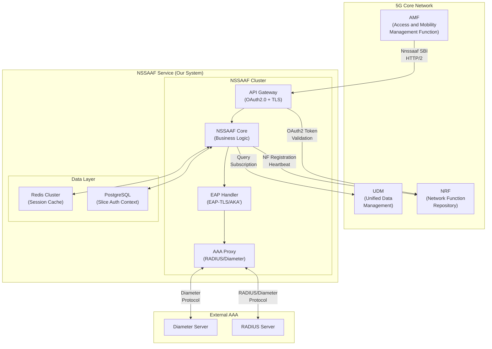
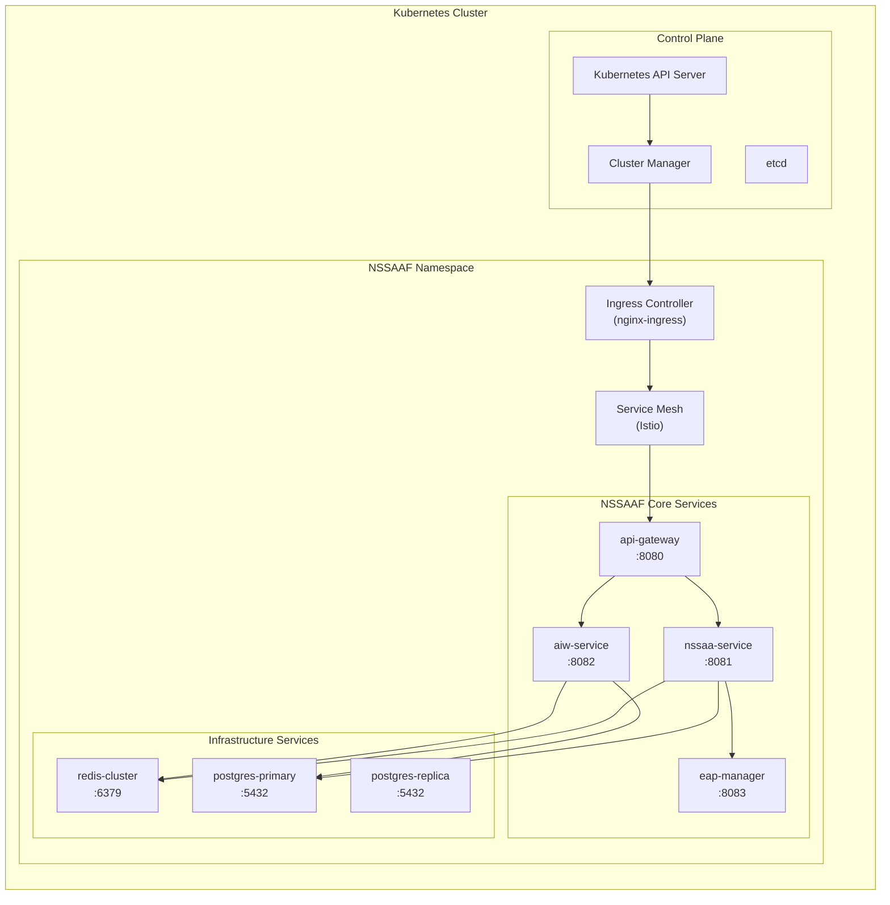
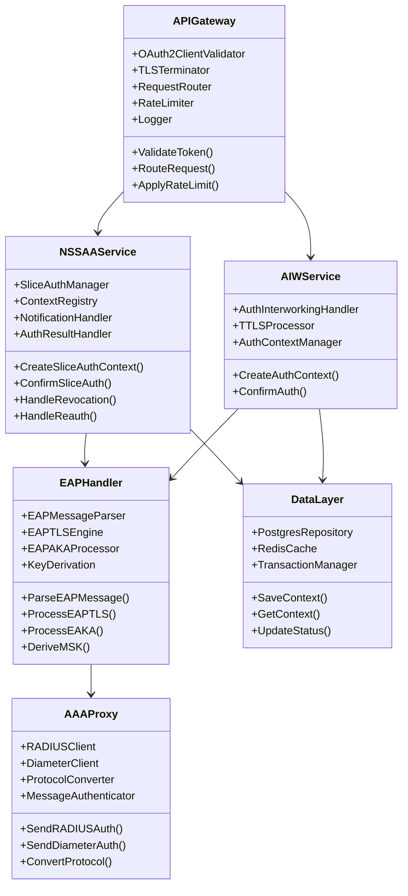
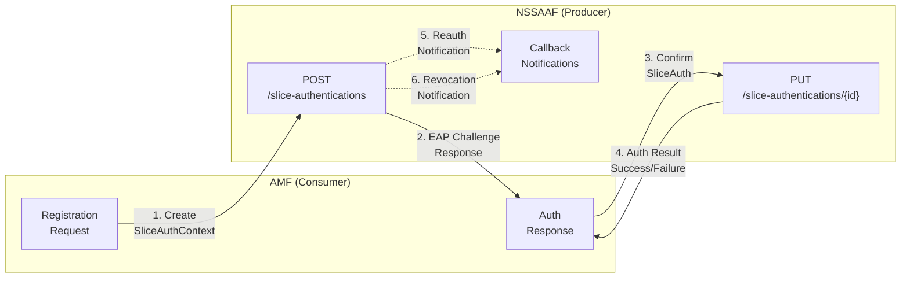
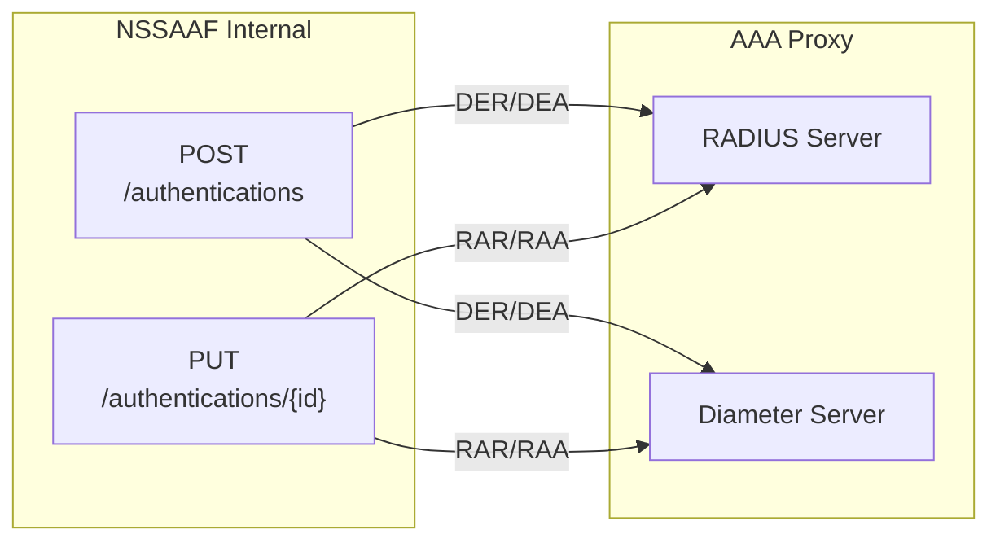
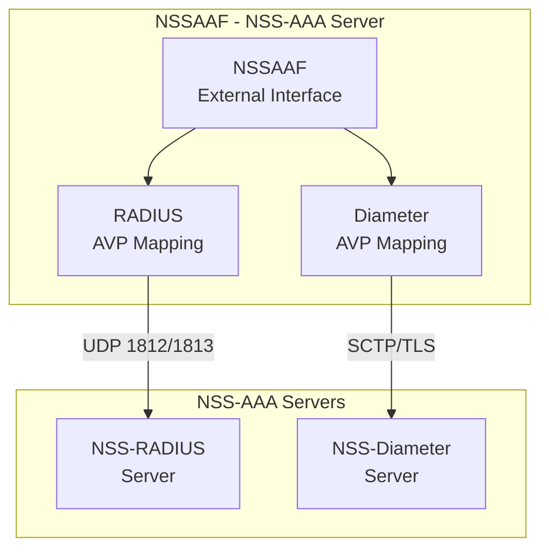
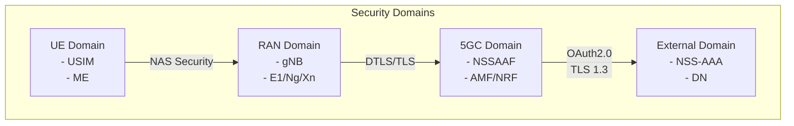
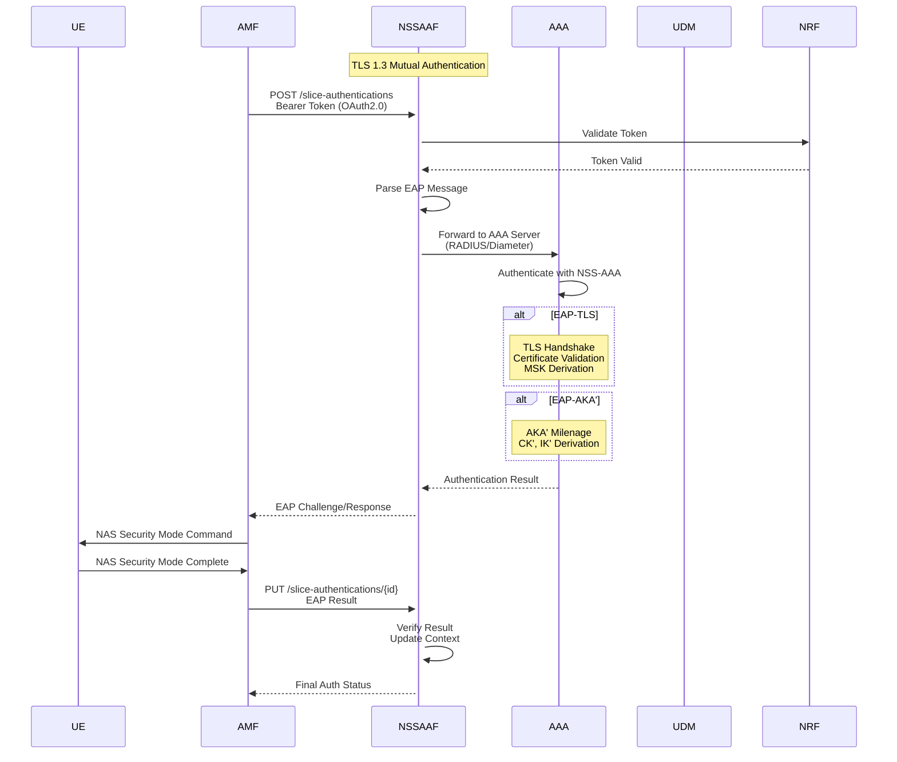
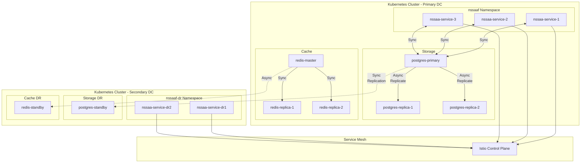

# NSSAAF Detail Design - Part 1: System Architecture

**Document Version:** 1.0.0
**Date:** 2026-04-13
**Project:** NSSAAF (Network Slice-Specific Authentication and Authorization Function)
**Technology Stack:** Golang, PostgreSQL, Redis, Kubernetes (Kubeadm)
**Compliance:** 3GPP Release 17/18

---

## 1. Tổng quan Project

### 1.1 Mục đích và Phạm vi

NSSAAF là Network Function trong kiến trúc 5G Core (5GC)，负责执行 Network Slice-Specific Authentication and Authorization (NSSAA)。该功能支持基于 EAP 的切片特定身份验证和授权流程。

**Core Responsibilities:**
- 提供基于 EAP 的切片认证和授权服务
- 与外部 AAA 服务器 (RADIUS/Diameter) 互操作
- 支持切片授权的撤销和重新认证
- 管理切片认证上下文生命周期

### 1.2 关键文档映射

| 3GPP Spec | 用途 | 关键章节 |
|-----------|------|----------|
| TS 29.526 | NSSAAF 服务定义 | Nnssaaf_NSSAA API |
| TS 29.561 | 外部 DN 互操作 | N58/N60 接口 |
| TS 33.501 | 安全架构 | EAP-TLS, AKA' 流程 |
| TS 29.500 | SBA 技术实现 | HTTP/2, OAuth2.0 |
| TS 29.510 | NRF 服务 | NF 注册/发现 |

---

## 2. Kiến trúc Hệ thống

### 2.1 High-Level Architecture



### 2.2 Microservice Architecture



### 2.3 Component Architecture



---

## 3. Giao diện Dịch vụ (Service Interfaces)

### 3.1 SBI (Service Based Interface) - Nnssaaf

**API Root:** `https://nssaaf.operator.com/nnssaaf-nssaa/v1`

#### 3.1.1 Nnssaaf_NSSAA Service



#### 3.1.2 Nnssaaf_AIW Service (AAA Interworking)

**API Root:** `https://nssaaf.operator.com/nnssaaf-aiw/v1`



### 3.2 External Interface (N6 Reference Point)



---

## 4. Data Models

### 4.1 Core Data Types (theo TS 29.571)

```yaml
# Snssai - Single Network Slice Selection Assistance Information
Snssai:
  sst: uint8          # Slice/Service Type (1-255)
  sd: string          # Slice Differentiator (6 hex digits, optional)

# Supi - Subscription Permanent Identifier
Supi:
  type: enum          # "imsi", "nai", "gpsi"
  value: string       # Format depends on type

# Gpsi - Generic Public Subscription Identifier
Gpsi:
  type: enum          # "msisdn", "externalId", "bcdid"
  value: string

# UserLocation
UserLocation:
 utra: UtraLocation  # For 3G
  eutra: EutraLocation # For 4G
  nr: NrLocation      # For 5G

# NssaaStatus
NssaaStatus:
  status: enum        # "AUTHORIZED", "NOT_AUTHORIZED", "AUTHENTICATION_REQUIRED"
  failureReason: string (optional)
  nssaaAvail: bool
```

### 4.2 NSSAAF Specific Data Types

```yaml
# SliceAuthInfo - Request để tạo authentication context
SliceAuthInfo:
  gpsi: Gpsi              # UE Identifier
  snssai: Snssai          # Slice identifier
  eapIdRsp: EapMessage    # EAP Response from UE
  amfInstanceId: string   # AMF Instance ID
  reauthNotifUri: Uri     # URI for re-auth notification
  revocNotifUri: Uri      # URI for revocation notification

# SliceAuthContext - Authentication Context Resource
SliceAuthContext:
  gpsi: Gpsi
  snssai: Snssai
  authCtxId: string       # UUID
  eapMessage: EapMessage  # EAP Challenge/Response

# SliceAuthConfirmationData - Confirm authentication result
SliceAuthConfirmationData:
  gpsi: Gpsi
  snssai: Snssai
  eapMessage: EapMessage

# SliceAuthConfirmationResponse
SliceAuthConfirmationResponse:
  gpsi: Gpsi
  snssai: Snssai
  eapMessage: EapMessage
  authResult: AuthStatus  # "SUCCESS" or "FAILURE"

# SliceAuthReauthNotification
SliceAuthReauthNotification:
  notifType: enum         # "SLICE_RE_AUTH"
  gpsi: Gpsi
  snssai: Snssai
  supi: Supi

# SliceAuthRevocNotification
SliceAuthRevocNotification:
  notifType: enum         # "SLICE_REVOCATION"
  gpsi: Gpsi
  snssai: Snssai
  supi: Supi
```

### 4.3 EAP Message Structure

```yaml
# EapMessage - EAP Packet (RFC 3748)
EapMessage:
  format: byte           # Base64 encoded EAP packet
  # EAP Packet Structure:
  # Code: 1=Request, 2=Response, 3=Success, 4=Failure
  # Type: 1=Identity, 13=EAP-TLS, 50=EAP-AKA', 51=EAP-SIM

# EAP-TLS Packet (RFC 5216)
EAPTLS:
  code: 2               # Response
  type: 13              # EAP-TLS
  flags: bitfield
    - 0: Reserved
    - 1: Integrity=1
    - 2: Reserved
    - 3: MRU
    - 4: Fragmentation
    - 5-7:TLVs
  mtu: uint16           # If MRU flag set
  fragment: byte        # If fragmentation flag set
```

---

## 5. Security Architecture

### 5.1 Security Domain



### 5.2 Authentication Flow Security



---

## 6. Deployment Architecture

### 6.1 Kubernetes Deployment Model

```yaml
# Kubernetes Resources for NSSAAF
apiVersion: v1
kind: Namespace
metadata:
  name: nssaaf
  labels:
    app.kubernetes.io/part-of: 5gc
    topo.domain: core
---
apiVersion: apps/v1
kind: Deployment
metadata:
  name: nssaa-service
  namespace: nssaaf
spec:
  replicas: 3
  selector:
    matchLabels:
      app: nssaa-service
  template:
    metadata:
      labels:
        app: nssaa-service
        version: v1
    spec:
      containers:
      - name: nssaa-service
        image: nssaaf/nssaa-service:1.0.0
        ports:
        - containerPort: 8081
        resources:
          requests:
            memory: "512Mi"
            cpu: "500m"
          limits:
            memory: "2Gi"
            cpu: "2000m"
        env:
        - name: CONFIG_FILE
          value: "/config/nssaaf.yaml"
        - name: POD_NAME
          valueFrom:
            fieldRef:
              fieldPath: metadata.name
        volumeMounts:
        - name: config
          mountPath: /config
      volumes:
      - name: config
        configMap:
          name: nssaaf-config
---
apiVersion: v1
kind: Service
metadata:
  name: nssaa-service
  namespace: nssaaf
spec:
  type: ClusterIP
  ports:
  - port: 8081
    targetPort: 8081
    protocol: TCP
  selector:
    app: nssaa-service
---
apiVersion: autoscaling/v2
kind: HorizontalPodAutoscaler
metadata:
  name: nssaa-service-hpa
  namespace: nssaaf
spec:
  scaleTargetRef:
    apiVersion: apps/v1
    kind: Deployment
    name: nssaa-service
  minReplicas: 3
  maxReplicas: 10
  metrics:
  - type: Resource
    resource:
      name: cpu
      target:
        type: Utilization
        averageUtilization: 70
  - type: Resource
    resource:
      name: memory
      target:
        type: Utilization
        averageUtilization: 80
```

### 6.2 High Availability Topology



---

## 7. Network Configuration

### 7.1 Service Discovery

```yaml
# NSSAAF NF Profile for NRF Registration
nfProfile:
  nfInstanceId: "<auto-generated-uuid>"
  nfType: NSSAAF
  nfStatus: REGISTERED
  apiVersion: v1
  serviceName: nnssaaf-nssaa
  services:
    - serviceName: nnssaaf-nssaa
      versions:
        - apiVersionInUri: v1
          apiFullVersion: "1.2.1"
      scheme: https
      nfServiceStatus: SERVED
    - serviceName: nnssaaf-aiw
      versions:
        - apiVersionInUri: v1
          apiFullVersion: "1.1.0"
      scheme: https
      nfServiceStatus: SERVED
  fqdn: nssaaf.operator.com
  interPlmnFqdn: nssaaf.homenet.operator.com
  ipv4Addresses:
    - 10.100.1.10
  port: 443
  priority: 100
  capacity: 10000
  loadControlWeight: 1.0
  recoveryTime: "2026-04-13T00:00:00Z"
  supportedFeatures: "NSSAA-EAP-TLS,NSSAA-EAP-AKA"
```

### 7.2 Network Policies

```yaml
apiVersion: networking.k8s.io/v1
kind: NetworkPolicy
metadata:
  name: nssaaf-network-policy
  namespace: nssaaf
spec:
  podSelector:
    matchLabels:
      app: nssaa-service
  policyTypes:
  - Ingress
  - Egress
  ingress:
  - from:
    - namespaceSelector:
        matchLabels:
          name: 5gc
    ports:
    - protocol: TCP
      port: 8081
  egress:
  - to:
    - podSelector:
        matchLabels:
          app: postgres
    ports:
    - protocol: TCP
      port: 5432
  - to:
    - podSelector:
        matchLabels:
          app: redis
    ports:
    - protocol: TCP
      port: 6379
  - to:
    - namespaceSelector: {}
      podSelector:
        matchLabels:
          app: nrf
    ports:
    - protocol: TCP
      port: 8080
```

---

## 8. Monitoring and Observability

### 8.1 Metrics Collection

```yaml
# Prometheus Metrics for NSSAAF
metrics:
  # Request Metrics
  - name: nssaaf_http_requests_total
    type: counter
    labels: [method, endpoint, status_code]
  - name: nssaaf_http_request_duration_seconds
    type: histogram
    labels: [method, endpoint]
  
  # Business Metrics
  - name: nssaaf_auth_requests_total
    type: counter
    labels: [result, snssai_sst]
  - name: nssaaf_auth_duration_seconds
    type: histogram
    labels: [auth_type]
  - name: nssaaf_active_contexts
    type: gauge
  
  # AAA Proxy Metrics
  - name: nssaaf_radius_requests_total
    type: counter
    labels: [server, result]
  - name: nssaaf_diameter_requests_total
    type: counter
    labels: [server, result]
  
  # Infrastructure Metrics
  - name: nssaaf_db_connections_active
    type: gauge
  - name: nssaaf_redis_operations_total
    type: counter
    labels: [operation, result]
```

### 8.2 Logging Structure

```json
{
  "timestamp": "2026-04-13T10:30:00.123Z",
  "level": "INFO",
  "service": "nssaa-service",
  "trace_id": "abc123def456",
  "span_id": "span789",
  "message": "Slice authentication context created",
  "context": {
    "auth_ctx_id": "ctx-uuid-123",
    "gpsi": "msisdn-84-1234567890",
    "snssai_sst": 1,
    "amf_instance_id": "amf-001",
    "procedure_type": "NSSAA_INITIAL_AUTH"
  }
}
```

---

## 9. Performance Requirements

### 9.1 SLA Targets

| Metric | Target | Measurement |
|--------|--------|-------------|
| Auth Request Latency (p99) | < 100ms | End-to-end |
| Throughput | 10,000 req/sec | Per instance |
| Availability | 99.999% | Per year |
| Context Recovery | < 30s | After failure |
| Max Active Contexts | 1,000,000 | Per cluster |

### 9.2 Resource Scaling

```yaml
# Scaling Configuration
scaling:
  # Horizontal Pod Autoscaler
  hpa:
    min_replicas: 3
    max_replicas: 20
    target_cpu_utilization: 70
    target_memory_utilization: 80
  
  # Vertical Pod Autoscaler (for memory optimization)
  vpa:
    memory:
      target_avg_utilization: 70
  
  # Pod Disruption Budget
  pdb:
    min_available: 2
  
  # Resource Quotas
  resource_quota:
    cpu_limit: "40 cores"
    memory_limit: "80 Gi"
```

---

## 10. Compliance Checklist

- [x] TS 29.526 NSSAAF Service Implementation
- [x] TS 29.571 Common Data Types
- [x] TS 29.500 SBA Technical Realization
- [x] TS 29.501 SBI Design Principles
- [x] TS 29.561 External DN Interworking (N58/N60)
- [x] TS 33.501 Security Architecture
- [x] TS 28.532 Performance Metrics
- [x] RFC 3748 EAP Protocol
- [x] RFC 5216 EAP-TLS
- [x] OAuth2.0 Client Credentials Flow

---

**Document Author:** NSSAAF Design Team
**Next Document:** Part 2 - API Specification & Data Models
