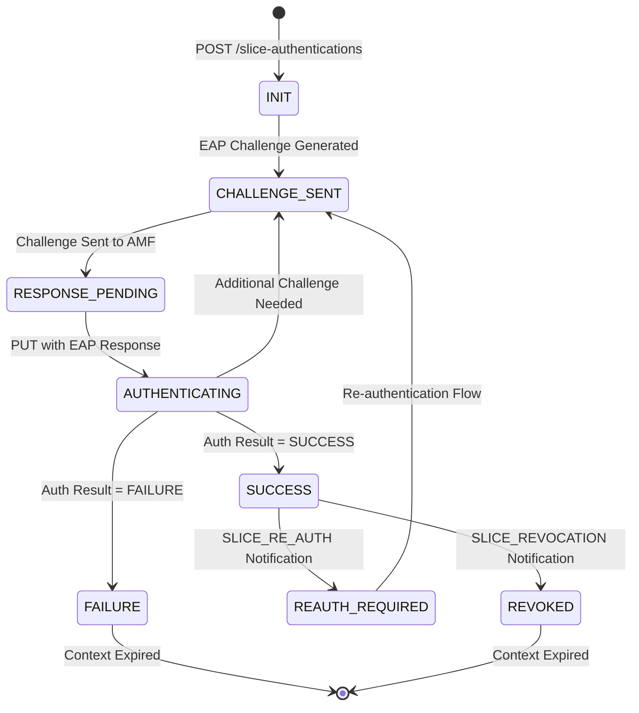
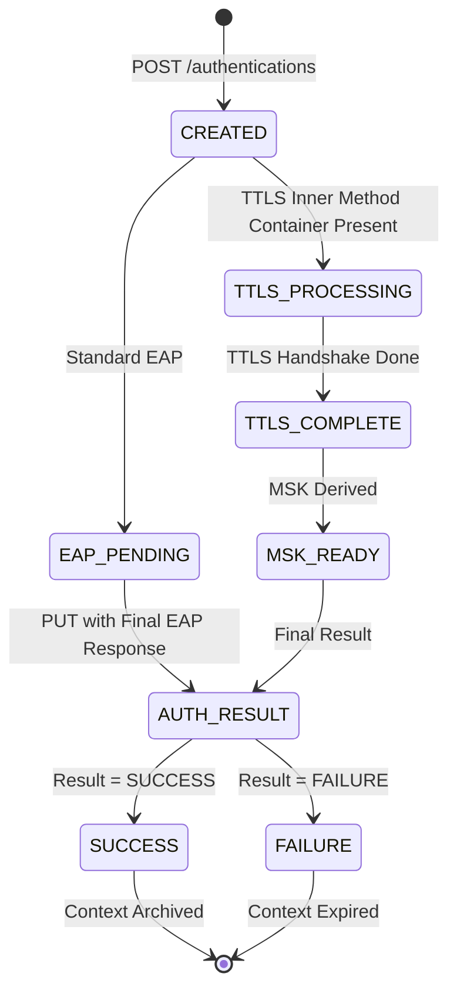

# NSSAAF Detail Design - Part 2: API Specification

**Document Version:** 1.0.0
**Date:** 2026-04-13
**Project:** NSSAAF (Network Slice-Specific Authentication and Authorization Function)
**Based on:** 3GPP TS 29.526, TS 29.571, TS 29.500

---

## 1. API Overview

### 1.1 API Summary

| API Name | Version | Base Path | Purpose |
|----------|---------|-----------|---------|
| Nnssaaf_NSSAA | 1.2.1 | `/nnssaaf-nssaa/v1` | Slice-specific authentication |
| Nnssaaf_AIW | 1.1.0 | `/nnssaaf-aiw/v1` | AAA Interworking |

### 1.2 Common Headers

```yaml
# Request Headers
Headers:
  Content-Type: application/json
  Accept: application/json
  Authorization: Bearer <access_token>
  3gpp-Sbi-Message-Priority: <0-15>  # Optional
  3gpp-Sbi-Correlation-Info: <uuid>  # Optional
  3gpp-Sbi-Max-Rsp-Time: <seconds>   # Optional

# Response Headers
Headers:
  Content-Type: application/json
  Location: <resource_uri>          # For 201 Created
  3gpp-Sbi-Binding: <binding-id>    # Optional
  X-Request-Id: <request-id>
```

---

## 2. Nnssaaf_NSSAA API

### 2.1 Create Slice Authentication Context

**Endpoint:** `POST /slice-authentications`

**Description:** Tạo authentication context mới cho slice-specific authentication.

**Request:**

```yaml
POST /nnssaaf-nssaa/v1/slice-authentications
Content-Type: application/json
Authorization: Bearer <token>

RequestBody:
{
  "gpsi": "msisdn-84-1234567890",          # Generic Public Subscription Identifier
  "snssai": {                               # Single NSSAI
    "sst": 1,                              # Slice/Service Type (1=eMBB, 2=URLLC, 3=MIoT)
    "sd": "001V01"                          # Slice Differentiator (optional)
  },
  "eapIdRsp": "<base64-encoded-eap-response>",  # EAP Response from UE
  "amfInstanceId": "amf-instance-uuid-001",    # AMF Instance ID
  "reauthNotifUri": "https://amf.operator.com/nnssaa-notify/v1/reauth",
  "revocNotifUri": "https://amf.operator.com/nnssaa-notify/v1/revoc"
}
```

**Response (201 Created):**

```yaml
HTTP/1.1 201 Created
Location: /nnssaaf-nssaa/v1/slice-authentications/ctx-uuid-12345
Content-Type: application/json

{
  "gpsi": "msisdn-84-1234567890",
  "snssai": {
    "sst": 1,
    "sd": "001V01"
  },
  "authCtxId": "ctx-uuid-12345",           # Authentication Context ID
  "eapMessage": "<base64-encoded-eap-challenge>"  # EAP Challenge to send to UE
}
```

**Response Codes:**

| Code | Description | Action |
|------|-------------|--------|
| 201 | Context Created | Return SliceAuthContext |
| 307 | Temporary Redirect | Follow Location header |
| 308 | Permanent Redirect | Update URI for future |
| 400 | Bad Request | Check request format |
| 401 | Unauthorized | Re-authenticate token |
| 403 | Forbidden | Authorization failed |
| 404 | User Not Found | Check GPSI validity |
| 411 | Length Required | Add Content-Length |
| 413 | Payload Too Large | Reduce message size |
| 415 | Unsupported Media | Use application/json |
| 429 | Too Many Requests | Apply rate limiting |
| 500 | Server Error | Retry with backoff |
| 502 | Bad Gateway | Check backend services |
| 503 | Service Unavailable | Wait for recovery |
| 504 | Gateway Timeout | Check network latency |

**Error Response Format:**

```yaml
{
  "type": "https://nssaaf.operator.com/probs/validation-error",
  "title": "Bad Request",
  "status": 400,
  "detail": "Invalid EAP message format",
  "instance": "/slice-authentications",
  "cause": "eapIdRsp parsing failed at byte offset 45",
  "invalidParams": [
    {
      "param": "eapIdRsp",
      "reason": "Invalid EAP code in packet"
    }
  ]
}
```

---

### 2.2 Confirm Slice Authentication

**Endpoint:** `PUT /slice-authentications/{authCtxId}`

**Description:** Xác nhận kết quả authentication từ UE.

**Path Parameters:**

| Parameter | Type | Required | Description |
|-----------|------|----------|-------------|
| authCtxId | string | Yes | Authentication Context ID |

**Request:**

```yaml
PUT /nnssaaf-nssaa/v1/slice-authentications/ctx-uuid-12345
Content-Type: application/json
Authorization: Bearer <token>

{
  "gpsi": "msisdn-84-1234567890",
  "snssai": {
    "sst": 1,
    "sd": "001V01"
  },
  "eapMessage": "<base64-encoded-eap-response>"  # EAP Response from UE
}
```

**Response (200 OK):**

```yaml
HTTP/1.1 200 OK
Content-Type: application/json

{
  "gpsi": "msisdn-84-1234567890",
  "snssai": {
    "sst": 1,
    "sd": "001V01"
  },
  "eapMessage": "<base64-encoded-eap-success-or-failure>",
  "authResult": "SUCCESS"  # or "FAILURE"
}
```

**AuthResult Values:**

```yaml
AuthResult:
  enum: [SUCCESS, FAILURE, CONTEXT_NOT_FOUND, PROTOCOL_ERROR]
```

---

### 2.3 Callback Notifications

#### 2.3.1 Re-authentication Notification Callback

**Triggered by:** NSSAAF khi cần re-authenticate UE cho một slice.

**Callback Request:**

```yaml
POST https://amf.operator.com/nnssaa-notify/v1/reauth
Content-Type: application/json
Authorization: Bearer <callback-token>

{
  "notifType": "SLICE_RE_AUTH",
  "gpsi": "msisdn-84-1234567890",
  "snssai": {
    "sst": 1,
    "sd": "001V01"
  },
  "supi": "imsi-8401234567890"
}
```

**Callback Response:** `204 No Content`

#### 2.3.2 Revocation Notification Callback

**Triggered by:** NSSAAF khi authorization bị revoke bởi NSS-AAA.

**Callback Request:**

```yaml
POST https://amf.operator.com/nnssaa-notify/v1/revoc
Content-Type: application/json
Authorization: Bearer <callback-token>

{
  "notifType": "SLICE_REVOCATION",
  "gpsi": "msisdn-84-1234567890",
  "snssai": {
    "sst": 1,
    "sd": "001V01"
  },
  "supi": "imsi-8401234567890"
}
```

**Callback Response:** `204 No Content`

---

## 3. Nnssaaf_AIW API

### 3.1 Create Authentication Context (AAA Interworking)

**Endpoint:** `POST /authentications`

**Description:** Tạo authentication context cho AAA interworking.

**Request:**

```yaml
POST /nnssaaf-aiw/v1/authentications
Content-Type: application/json
Authorization: Bearer <token>

{
  "supi": "imsi-8401234567890",                    # Subscription Permanent Identifier
  "eapIdRsp": "<base64-encoded-eap-response>",      # EAP Response
  "ttlsInnerMethodContainer": "<base64-encoded>",   # TTLS Inner Method (optional)
  "supportedFeatures": "AIW-EAP-TTLS,AIW-PLAIN-MSK" # Supported Features
}
```

**Response (201 Created):**

```yaml
HTTP/1.1 201 Created
Location: /nnssaaf-aiw/v1/authentications/auth-uuid-67890
Content-Type: application/json

{
  "supi": "imsi-8401234567890",
  "authCtxId": "auth-uuid-67890",
  "eapMessage": "<base64-encoded-eap-challenge>",
  "ttlsInnerMethodContainer": "<base64-encoded-inner-data>",  # If applicable
  "supportedFeatures": "AIW-EAP-TTLS,AIW-PLAIN-MSK"
}
```

---

### 3.2 Confirm Authentication (AAA Interworking)

**Endpoint:** `PUT /authentications/{authCtxId}`

**Request:**

```yaml
PUT /nnssaaf-aiw/v1/authentications/auth-uuid-67890
Content-Type: application/json
Authorization: Bearer <token>

{
  "supi": "imsi-8401234567890",
  "eapMessage": "<base64-encoded-eap-response>",
  "supportedFeatures": "AIW-EAP-TTLS,AIW-PLAIN-MSK"
}
```

**Response (200 OK):**

```yaml
{
  "supi": "imsi-8401234567890",
  "eapMessage": "<base64-encoded-eap-result>",
  "authResult": "SUCCESS",
  "pvsInfo": [                              # Proxy VS Address Info
    {
      "pvsId": "pvs-001",
      "pvsIPv4Address": "192.168.1.100"
    }
  ],
  "msk": "<base64-encoded-master-session-key>",  # Master Session Key
  "supportedFeatures": "AIW-EAP-TTLS,AIW-PLAIN-MSK"
}
```

---

## 4. Common Data Types (TS 29.571)

### 4.1 Identifier Types

```yaml
# Supi - Subscription Permanent Identifier
Supi:
  type: string
  pattern: "^(imsi|nai|gpsi|extid):[a-zA-Z0-9.-]+$"
  examples:
    - "imsi-8401234567890"
    - "nai:user@operator.com"
    - "gpsi:msisdn-84-1234567890"

# Gpsi - Generic Public Subscription Identifier
Gpsi:
  type: string
  pattern: "^(msisdn|extid|bcdid):[a-zA-Z0-9.-]+$"
  examples:
    - "msisdn-84-1234567890"
    - "extid:user@domain.com"

# Snssai - Single Network Slice Selection Assistance Information
Snssai:
  type: object
  properties:
    sst:
      type: integer
      minimum: 1
      maximum: 255
      description: |
        Slice/Service Type:
        1 = eMBB (Enhanced Mobile Broadband)
        2 = URLLC (Ultra-Reliable Low-Latency)
        3 = MIoT (Massive IoT)
        4-255 = Operator-specific
    sd:
      type: string
      pattern: "^[0-9A-Fa-f]{6}$"
      description: Slice Differentiator (optional)
  required: [sst]

# Guami - Globally Unique AMF Identifier
Guami:
  type: object
  properties:
    plmnId:
      $ref: '#/components/schemas/PlmnId'
    amfId:
      type: string
      pattern: "^[0-9A-Fa-f]{8,10}$"
  required: [plmnId, amfId]

# PlmnId - Public Land Mobile Network Identifier
PlmnId:
  type: object
  properties:
    mcc:
      type: string
      pattern: "^[0-9]{3}$"
    mnc:
      type: string
      pattern: "^[0-9]{2,3}$"
  required: [mcc, mnc]
```

### 4.2 Status Types

```yaml
# AuthStatus
AuthStatus:
  type: string
  enum:
    - SUCCESS          # Authentication successful
    - FAILURE          # Authentication failed
    - CONTEXT_NOT_FOUND # Auth context not found
    - TIMEOUT          # Authentication timeout
    - PROTOCOL_ERROR   # Protocol error

# SnssaiStatus
SnssaiStatus:
  type: object
  properties:
    status:
      type: string
      enum: [AUTHORIZED, NOT_AUTHORIZED, AUTH_PENDING]
    failureReason:
      type: string
      description: Reason for authorization failure
    nssaaAvail:
      type: boolean
      description: NSSAA availability status

# NssaaStatus
NssaaStatus:
  type: object
  properties:
    authorized:
      type: boolean
    result:
      $ref: '#/components/schemas/AuthStatus'
    failureReason:
      type: string
    restrictedAccess:
      type: boolean
```

### 4.3 Network Identity Types

```yaml
# Ecgi - E-UTRA Cell Global Identifier
Ecgi:
  type: object
  properties:
    plmnId:
      $ref: '#/components/schemas/PlmnId'
    eutraCellId:
      type: string
      pattern: "^[0-9A-Fa-f]{9}$"
  required: [plmnId, eutraCellId]

# NrLocation - NR Location
NrLocation:
  type: object
  properties:
    plmnId:
      $ref: '#/components/schemas/PlmnId'
    nrCellId:
      type: string
      pattern: "^[0-9A-Fa-f]{9}$"
    nci:
      type: string
      format: uint64
    tac:
      type: string
      format: uint32
  required: [plmnId]

# UserLocation
UserLocation:
  type: object
  properties:
    eutraLocation:
      $ref: '#/components/schemas/EutraLocation'
    nrLocation:
      $ref: '#/components/schemas/NrLocation'
    n3gaLocation:
      $ref: '#/components/schemas/N3gaLocation'
```

---

## 5. HTTP Custom Headers (TS 29.500)

### 5.1 Mandatory Headers

```yaml
# 3gpp-Sbi-Message-Priority
3gpp-Sbi-Message-Priority:
  description: Priority of the SBI message
  type: integer
  minimum: 0
  maximum: 15
  values:
    0: Normal priority
    1-7: High priority
    8-15: Critical priority

# 3gpp-Sbi-Routing-Binding
3gpp-Sbi-Routing-Binding:
  description: Binding for routing
  type: string
  format: "<producer-nf-id>;<timestamp>"

# 3gpp-Sbi-Binding
3gpp-Sbi-Binding:
  description: Service binding information
  type: string
  format: "<binding-id>"

# 3gpp-Sbi-Target-apiRoot
3gpp-Sbi-Target-apiRoot:
  description: Target API root for indirect communication
  type: string
  format: "https://<target-fqdn>:<port>"
```

### 5.2 Optional Headers

```yaml
# 3gpp-Sbi-Discovery
3gpp-Sbi-Discovery:
  description: Discovery parameters
  type: string

# 3gpp-Sbi-Nrf-Uri
3gpp-Sbi-Nrf-Uri:
  description: NRF URI for token validation
  type: string

# 3gpp-Sbi-Max-Rsp-Time
3gpp-Sbi-Max-Rsp-Time:
  description: Maximum response time
  type: integer
  format: int32
  unit: seconds

# 3gpp-Sbi-Correlation-Info
3gpp-Sbi-Correlation-Info:
  description: Correlation ID for tracing
  type: string
  format: UUID
```

---

## 6. OAuth 2.0 Security

### 6.1 Token Request

```yaml
# Client Credentials Grant
POST /oauth2/token
Content-Type: application/x-www-form-urlencoded

grant_type=client_credentials
&client_id=<nf-instance-id>
&client_assertion_type=urn:ietf:params:oauth:client-assertion-type:sjwt
&client_assertion=<signed-jwt>
&scope=nnssaaf-nssaa nnssaaf-aiw
```

### 6.2 Client Assertion JWT

```yaml
# JWT Header
{
  "alg": "PS256",
  "typ": "jwt",
  "kid": "key-id-001"
}

# JWT Payload
{
  "iss": "<nsssaf-nf-instance-id>",
  "sub": "<nsssaf-nf-instance-id>",
  "aud": ["https://nrf.operator.com"],
  "jti": "<unique-token-id>",
  "exp": 1713000000,
  "iat": 1712996400,
  "nf_type": "NSSAAF",
  "scope": "nnssaaf-nssaa nnssaaf-aiw"
}
```

### 6.3 Scopes

```yaml
Scopes:
  nnssaaf-nssaa:
    description: Access to NSSAA service
    priority: High
  nnssaaf-aiw:
    description: Access to AIW service
    priority: High
```

---

## 7. API State Machine

### 7.1 Slice Authentication Context State Machine



### 7.2 Authentication Context State Machine (AIW)



---

## 8. Error Handling

### 8.1 Problem Details Format (RFC 7807)

```yaml
# Standard Error Response
{
  "type": "https://nssaaf.operator.com/probs/<error-type>",
  "title": "<Human-readable title>",
  "status": <http-status-code>,
  "detail": "<Detailed error message>",
  "instance": "<Request URI>",
  "cause": "<Technical cause>",
  "invalidParams": [
    {
      "param": "<parameter-path>",
      "reason": "<Why invalid>"
    }
  ],
  "supportedFeatures": "<feature-flags>",
  "traceId": "<correlation-id>"
}
```

### 8.2 Error Types

```yaml
ErrorTypes:
  validation-error:
    status: 400
    description: Invalid request format or parameters
  
  unauthorized:
    status: 401
    description: Invalid or expired access token
  
  forbidden:
    status: 403
    description: Insufficient permissions
  
  not-found:
    status: 404
    description: Resource not found
  
  conflict:
    status: 409
    description: State conflict (e.g., duplicate context)
  
  too-many-requests:
    status: 429
    description: Rate limit exceeded
  
  internal-error:
    status: 500
    description: Internal server error
  
  bad-gateway:
    status: 502
    description: Backend service error
  
  service-unavailable:
    status: 503
    description: Service temporarily unavailable
  
  gateway-timeout:
    status: 504
    description: Request timeout
```

### 8.3 Retry Strategy

```yaml
RetryPolicy:
  maxRetries: 3
  backoffMultiplier: 2
  initialDelay: 100ms
  maxDelay: 5s
  retryableStatuses:
    - 502
    - 503
    - 504
  nonRetryableStatuses:
    - 400
    - 401
    - 403
    - 404
    - 409
    - 429
```

---

## 9. Rate Limiting

### 9.1 Rate Limit Headers

```yaml
# Response Headers
X-RateLimit-Limit: 1000
X-RateLimit-Remaining: 999
X-RateLimit-Reset: 1712997000
Retry-After: 60  # When 429 is returned
```

### 9.2 Rate Limit Configuration

```yaml
RateLimits:
  perIP:
    requests: 100
    window: 1 minute
  
  perAMF:
    requests: 10000
    window: 1 minute
  
  perGPSI:
    requests: 10
    window: 1 minute
  
  global:
    requests: 100000
    window: 1 minute
```

---

## 10. API Versioning

### 10.1 Version Lifecycle

```yaml
VersionLifecycle:
  current:
    apiVersion: v1
    specVersion: "1.2.1"
    status: ACTIVE
    sunsetDate: null
  
  deprecated:
    apiVersion: v0
    specVersion: "1.1.0"
    status: DEPRECATED
    sunsetDate: "2026-10-01"
```

### 10.2 Version Negotiation

```yaml
# Supported Versions Header
Accept: application/json
  Content-Type: application/json;version=1.2.1

# Alternative: URI Version
GET /nnssaaf-nssaa/v1/slice-authentications
GET /nnssaaf-nssaa/v2/slice-authentications  # Future version
```

---

**Document Author:** NSSAAF Design Team
**Next Document:** Part 3 - Procedure Flows
