# NSSAAF Detail Design - Part 3: Procedure Flows

**Document Version:** 1.0.0
**Date:** 2026-04-13
**Project:** NSSAAF (Network Slice-Specific Authentication and Authorization Function)
**Based on:** 3GPP TS 23.502, TS 29.526, TS 33.501

---

## 1. Tổng quan Procedures

Document này mô tả chi tiết step-by-step các luồng xử lý trong NSSAAF theo chuẩn 3GPP.

### 1.1 Procedure List

| Procedure | Description | Reference |
|-----------|-------------|-----------|
| NSSAA Initial Authentication | Xác thực ban đầu khi UE đăng ký slice | TS 23.502 4.2.2 |
| NSSAA Re-authentication | Xác thực lại khi hết hạn | TS 23.502 4.2.2 |
| NSSAA Revocation | Thu hồi authorization | TS 29.526 |
| AIW Authentication | Interworking với AAA server | TS 29.561 |
| Context Management | Quản lý authentication context | TS 29.526 |

---

## 2. NSSAA Initial Authentication Flow

### 2.1 Overview Flow

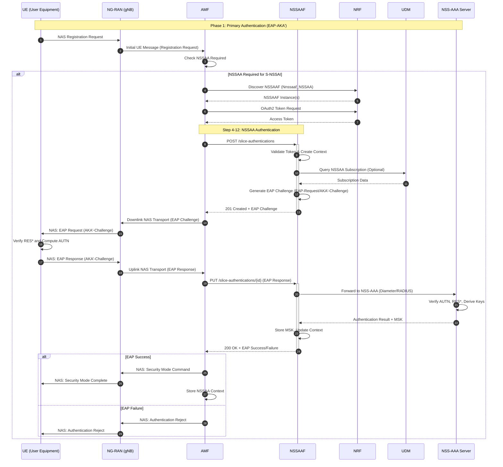
```mermaid
sequenceDiagram
    autonumber
    participant UE as UE (User Equipment)
    participant gNB as NG-RAN (gNB)
    participant AMF as AMF
    participant NSSAAF as NSSAAF
    participant NRF as NRF
    participant UDM as UDM
    participant AAA as NSS-AAA Server

    Note over UE,AAA: Phase 1: Primary Authentication (EAP-AKA')
    UE->>gNB: NAS Registration Request
    gNB->>AMF: Initial UE Message (Registration Request)
    AMF->>AMF: Check NSSAA Required
    
    alt NSSAA Required for S-NSSAI
        AMF->>NRF: Discover NSSAAF (Nnssaaf_NSSAA)
        NRF-->>AMF: NSSAAF Instance(s)
        AMF->>NRF: OAuth2 Token Request
        NRF-->>AMF: Access Token
        
        Note over AMF,NSSAAF: Step 4-12: NSSAA Authentication
        AMF->>+NSSAAF: POST /slice-authentications
        NSSAAF->>NSSAAF: Validate Token & Create Context
        NSSAAF->>UDM: Query NSSAA Subscription (Optional)
        UDM-->>NSSAAF: Subscription Data
        NSSAAF->>NSSAAF: Generate EAP Challenge (EAP-Request/AKA'-Challenge)
        NSSAAF-->>-AMF: 201 Created + EAP Challenge
        
        AMF->>gNB: Downlink NAS Transport (EAP Challenge)
        gNB->>UE: NAS: EAP Request (AKA'-Challenge)
        
        UE->>UE: Verify RES* and Compute AUTN
        UE->>gNB: NAS: EAP Response (AKA'-Challenge)
        gNB->>AMF: Uplink NAS Transport (EAP Response)
        AMF->>+NSSAAF: PUT /slice-authentications/{id} (EAP Response)
        NSSAAF->>AAA: Forward to NSS-AAA (Diameter/RADIUS)
        
        AAA->>AAA: Verify AUTN, RES*, Derive Keys
        AAA-->>NSSAAF: Authentication Result + MSK
        
        NSSAAF->>NSSAAF: Store MSK, Update Context
        NSSAAF-->>-AMF: 200 OK + EAP Success/Failure
        
        alt EAP Success
            AMF->>gNB: NAS: Security Mode Command
            gNB->>UE: NAS: Security Mode Complete
            AMF->>AMF: Store NSSAA Context
        else EAP Failure
            AMF->>gNB: NAS: Authentication Reject
            gNB->>UE: NAS: Authentication Reject
        end
    end
```

### 2.2 NSSAA Authentication - Step by Step Detail

#### Bước 1: AMF khởi tạo NSSAA

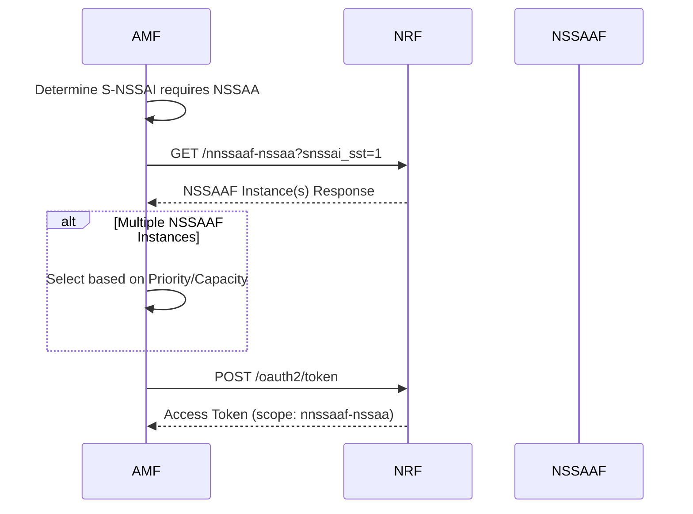
```mermaid
sequenceDiagram
    participant AMF
    participant NRF
    participant NSSAAF

    AMF->>AMF: Determine S-NSSAI requires NSSAA
    AMF->>NRF: GET /nnssaaf-nssaa?snssai_sst=1
    NRF-->>AMF: NSSAAF Instance(s) Response
    
    alt Multiple NSSAAF Instances
        AMF->>AMF: Select based on Priority/Capacity
    end
    
    AMF->>NRF: POST /oauth2/token
    NRF-->>AMF: Access Token (scope: nnssaaf-nssaa)
```

#### Bước 2: Create Slice Authentication Context

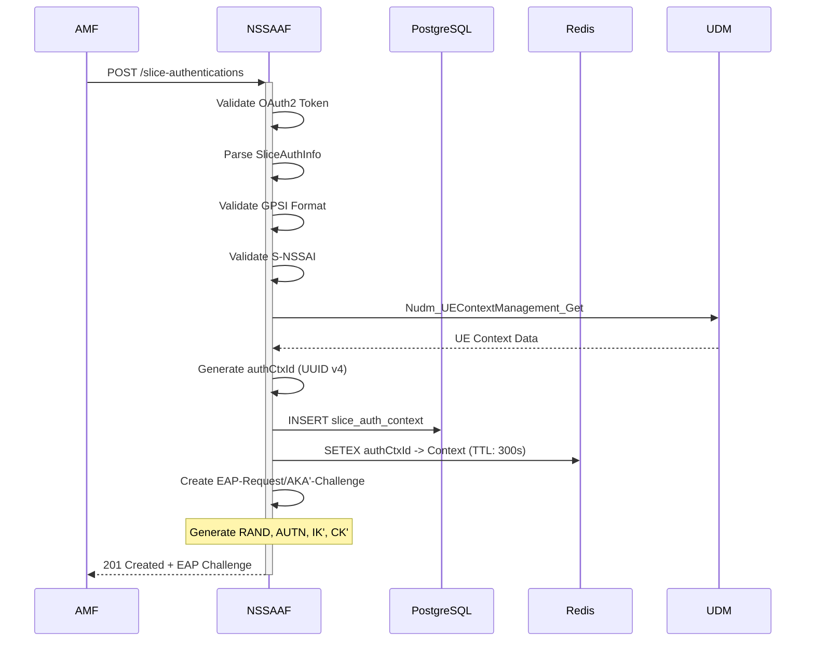
```mermaid
sequenceDiagram
    participant AMF
    participant NSSAAF
    participant DB as PostgreSQL
    participant Cache as Redis
    participant UDM

    AMF->>+NSSAAF: POST /slice-authentications
    NSSAAF->>NSSAAF: Validate OAuth2 Token
    
    NSSAAF->>NSSAAF: Parse SliceAuthInfo
    NSSAAF->>NSSAAF: Validate GPSI Format
    NSSAAF->>NSSAAF: Validate S-NSSAI
    
    NSSAAF->>UDM: Nudm_UEContextManagement_Get
    UDM-->>NSSAAF: UE Context Data
    
    NSSAAF->>NSSAAF: Generate authCtxId (UUID v4)
    NSSAAF->>DB: INSERT slice_auth_context
    NSSAAF->>Cache: SETEX authCtxId -> Context (TTL: 300s)
    
    NSSAAF->>NSSAAF: Create EAP-Request/AKA'-Challenge
    Note over NSSAAF: Generate RAND, AUTN, IK', CK'
    
    NSSAAF-->>-AMF: 201 Created + EAP Challenge
```

#### Bước 3: Xử lý EAP Response từ UE

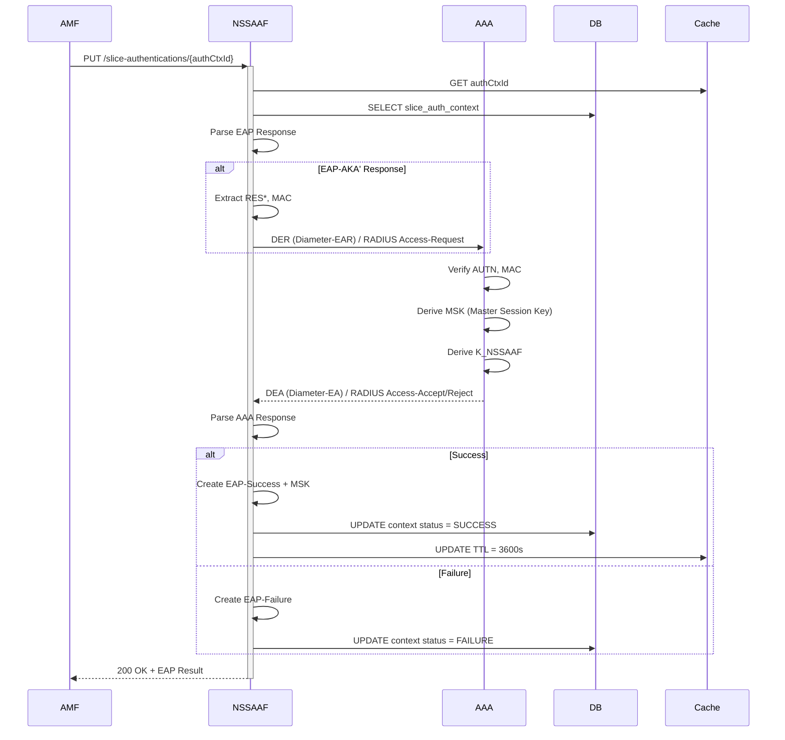
```mermaid
sequenceDiagram
    participant AMF
    participant NSSAAF
    participant AAA
    participant DB

    AMF->>+NSSAAF: PUT /slice-authentications/{authCtxId}
    NSSAAF->>Cache: GET authCtxId
    NSSAAF->>DB: SELECT slice_auth_context
    
    NSSAAF->>NSSAAF: Parse EAP Response
    
    alt EAP-AKA' Response
        NSSAAF->>NSSAAF: Extract RES*, MAC
        NSSAAF->>AAA: DER (Diameter-EAR) / RADIUS Access-Request
    end
    
    AAA->>AAA: Verify AUTN, MAC
    AAA->>AAA: Derive MSK (Master Session Key)
    AAA->>AAA: Derive K_NSSAAF
    
    AAA-->>NSSAAF: DEA (Diameter-EA) / RADIUS Access-Accept/Reject
    NSSAAF->>NSSAAF: Parse AAA Response
    
    alt Success
        NSSAAF->>NSSAAF: Create EAP-Success + MSK
        NSSAAF->>DB: UPDATE context status = SUCCESS
        NSSAAF->>Cache: UPDATE TTL = 3600s
    else Failure
        NSSAAF->>NSSAAF: Create EAP-Failure
        NSSAAF->>DB: UPDATE context status = FAILURE
    end
    
    NSSAAF-->>-AMF: 200 OK + EAP Result
```

---

## 3. NSSAA Re-authentication Flow

### 3.1 Overview

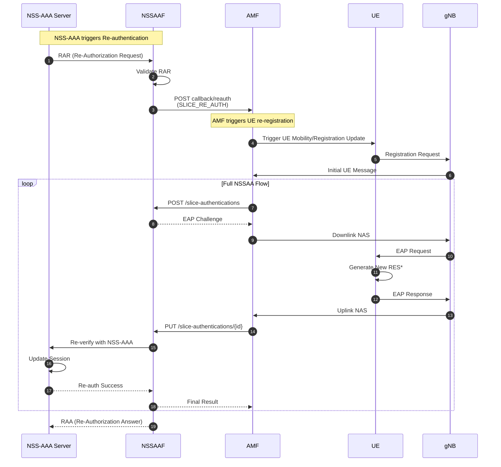
```mermaid
sequenceDiagram
    autonumber
    participant AAA as NSS-AAA Server
    participant NSSAAF
    participant AMF
    participant UE
    participant gNB

    Note over NSSAAF,AAA: NSS-AAA triggers Re-authentication
    
    AAA->>NSSAAF: RAR (Re-Authorization Request)
    NSSAAF->>NSSAAF: Validate RAR
    
    NSSAAF->>AMF: POST callback/reauth<br/>(SLICE_RE_AUTH)
    Note over AMF: AMF triggers UE re-registration
    
    AMF->>UE: Trigger UE Mobility/Registration Update
    UE->>gNB: Registration Request
    gNB->>AMF: Initial UE Message
    
    loop Full NSSAA Flow
        AMF->>NSSAAF: POST /slice-authentications
        NSSAAF-->>AMF: EAP Challenge
        AMF->>gNB: Downlink NAS
        gNB->>UE: EAP Request
        UE->>UE: Generate New RES*
        UE->>gNB: EAP Response
        gNB->>AMF: Uplink NAS
        AMF->>NSSAAF: PUT /slice-authentications/{id}
        NSSAAF->>AAA: Re-verify with NSS-AAA
        AAA->>AAA: Update Session
        AAA-->>NSSAAF: Re-auth Success
        NSSAAF-->>AMF: Final Result
    end
    
    NSSAAF-->>AAA: RAA (Re-Authorization Answer)
```

### 3.2 Step by Step

#### Bước 1: NSS-AAA Server trigger Re-auth

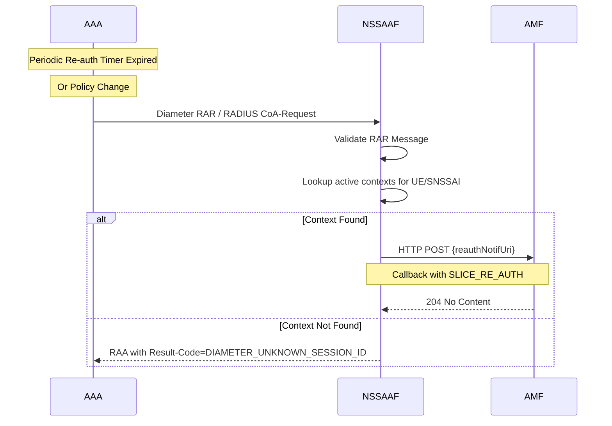
```mermaid
sequenceDiagram
    participant AAA
    participant NSSAAF
    participant AMF

    Note over AAA: Periodic Re-auth Timer Expired
    Note over AAA: Or Policy Change
    
    AAA->>NSSAAF: Diameter RAR / RADIUS CoA-Request
    NSSAAF->>NSSAAF: Validate RAR Message
    NSSAAF->>NSSAAF: Lookup active contexts for UE/SNSSAI
    
    alt Context Found
        NSSAAF->>AMF: HTTP POST {reauthNotifUri}
        Note over NSSAAF,AMF: Callback with SLICE_RE_AUTH
        AMF-->>NSSAAF: 204 No Content
    else Context Not Found
        NSSAAF-->>AAA: RAA with Result-Code=DIAMETER_UNKNOWN_SESSION_ID
    end
```

#### Bước 2: AMF trigger UE

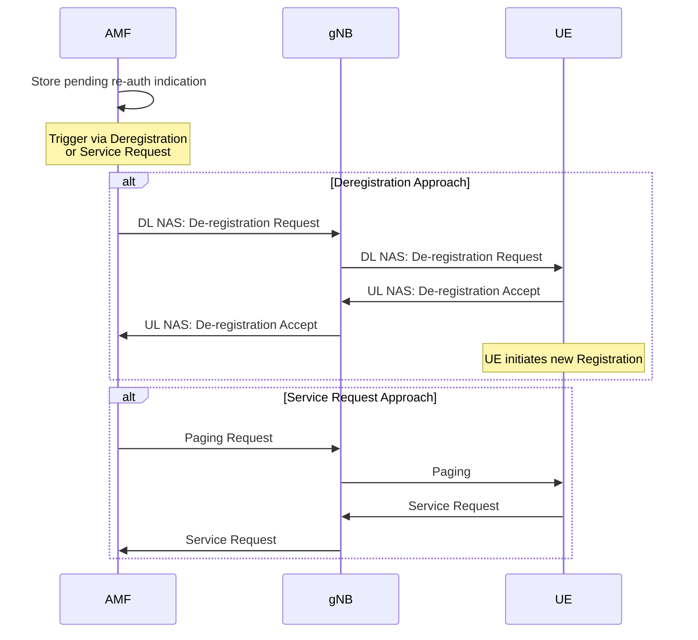
```mermaid
sequenceDiagram
    participant AMF
    participant gNB
    participant UE

    AMF->>AMF: Store pending re-auth indication
    Note over AMF: Trigger via Deregistration<br/>or Service Request
    
    alt Deregistration Approach
        AMF->>gNB: DL NAS: De-registration Request
        gNB->>UE: DL NAS: De-registration Request
        UE->>gNB: UL NAS: De-registration Accept
        gNB->>AMF: UL NAS: De-registration Accept
        Note over UE: UE initiates new Registration
    end
    
    alt Service Request Approach
        AMF->>gNB: Paging Request
        gNB->>UE: Paging
        UE->>gNB: Service Request
        gNB->>AMF: Service Request
    end
```

---

## 4. NSSAA Revocation Flow

### 4.1 Overview

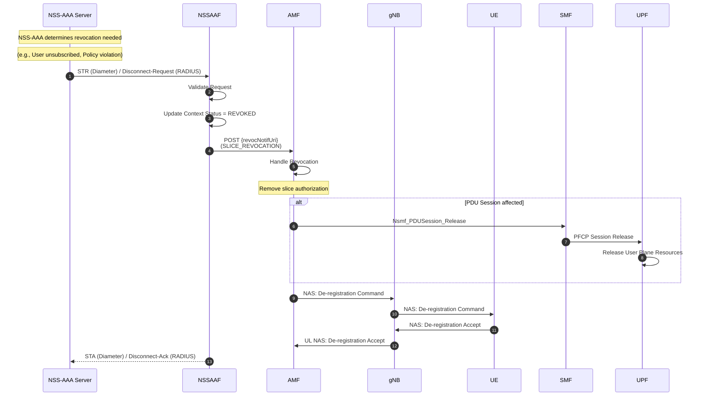
```mermaid
sequenceDiagram
    autonumber
    participant AAA as NSS-AAA Server
    participant NSSAAF
    participant AMF
    participant gNB
    participant UE
    participant SMF
    participant UPF

    Note over AAA: NSS-AAA determines revocation needed
    Note over AAA: (e.g., User unsubscribed, Policy violation)

    AAA->>NSSAAF: STR (Diameter) / Disconnect-Request (RADIUS)
    NSSAAF->>NSSAAF: Validate Request
    
    NSSAAF->>NSSAAF: Update Context Status = REVOKED
    NSSAAF->>AMF: POST {revocNotifUri}<br/>(SLICE_REVOCATION)
    
    AMF->>AMF: Handle Revocation
    Note over AMF: Remove slice authorization
    
    alt PDU Session affected
        AMF->>SMF: Nsmf_PDUSession_Release
        SMF->>UPF: PFCP Session Release
        UPF->>UPF: Release User Plane Resources
    end
    
    AMF->>gNB: NAS: De-registration Command
    gNB->>UE: NAS: De-registration Command
    UE->>gNB: NAS: De-registration Accept
    gNB->>AMF: UL NAS: De-registration Accept
    
    NSSAAF-->>AAA: STA (Diameter) / Disconnect-Ack (RADIUS)
```

### 4.2 Step by Step Revocation

#### Bước 1: NSS-AAA gửi Revocation Request

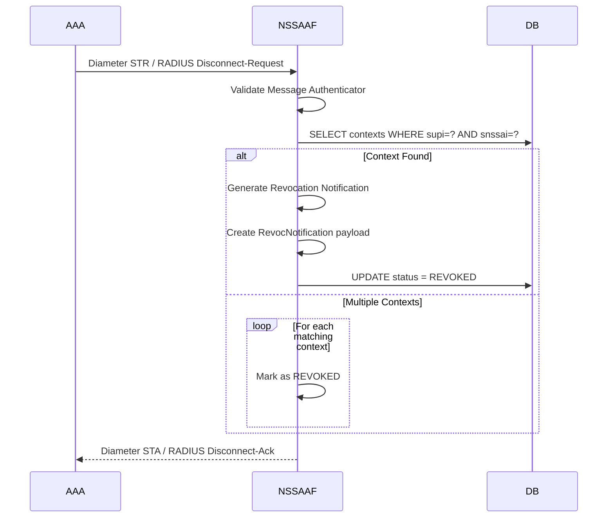
```mermaid
sequenceDiagram
    participant AAA
    participant NSSAAF
    participant DB

    AAA->>NSSAAF: Diameter STR / RADIUS Disconnect-Request
    NSSAAF->>NSSAAF: Validate Message Authenticator
    
    NSSAAF->>DB: SELECT contexts WHERE supi=? AND snssai=?
    
    alt Context Found
        NSSAAF->>NSSAAF: Generate Revocation Notification
        NSSAAF->>NSSAAF: Create RevocNotification payload
        NSSAAF->>DB: UPDATE status = REVOKED
    else Multiple Contexts
        loop For each matching context
            NSSAAF->>NSSAAF: Mark as REVOKED
        end
    end
    
    NSSAAF-->>AAA: Diameter STA / RADIUS Disconnect-Ack
```

#### Bước 2: AMF xử lý Revocation

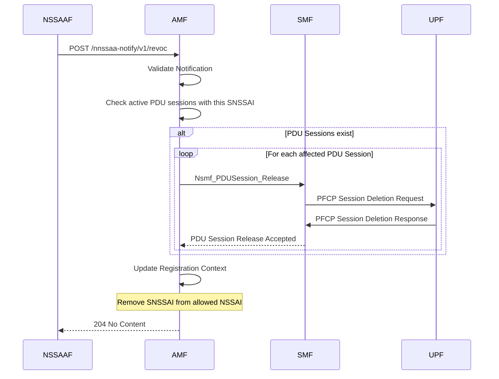
```mermaid
sequenceDiagram
    participant NSSAAF
    participant AMF
    participant SMF
    participant UPF

    NSSAAF->>AMF: POST /nnssaa-notify/v1/revoc
    AMF->>AMF: Validate Notification
    
    AMF->>AMF: Check active PDU sessions with this SNSSAI
    
    alt PDU Sessions exist
        loop For each affected PDU Session
            AMF->>SMF: Nsmf_PDUSession_Release
            SMF->>UPF: PFCP Session Deletion Request
            UPF->>SMF: PFCP Session Deletion Response
            SMF-->>AMF: PDU Session Release Accepted
        end
    end
    
    AMF->>AMF: Update Registration Context
    Note over AMF: Remove SNSSAI from allowed NSSAI
    
    AMF-->>NSSAAF: 204 No Content
```

---

## 5. AIW (AAA Interworking) Authentication Flow

### 5.1 EAP-TTLS Flow Overview

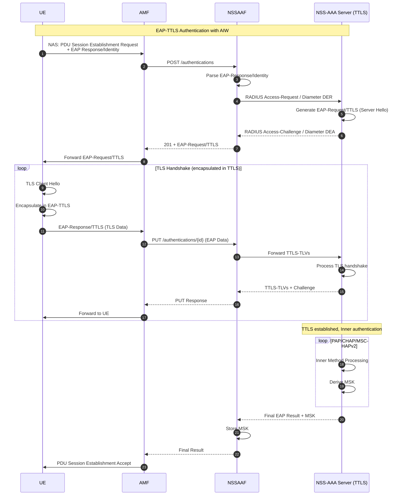
```mermaid
sequenceDiagram
    autonumber
    participant UE
    participant AMF
    participant NSSAAF
    participant AAA as NSS-AAA Server (TTLS)

    Note over UE,AAA: EAP-TTLS Authentication with AIW

    UE->>AMF: NAS: PDU Session Establishment Request<br/>+ EAP Response/Identity
    AMF->>NSSAAF: POST /authentications
    NSSAAF->>NSSAAF: Parse EAP-Response/Identity
    
    NSSAAF->>AAA: RADIUS Access-Request / Diameter DER
    AAA->>AAA: Generate EAP-Request/TTLS (Server Hello)
    
    AAA-->>NSSAAF: RADIUS Access-Challenge / Diameter DEA
    NSSAAF-->>AMF: 201 + EAP-Request/TTLS
    AMF->>UE: Forward EAP-Request/TTLS
    
    loop TLS Handshake (encapsulated in TTLS)
        UE->>UE: TLS Client Hello
        UE->>UE: Encapsulate in EAP-TTLS
        UE->>AMF: EAP-Response/TTLS (TLS Data)
        AMF->>NSSAAF: PUT /authentications/{id} (EAP Data)
        NSSAAF->>AAA: Forward TTLS-TLVs
        AAA->>AAA: Process TLS handshake
        AAA-->>NSSAAF: TTLS-TLVs + Challenge
        NSSAAF-->>AMF: PUT Response
        AMF->>UE: Forward to UE
    end
    
    Note over AAA: TTLS established, Inner authentication
    
    loop PAP/CHAP/MSCHAPv2
        AAA->>AAA: Inner Method Processing
        AAA->>AAA: Derive MSK
    end
    
    AAA-->>NSSAAF: Final EAP Result + MSK
    NSSAAF->>NSSAAF: Store MSK
    NSSAAF-->>AMF: Final Result
    AMF->>UE: PDU Session Establishment Accept
```

### 5.2 AIW Step by Step

#### Bước 1: Create Authentication Context

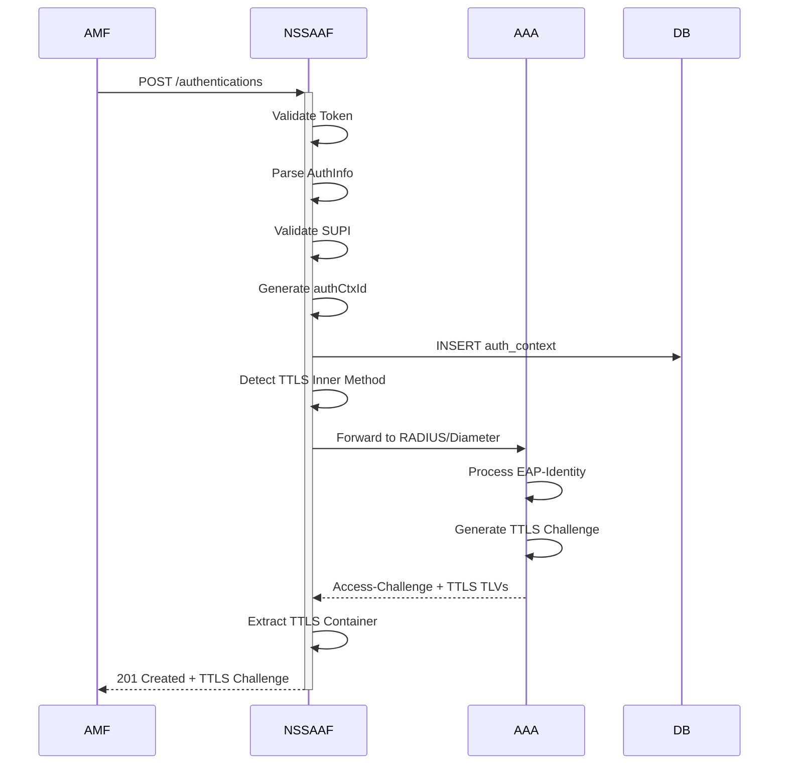
```mermaid
sequenceDiagram
    participant AMF
    participant NSSAAF
    participant AAA
    participant DB

    AMF->>+NSSAAF: POST /authentications
    NSSAAF->>NSSAAF: Validate Token
    
    NSSAAF->>NSSAAF: Parse AuthInfo
    NSSAAF->>NSSAAF: Validate SUPI
    
    NSSAAF->>NSSAAF: Generate authCtxId
    NSSAAF->>DB: INSERT auth_context
    
    NSSAAF->>NSSAAF: Detect TTLS Inner Method
    NSSAAF->>AAA: Forward to RADIUS/Diameter
    
    AAA->>AAA: Process EAP-Identity
    AAA->>AAA: Generate TTLS Challenge
    AAA-->>NSSAAF: Access-Challenge + TTLS TLVs
    NSSAAF->>NSSAAF: Extract TTLS Container
    NSSAAF-->>-AMF: 201 Created + TTLS Challenge
```

#### Bước 2: TTLS Tunnel Establishment

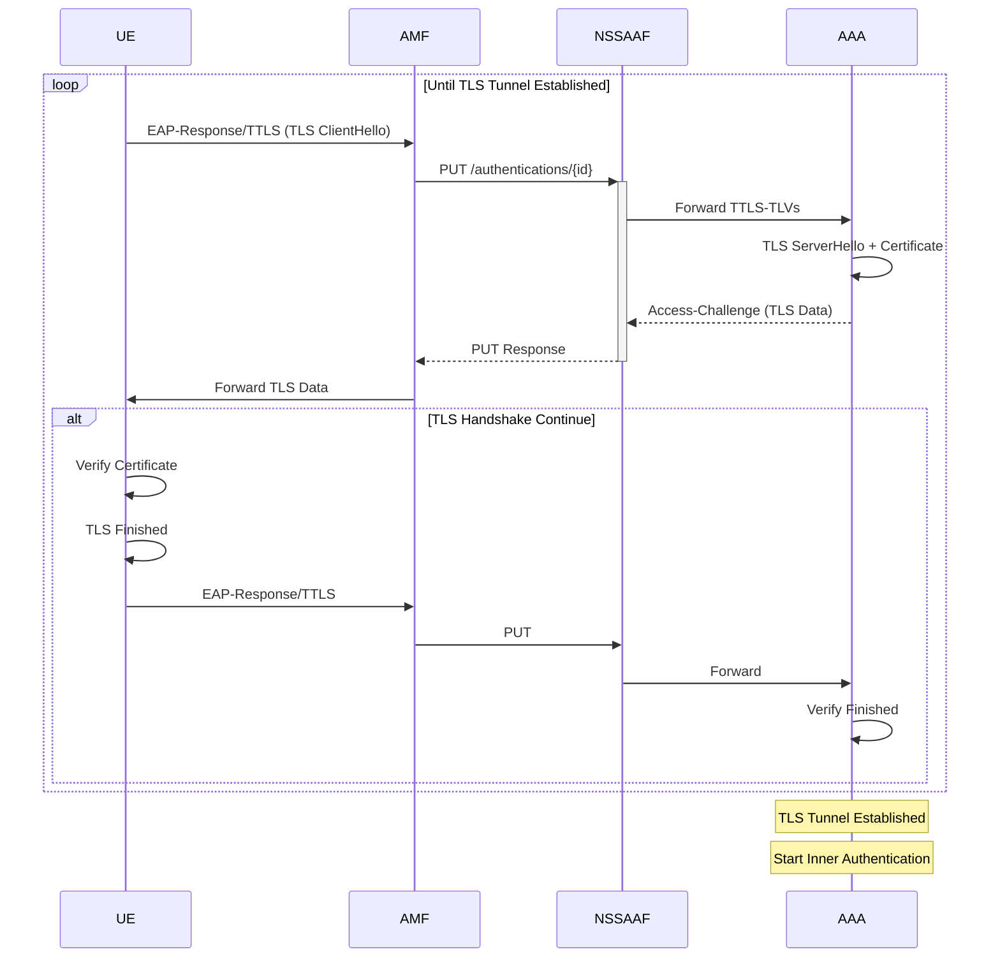
```mermaid
sequenceDiagram
    participant UE
    participant AMF
    participant NSSAAF
    participant AAA

    loop Until TLS Tunnel Established
        UE->>AMF: EAP-Response/TTLS (TLS ClientHello)
        AMF->>+NSSAAF: PUT /authentications/{id}
        NSSAAF->>AAA: Forward TTLS-TLVs
        AAA->>AAA: TLS ServerHello + Certificate
        AAA-->>NSSAAF: Access-Challenge (TLS Data)
        NSSAAF-->>-AMF: PUT Response
        AMF->>UE: Forward TLS Data
        
        alt TLS Handshake Continue
            UE->>UE: Verify Certificate
            UE->>UE: TLS Finished
            UE->>AMF: EAP-Response/TTLS
            AMF->>NSSAAF: PUT
            NSSAAF->>AAA: Forward
            AAA->>AAA: Verify Finished
        end
    end
    
    Note over AAA: TLS Tunnel Established
    Note over AAA: Start Inner Authentication
```

---

## 6. NF Registration and Discovery Flow

### 6.1 NSSAAF Registration to NRF

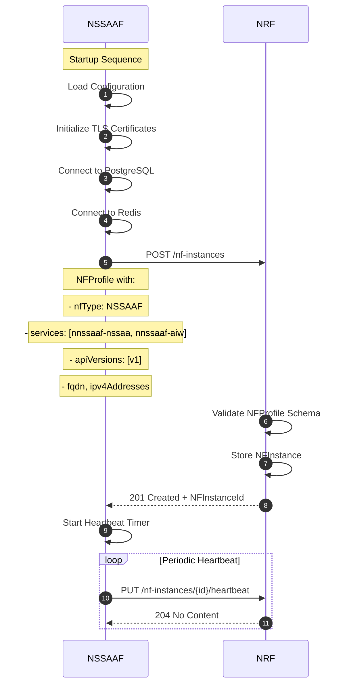
```mermaid
sequenceDiagram
    autonumber
    participant NSSAAF
    participant NRF

    Note over NSSAAF: Startup Sequence
    
    NSSAAF->>NSSAAF: Load Configuration
    NSSAAF->>NSSAAF: Initialize TLS Certificates
    NSSAAF->>NSSAAF: Connect to PostgreSQL
    NSSAAF->>NSSAAF: Connect to Redis
    
    NSSAAF->>NRF: POST /nf-instances
    Note over NSSAAF: NFProfile with:
    Note over NSSAAF: - nfType: NSSAAF
    Note over NSSAAF: - services: [nnssaaf-nssaa, nnssaaf-aiw]
    Note over NSSAAF: - apiVersions: [v1]
    Note over NSSAAF: - fqdn, ipv4Addresses
    
    NRF->>NRF: Validate NFProfile Schema
    NRF->>NRF: Store NFInstance
    NRF-->>NSSAAF: 201 Created + NFInstanceId
    
    NSSAAF->>NSSAAF: Start Heartbeat Timer
    
    loop Periodic Heartbeat
        NSSAAF->>NRF: PUT /nf-instances/{id}/heartbeat
        NRF-->>NSSAAF: 204 No Content
    end
```

### 6.2 AMF Discovery NSSAAF

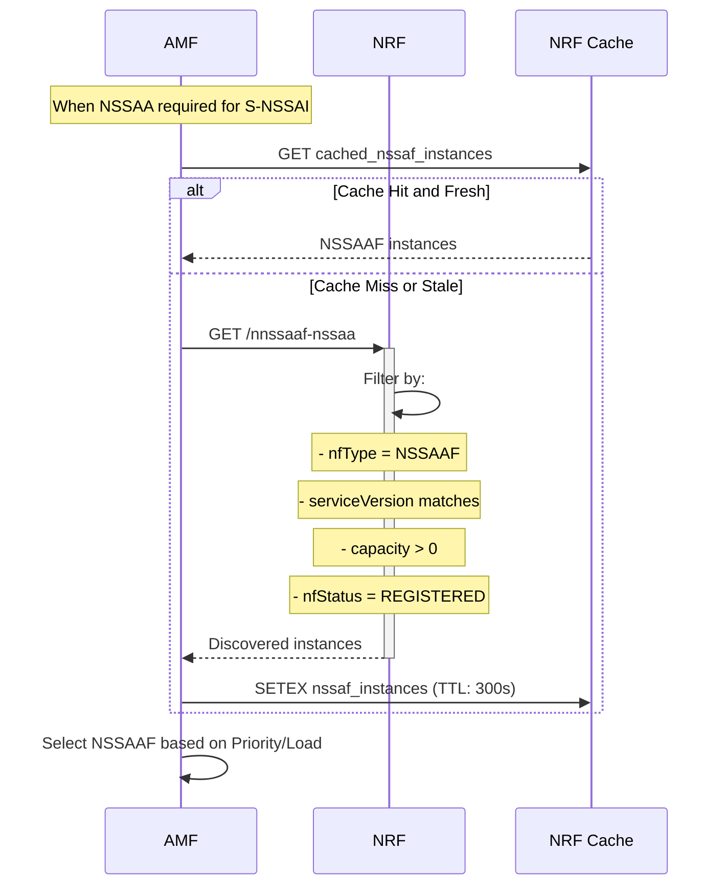
```mermaid
sequenceDiagram
    participant AMF
    participant NRF
    participant Cache as NRF Cache

    Note over AMF: When NSSAA required for S-NSSAI

    AMF->>Cache: GET cached_nssaf_instances
    alt Cache Hit and Fresh
        Cache-->>AMF: NSSAAF instances
    else Cache Miss or Stale
        AMF->>+NRF: GET /nnssaaf-nssaa
        NRF->>NRF: Filter by:
        Note over NRF: - nfType = NSSAAF
        Note over NRF: - serviceVersion matches
        Note over NRF: - capacity > 0
        Note over NRF: - nfStatus = REGISTERED
        
        NRF-->>-AMF: Discovered instances
        
        AMF->>Cache: SETEX nssaf_instances (TTL: 300s)
    end
    
    AMF->>AMF: Select NSSAAF based on Priority/Load
```

---

## 7. Error Handling Flows

### 7.1 Timeout Handling

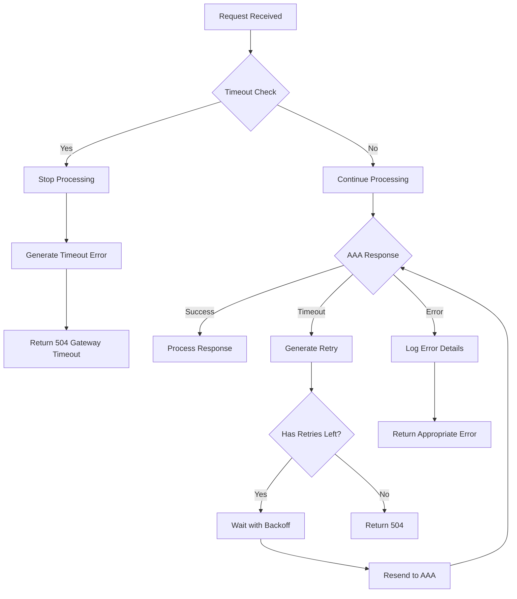
```mermaid
flowchart TD
    A[Request Received] --> B{Timeout Check}
    B -->|Yes| C[Stop Processing]
    C --> D[Generate Timeout Error]
    D --> E[Return 504 Gateway Timeout]
    
    B -->|No| F[Continue Processing]
    F --> G{AAA Response}
    
    G -->|Success| H[Process Response]
    G -->|Timeout| I[Generate Retry]
    I --> J{Has Retries Left?}
    J -->|Yes| K[Wait with Backoff]
    K --> L[Resend to AAA]
    L --> G
    J -->|No| M[Return 504]
    
    G -->|Error| N[Log Error Details]
    N --> O[Return Appropriate Error]
```

### 7.2 Database Failover

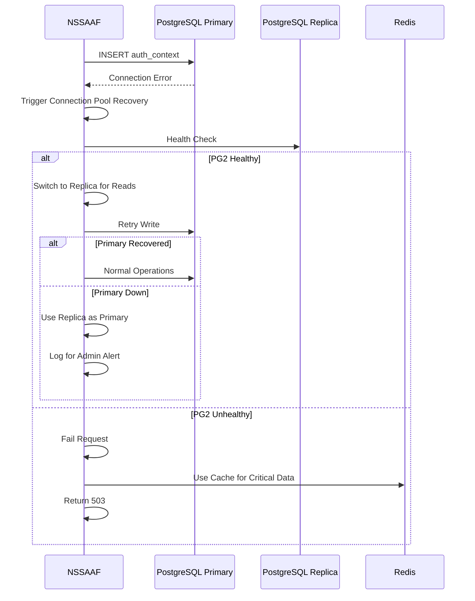
```mermaid
sequenceDiagram
    participant NSSAAF
    participant PG1 as PostgreSQL Primary
    participant PG2 as PostgreSQL Replica
    participant Redis

    NSSAAF->>PG1: INSERT auth_context
    PG1-->>NSSAAF: Connection Error
    
    NSSAAF->>NSSAAF: Trigger Connection Pool Recovery
    
    NSSAAF->>PG2: Health Check
    alt PG2 Healthy
        NSSAAF->>NSSAAF: Switch to Replica for Reads
        NSSAAF->>PG1: Retry Write
        alt Primary Recovered
            NSSAAF->>PG1: Normal Operations
        else Primary Down
            NSSAAF->>NSSAAF: Use Replica as Primary
            NSSAAF->>NSSAAF: Log for Admin Alert
        end
    else PG2 Unhealthy
        NSSAAF->>NSSAAF: Fail Request
        NSSAAF->>Redis: Use Cache for Critical Data
        NSSAAF->>NSSAAF: Return 503
    end
```

---

## 8. Context Lifecycle Management

### 8.1 Context States

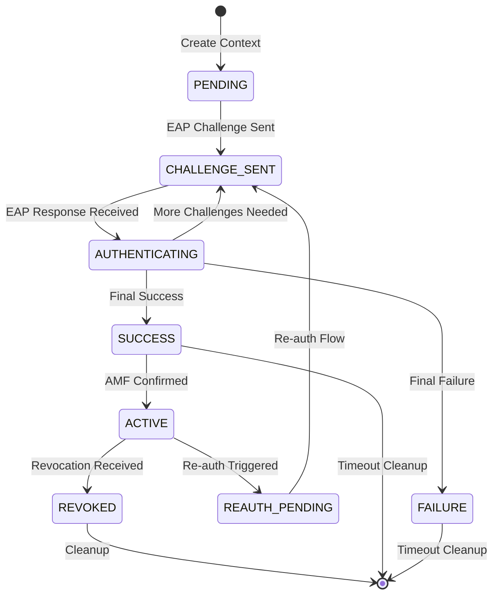
```mermaid
stateDiagram-v2
    [*] --> PENDING: Create Context
    PENDING --> CHALLENGE_SENT: EAP Challenge Sent
    CHALLENGE_SENT --> AUTHENTICATING: EAP Response Received
    AUTHENTICATING --> CHALLENGE_SENT: More Challenges Needed
    AUTHENTICATING --> SUCCESS: Final Success
    AUTHENTICATING --> FAILURE: Final Failure
    SUCCESS --> ACTIVE: AMF Confirmed
    ACTIVE --> REAUTH_PENDING: Re-auth Triggered
    ACTIVE --> REVOKED: Revocation Received
    REAUTH_PENDING --> CHALLENGE_SENT: Re-auth Flow
    REVOKED --> [*]: Cleanup
    SUCCESS --> [*]: Timeout Cleanup
    FAILURE --> [*]: Timeout Cleanup
```

### 8.2 Context Cleanup Timer

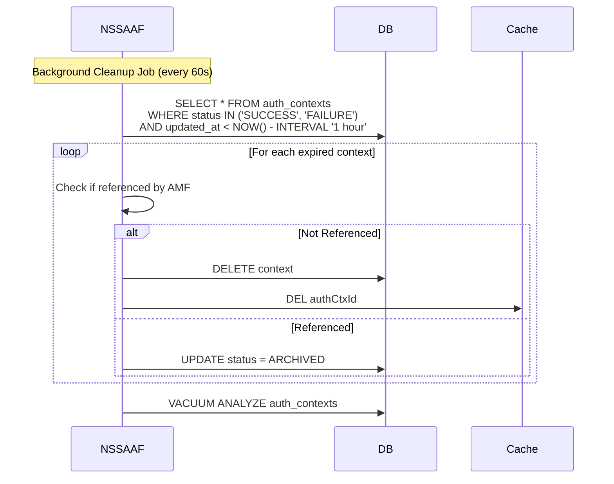
```mermaid
sequenceDiagram
    participant NSSAAF
    participant DB
    participant Cache

    Note over NSSAAF: Background Cleanup Job (every 60s)

    NSSAAF->>DB: SELECT * FROM auth_contexts<br/>WHERE status IN ('SUCCESS', 'FAILURE')<br/>AND updated_at < NOW() - INTERVAL '1 hour'
    
    loop For each expired context
        NSSAAF->>NSSAAF: Check if referenced by AMF
        alt Not Referenced
            NSSAAF->>DB: DELETE context
            NSSAAF->>Cache: DEL authCtxId
        else Referenced
            NSSAAF->>DB: UPDATE status = ARCHIVED
        end
    end
    
    NSSAAF->>DB: VACUUM ANALYZE auth_contexts
```

---

## 9. Notification Flows

### 9.1 Callback URL Configuration

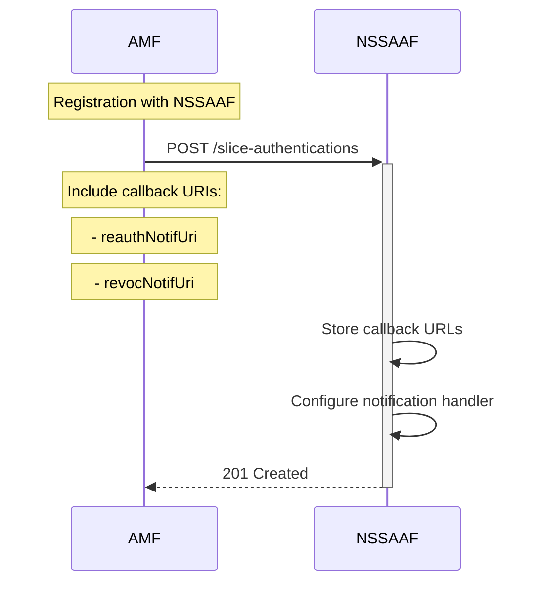
```mermaid
sequenceDiagram
    participant AMF
    participant NSSAAF

    Note over AMF: Registration with NSSAAF
    
    AMF->>+NSSAAF: POST /slice-authentications
    Note over AMF: Include callback URIs:
    Note over AMF: - reauthNotifUri
    Note over AMF: - revocNotifUri
    
    NSSAAF->>NSSAAF: Store callback URLs
    NSSAAF->>NSSAAF: Configure notification handler
    
    NSSAAF-->>-AMF: 201 Created
```

### 9.2 Notification Delivery with Retry

```mermaid
sequenceDiagram
    participant NSSAAF
    participant AMF

    NSSAAF->>NSSAAF: Prepare Notification Payload
    NSSAAF->>NSSAAF: Generate OAuth2 Callback Token
    
    loop Retry 3 times with exponential backoff
        NSSAAF->>AMF: POST {callbackUri}
        alt Success (2xx)
            AMF-->>NSSAAF: 204 No Content
            NSSAAF->>NSSAAF: Log success
        else Transient Error (5xx)
            NSSAAF->>NSSAAF: Wait (1s, 2s, 4s)
        else Client Error (4xx)
            NSSAAF->>NSSAAF: Log error, stop retry
        end
    end
    
    alt All retries failed
        NSSAAF->>NSSAAF: Queue for async retry
        NSSAAF->>NSSAAF: Alert monitoring
    end
```

---

## 10. Key Derivation Flows

### 10.1 MSK Derivation (EAP-TLS)

```mermaid
sequenceDiagram
    participant UE
    participant NSSAAF
    participant AAA

    Note over AAA: TLS 1.3 Handshake Complete
    
    AAA->>AAA: Derive TLS Master Secret
    AAA->>AAA: Derive TLS Session Hash
    
    AAA->>AAA: Derive EMS (Extended Master Secret)
    AAA->>AAA: Derive MSK (Master Session Key)
    
    Note over AAA: MSK = first 64 octets of<br/>TLS-Exporter-Master-Secret
    
    AAA->>AAA: Derive K_NSSAAF (for NSSAAF-AAA)
    AAA->>AAA: Derive AMF-Key (for AMF)
    
    AAA-->>NSSAAF: Access-Accept + MSK
    NSSAAF->>NSSAAF: Validate MSK
    
    NSSAAF->>NSSAAF: Derive AMF-Key from MSK
    NSSAAF-->>AMF: Return AMF-Key in response
    
    Note over AMF: AMF stores AMF-Key
    Note over AMF: for slice-specific NAS security
```

### 10.2 EAP-AKA' Key Derivation

```mermaid
sequenceDiagram
    participant UE
    participant AUSF as AUSF/SEAF
    participant NSSAAF
    participant AAA

    Note over AAA: AKA' Authentication Vector Received

    AAA->>AAA: Compute CK', IK' from AKA' Algorithm
    AAA->>AAA: Derive KAUSF from CK', IK'
    AAA->>AAA: Derive XRES* from RES*
    
    AAA->>AAA: Derive MSK = HMAC(K_NSSAAF, "MSK")
    AAA->>AAA: Derive AMF-Key = HMAC(K_NSSAAF, "AMF-Key")
    
    AAA-->>NSSAAF: Authentication-Result + MSK + AMF-Key
    NSSAAF->>NSSAAF: Validate Response
    
    NSSAAF->>NSSAAF: Derive NAS Integrity Key<br/>for this SNSSAI
    NSSAAF-->>AMF: Return slice-specific keys
```

---

## 11. Multi-Slice Authentication

### 11.1 Sequential Slice Authentication

```mermaid
sequenceDiagram
    participant UE
    participant AMF
    participant NSSAAF1 as NSSAAF (Slice 1)
    participant NSSAAF2 as NSSAAF (Slice 2)

    Note over UE: Registration with 2 S-NSSAIs
    
    AMF->>NSSAAF1: POST /slice-authentications (SNSSAI 1)
    NSSAAF1-->>AMF: EAP Challenge 1
    AMF->>UE: Forward Challenge 1
    UE->>AMF: EAP Response 1
    AMF->>NSSAAF1: PUT (Response 1)
    NSSAAF1-->>AMF: Success/Failure 1
    
    alt Slice 1 Success
        AMF->>NSSAAF2: POST /slice-authentications (SNSSAI 2)
        NSSAAF2-->>AMF: EAP Challenge 2
        AMF->>UE: Forward Challenge 2
        UE->>AMF: EAP Response 2
        AMF->>NSSAAF2: PUT (Response 2)
        NSSAAF2-->>AMF: Success/Failure 2
    end
    
    alt Both Slices Authorized
        AMF->>AMF: Aggregate NSSAA Results
        AMF->>UE: Registration Accept with 2 S-NSSAIs
    else Any Slice Failed
        AMF->>AMF: Handle Authorization Failure
        AMF->>UE: Registration Reject / Partial Accept
    end
```

### 11.2 Parallel Slice Authentication

```mermaid
sequenceDiagram
    participant UE
    participant AMF
    participant NSSAAF as NSSAAFs

    Note over AMF: Multiple Slices require NSSAA

    par Parallel Authentication
        AMF->>NSSAAF: POST /slice-authentications (SNSSAI 1)
        AMF->>NSSAAF: POST /slice-authentications (SNSSAI 2)
        NSSAAF-->>AMF: Challenge 1
        NSSAAF-->>AMF: Challenge 2
    end
    
    Note over UE: UE processes challenges sequentially<br/>(same UE capability)
    
    AMF->>UE: Challenge 1
    UE->>AMF: Response 1
    AMF->>NSSAAF: PUT (Response 1)
    NSSAAF-->>AMF: Result 1
    
    AMF->>UE: Challenge 2
    UE->>AMF: Response 2
    AMF->>NSSAAF: PUT (Response 2)
    NSSAAF-->>AMF: Result 2
    
    AMF->>AMF: Aggregate Results
```

---

## 12. Inter-PLMN Roaming Flow

### 12.1 Visited PLMN NSSAA

```mermaid
sequenceDiagram
    autonumber
    participant UE
    participant V_AMF as AMF (Visited)
    participant H_AMF as AMF (Home)
    participant H_NSSAAF as NSSAAF (Home)
    participant NSS_AAA as NSS-AAA (Home)
    participant SEPP as SEPP

    Note over UE,H_NSSAAF: Cross-PLMN NSSAA Flow

    V_AMF->>H_AMF: Initial Registration (via AMF)
    H_AMF->>H_AMF: Determine NSSAA Required
    
    H_AMF->>SEPP: Discover H-NSSAAF
    SEPP->>H_NSSAAF: Discover via NRF
    H_NSSAAF-->>SEPP: NSSAAF URI
    SEPP-->>H_AMF: NSSAAF URI
    
    H_AMF->>H_NSSAAF: POST /slice-authentications<br/>(via SEPP)
    SEPP->>SEPP: Apply Security (N32-c)
    SEPP->>H_NSSAAF: Forward Request
    H_NSSAAF->>NSS_AAA: Process Authentication
    NSS_AAA-->>H_NSSAAF: Result
    H_NSSAAF->>SEPP: Response
    SEPP->>SEPP: Apply Security (N32-c)
    SEPP-->>H_AMF: Forward Response
    H_AMF-->>V_AMF: NSSAA Result via AMF
    
    V_AMF->>UE: Registration Accept (if authorized)
```

---

**Document Author:** NSSAAF Design Team
**Next Document:** Part 4 - Database Design
