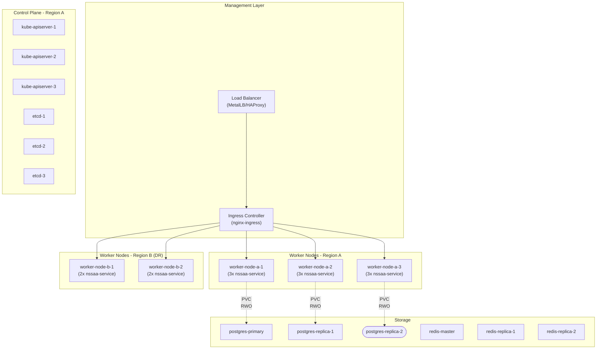

# NSSAAF Detail Design - Part 5: High Availability & Kubernetes Deployment

**Document Version:** 1.0.0
**Date:** 2026-04-13
**Project:** NSSAAF (Network Slice-Specific Authentication and Authorization Function)
**Platform:** Kubernetes (Kubeadm)

---

## 1. Kubernetes Cluster Architecture

### 1.1 Cluster Overview



### 1.2 Node Configuration

```yaml
# Node Labels and Taints
node_labels:
  nssaaf/enabled: "true"
  nssaaf/zones: "primary"  # or "dr"
  topology.kubernetes.io/region: "region-a"
  topology.kubernetes.io/zone: "zone-1"

node_taints:
  - key: "nssaaf/enabled"
    value: "true"
    effect: "NoSchedule"
```

---

## 2. Kubernetes Manifests

### 2.1 Namespace

```yaml
apiVersion: v1
kind: Namespace
metadata:
  name: nssaaf
  labels:
    app.kubernetes.io/part-of: 5gc
    topo.domain: core
    security.openshift.io/scc.podSecurityLabelSync: "false"
---
apiVersion: v1
kind: Namespace
metadata:
  name: nssaaf-infra
  labels:
    app.kubernetes.io/part-of: 5gc
    topo.domain: core
```

### 2.2 ConfigMap

```yaml
apiVersion: v1
kind: ConfigMap
metadata:
  name: nssaaf-config
  namespace: nssaaf
data:
  nssaaf.yaml: |
    server:
      host: "0.0.0.0"
      port: 8081
      read_timeout: 10s
      write_timeout: 30s
      idle_timeout: 120s
    
    nrf:
      base_url: "https://nrf.operator.com"
      timeout: 5s
      retry:
        max_attempts: 3
        backoff: 500ms
    
    database:
      host: "postgres-primary"
      port: 5432
      name: "nssaaf"
      user: "nssaa_app"
      max_open_conns: 100
      max_idle_conns: 10
      conn_max_lifetime: 30m
    
    redis:
      addrs:
        - "redis-cluster:6379"
      password: ""
      db: 0
      pool_size: 100
    
    aaa:
      default_timeout: 10s
      retry_attempts: 2
    
    auth:
      msk_encryption_key_ref: "vault:secret/data/nssaaf/msk-key"
      session_key_ttl: 3600s
    
    logging:
      level: "info"
      format: "json"
      sampling:
        initial: 100
        thereafter: 100
```

### 2.3 Secrets

```yaml
apiVersion: v1
kind: Secret
metadata:
  name: nssaaf-secrets
  namespace: nssaaf
type: Opaque
stringData:
  db_password: "xxx"  # Should use external secrets management
  redis_password: ""
  msk_encryption_key: "base64-encoded-32-byte-key"
---
apiVersion: cert-manager.io/v1
kind: Certificate
metadata:
  name: nssaaf-server-cert
  namespace: nssaaf
spec:
  secretName: nssaaf-server-cert
  issuerRef:
    name: letsencrypt-prod
    kind: ClusterIssuer
  dnsNames:
    - nssaaf.operator.com
    - nssaaf
    - nssaaf.nssaaf.svc.cluster.local
```

### 2.4 Deployment - NSSAA Service

```yaml
apiVersion: apps/v1
kind: Deployment
metadata:
  name: nssaa-service
  namespace: nssaaf
  labels:
    app: nssaa-service
    version: v1
spec:
  replicas: 3
  revisionHistoryLimit: 5
  strategy:
    type: RollingUpdate
    rollingUpdate:
      maxSurge: 25%
      maxUnavailable: 0
  selector:
    matchLabels:
      app: nssaa-service
  template:
    metadata:
      labels:
        app: nssaa-service
        version: v1
      annotations:
        prometheus.io/scrape: "true"
        prometheus.io/port: "8081"
        prometheus.io/path: "/metrics"
    spec:
      # Pod Anti-Affinity for HA
      affinity:
        podAntiAffinity:
          requiredDuringSchedulingIgnoredDuringExecution:
          - labelSelector:
              matchExpressions:
              - key: app
                operator: In
                values:
                - nssaa-service
            topologyKey: kubernetes.io/hostname
        # Spread across zones
        podAntiAffinity:
          preferredDuringSchedulingIgnoredDuringExecution:
          - weight: 100
            podAffinityTerm:
              labelSelector:
                matchExpressions:
                - key: app
                  operator: In
                  values:
                  - nssaa-service
              topologyKey: topology.kubernetes.io/zone
      # Topology Spread
      topologySpreadConstraints:
      - maxSkew: 1
        topologyKey: topology.kubernetes.io/zone
        whenUnsatisfiable: ScheduleAnyway
        labelSelector:
          matchLabels:
            app: nssaa-service
      
      # Security Context
      securityContext:
        runAsNonRoot: true
        runAsUser: 1000
        fsGroup: 1000
        seccompProfile:
          type: RuntimeDefault
      
      containers:
      - name: nssaa-service
        image: nssaaf/nssaa-service:1.0.0
        imagePullPolicy: Always
        
        ports:
        - containerPort: 8081
          name: http
          protocol: TCP
        
        resources:
          requests:
            memory: "512Mi"
            cpu: "500m"
          limits:
            memory: "2Gi"
            cpu: "2000m"
        
        env:
        - name: POD_NAME
          valueFrom:
            fieldRef:
              fieldPath: metadata.name
        - name: POD_NAMESPACE
          valueFrom:
            fieldRef:
              fieldPath: metadata.namespace
        - name: CONFIG_FILE
          value: "/config/nssaaf.yaml"
        
        envFrom:
        - secretRef:
            name: nssaaf-secrets
        
        volumeMounts:
        - name: config
          mountPath: /config
          readOnly: true
        - name: tls-cert
          mountPath: /tls
          readOnly: true
        
        # Health Probes
        startupProbe:
          httpGet:
            path: /health/startup
            port: 8081
          initialDelaySeconds: 10
          periodSeconds: 5
          failureThreshold: 30
        livenessProbe:
          httpGet:
            path: /health/live
            port: 8081
          initialDelaySeconds: 30
          periodSeconds: 10
          failureThreshold: 3
        readinessProbe:
          httpGet:
            path: /health/ready
            port: 8081
          initialDelaySeconds: 5
          periodSeconds: 5
          failureThreshold: 3
        
        securityContext:
          allowPrivilegeEscalation: false
          readOnlyRootFilesystem: true
          capabilities:
            drop:
            - ALL
        
      volumes:
      - name: config
        configMap:
          name: nssaaf-config
      - name: tls-cert
        secret:
          secretName: nssaaf-server-cert
      
      # Graceful shutdown
      terminationGracePeriodSeconds: 60
```

### 2.5 Service

```yaml
apiVersion: v1
kind: Service
metadata:
  name: nssaa-service
  namespace: nssaaf
  labels:
    app: nssaaf
  annotations:
    # External DNS annotation for NRF
    external-dns.alpha.kubernetes.io/hostname: nssaaf.operator.com
spec:
  type: ClusterIP
  ports:
  - name: http
    port: 8081
    targetPort: 8081
    protocol: TCP
  selector:
    app: nssaa-service
---
apiVersion: v1
kind: Service
metadata:
  name: nssaa-service-headless
  namespace: nssaaf
spec:
  clusterIP: None
  ports:
  - name: http
    port: 8081
    targetPort: 8081
  selector:
    app: nssaa-service
```

### 2.6 Horizontal Pod Autoscaler

```yaml
apiVersion: autoscaling/v2
kind: HorizontalPodAutoscaler
metadata:
  name: nssaa-service-hpa
  namespace: nssaaf
spec:
  scaleTargetRef:
    apiVersion: apps/v1
    kind: Deployment
    name: nssaa-service
  minReplicas: 3
  maxReplicas: 20
  
  metrics:
  - type: Resource
    resource:
      name: cpu
      target:
        type: Utilization
        averageUtilization: 70
  
  - type: Resource
    resource:
      name: memory
      target:
        type: Utilization
        averageUtilization: 80
  
  - type: Pods
    pods:
      metric:
        name: nssaaf_http_requests_per_second
      target:
        type: AverageValue
        averageValue: "100"
  
  behavior:
    scaleDown:
      stabilizationWindowSeconds: 300
      policies:
      - type: Percent
        value: 10
        periodSeconds: 60
    scaleUp:
      stabilizationWindowSeconds: 0
      policies:
      - type: Percent
        value: 100
        periodSeconds: 15
      - type: Pods
        value: 4
        periodSeconds: 15
      selectPolicy: Max
```

### 2.7 Pod Disruption Budget

```yaml
apiVersion: policy/v1
kind: PodDisruptionBudget
metadata:
  name: nssaa-service-pdb
  namespace: nssaaf
spec:
  minAvailable: 2
  selector:
    matchLabels:
      app: nssaa-service
---
apiVersion: policy/v1
kind: PodDisruptionBudget
metadata:
  name: nssaa-service-pdb-maxunavailable
  namespace: nssaaf
spec:
  maxUnavailable: 1
  selector:
    matchLabels:
      app: nssaa-service
```

---

## 3. Service Mesh (Istio)

### 3.1 Virtual Service

```yaml
apiVersion: networking.istio.io/v1beta1
kind: VirtualService
metadata:
  name: nssaa-service
  namespace: nssaaf
spec:
  hosts:
  - nssaa-service
  - nssaa-service.nssaaf.svc.cluster.local
  - nssaaf.operator.com
  http:
  - match:
    - uri:
        prefix: "/nnssaaf-nssaa/v1/"
    route:
    - destination:
        host: nssaa-service
        port:
          number: 8081
    retries:
      attempts: 3
      perTryTimeout: 5s
      retryOn: connect-failure,reset,refused-stream,unavailable,cancelled,retriable-status-codes
    timeout: 30s
    cors:
      allowOrigins:
      - exact: "*"
      allowMethods:
      - POST
      - PUT
      - GET
      - OPTIONS
      allowHeaders:
      - "*"
      maxAge: 24h
  - match:
    - uri:
        prefix: "/nnssaaf-aiw/v1/"
    route:
    - destination:
        host: nssaa-service
        port:
          number: 8081
```

### 3.2 Destination Rules

```yaml
apiVersion: networking.istio.io/v1beta1
kind: DestinationRule
metadata:
  name: nssaa-service
  namespace: nssaaf
spec:
  host: nssaa-service
  trafficPolicy:
    connectionPool:
      http:
        h2UpgradePolicy: UPGRADE
        http1MaxPendingRequests: 1000
        http2MaxRequests: 1000
        maxRequestsPerConnection: 100
        maxRetries: 3
    loadBalancer:
      simple: LEAST_CONN
      localityLbSetting:
        enabled: true
        distribute:
        - from: region-a/*
          to:
            "region-a/*": 100
        - from: region-b/*
          to:
            "region-b/*": 100
    outlierDetection:
      consecutiveGatewayErrors: 5
      interval: 30s
      baseEjectionTime: 30s
      maxEjectionPercent: 50
      minHealthPercent: 30
    tls:
      mode: SIMPLE
      sni: nssaa-service
```

### 3.3 Authorization Policy

```yaml
apiVersion: security.istio.io/v1beta1
kind: AuthorizationPolicy
metadata:
  name: nssaa-service-authz
  namespace: nssaaf
spec:
  selector:
    matchLabels:
      app: nssaa-service
  action: ALLOW
  rules:
  # Allow from AMF namespace
  - from:
    - source:
        principals:
        - "cluster.local/ns/5gc/sa/amf-service"
    to:
    - operation:
        methods: ["POST", "PUT"]
        paths: ["/nnssaaf-nssaa/v1/*"]
  
  # Allow from internal services
  - from:
    - source:
        namespaces: ["istio-system", "nssaaf"]
    to:
    - operation:
        methods: ["GET"]
        paths: ["/health/*", "/metrics"]
  
  # Default deny
  - to:
    - operation:
        methods: ["*"]
```

---

## 4. Ingress Configuration

### 4.1 NGINX Ingress

```yaml
apiVersion: networking.k8s.io/v1
kind: Ingress
metadata:
  name: nssaa-service-ingress
  namespace: nssaaf
  annotations:
    nginx.ingress.kubernetes.io/ssl-redirect: "true"
    nginx.ingress.kubernetes.io/proxy-body-size: "10m"
    nginx.ingress.kubernetes.io/proxy-read-timeout: "60"
    nginx.ingress.kubernetes.io/proxy-send-timeout: "60"
    nginx.ingress.kubernetes.io/upstream-hash-by: "$request_id"
    nginx.ingress.kubernetes.io/limit-rps: "10000"
    nginx.ingress.kubernetes.io/limit-connections: "5000"
    nginx.ingress.kubernetes.io/rate-limit-window: "1s"
spec:
  ingressClassName: nginx
  tls:
  - hosts:
    - nssaaf.operator.com
    secretName: nssaaf-tls-cert
  rules:
  - host: nssaaf.operator.com
    http:
      paths:
      - path: /nnssaaf-nssaa
        pathType: Prefix
        backend:
          service:
            name: nssaa-service
            port:
              number: 8081
      - path: /nnssaaf-aiw
        pathType: Prefix
        backend:
          service:
            name: nssaa-service
            port:
              number: 8081
```

---

## 5. Database High Availability

### 5.1 PostgreSQL StatefulSet

```yaml
apiVersion: apps/v1
kind: StatefulSet
metadata:
  name: postgres-primary
  namespace: nssaaf-infra
spec:
  serviceName: postgres-primary
  replicas: 1
  selector:
    matchLabels:
      app: postgres
      role: primary
  template:
    metadata:
      labels:
        app: postgres
        role: primary
    spec:
      containers:
      - name: postgres
        image: postgres:15-alpine
        resources:
          requests:
            cpu: "1"
            memory: "2Gi"
          limits:
            cpu: "4"
            memory: "8Gi"
        env:
        - name: POSTGRES_DB
          value: nssaaf
        - name: POSTGRES_USER
          value: nssaa_app
        - name: POSTGRES_PASSWORD
          valueFrom:
            secretKeyRef:
              name: postgres-secrets
              key: password
        - name: POSTGRES_INITDB_ARGS
          value: "-c max_connections=500"
        - name: POSTGRES_SHARED_BUFFERS
          value: "1GB"
        - name: POSTGRES_EFFECTIVE_CACHE_SIZE
          value: "3GB"
        - name: POSTGRES_WORK_MEM
          value: "16MB"
        - name: POSTGRES_MAINTENANCE_WORK_MEM
          value: "256MB"
        ports:
        - containerPort: 5432
          name: postgres
        volumeMounts:
        - name: postgres-data
          mountPath: /var/lib/postgresql/data
        - name: postgres-config
          mountPath: /etc/postgresql
        livenessProbe:
          exec:
            command: ["pg_isready", "-U", "postgres"]
          initialDelaySeconds: 30
          periodSeconds: 10
        readinessProbe:
          exec:
            command: ["pg_isready", "-U", "postgres"]
          initialDelaySeconds: 5
          periodSeconds: 10
  volumeClaimTemplates:
  - metadata:
      name: postgres-data
    spec:
      accessModes: ["ReadWriteOnce"]
      storageClassName: "fast-ssd"
      resources:
        requests:
          storage: 100Gi
---
# Replica
apiVersion: apps/v1
kind: StatefulSet
metadata:
  name: postgres-replica
  namespace: nssaaf-infra
spec:
  serviceName: postgres-replica
  replicas: 2
  selector:
    matchLabels:
      app: postgres
      role: replica
  template:
    metadata:
      labels:
        app: postgres
        role: replica
    spec:
      containers:
      - name: postgres
        image: postgres:15-alpine
        env:
        - name: POSTGRES_DB
          value: nssaaf
        - name: POSTGRES_USER
          value: nssaa_app
        - name: POSTGRES_PASSWORD
          valueFrom:
            secretKeyRef:
              name: postgres-secrets
              key: password
        - name: POSTGRES_REPLICATION_USER
          value: repl_user
        - name: POSTGRES_REPLICATION_PASSWORD
          valueFrom:
            secretKeyRef:
              name: postgres-secrets
              key: repl_password
        - name: POSTGRES_REPLICATION_MODE
          value: "replica"
        - name: POSTGRES_REPLICATION_HOST
          value: "postgres-primary"
        command:
        - /bin/sh
        - -c
        - |
          exec docker-entrypoint.sh postgres
        ports:
        - containerPort: 5432
        volumeMounts:
        - name: postgres-data
          mountPath: /var/lib/postgresql/data
  volumeClaimTemplates:
  - metadata:
      name: postgres-data
    spec:
      accessModes: ["ReadWriteOnce"]
      storageClassName: "fast-ssd"
      resources:
        requests:
          storage: 100Gi
```

### 5.2 Redis Cluster

```yaml
apiVersion: apps/v1
kind: StatefulSet
metadata:
  name: redis-cluster
  namespace: nssaaf-infra
spec:
  serviceName: redis-cluster
  replicas: 6
  selector:
    matchLabels:
      app: redis
  template:
    metadata:
      labels:
        app: redis
    spec:
      containers:
      - name: redis
        image: redis:7-alpine
        command:
        - redis-server
        - /conf/redis.conf
        - --cluster-enabled
        - "yes"
        - --cluster-config-file
        - /data/nodes.conf
        ports:
        - containerPort: 6379
          name: redis
        - containerPort: 16379
          name: cluster
        volumeMounts:
        - name: conf
          mountPath: /conf
        - name: data
          mountPath: /data
  volumeClaimTemplates:
  - metadata:
      name: data
    spec:
      accessModes: ["ReadWriteOnce"]
      storageClassName: "fast-ssd"
      resources:
        requests:
          storage: 10Gi
```

---

## 6. Disaster Recovery

### 6.1 Cluster Federation

```yaml
# Kubefed Configuration for Multi-Cluster
apiVersion: core.kubefed.io/v1beta1
kind: KubeFedConfig
metadata:
  name: kubefed
  namespace: kube-federation-system
spec:
  scope: Namespaced
  controllerDuration:
    availableDelay: 20s
    unavailableDelay: 60s
  leaderElect:
    leaseDuration: 15s
    renewDeadline: 10s
    retryPeriod: 5s
    resourceLock: configmaps
  featureGates:
  - name: PushReconciler
    enabled: true
  - name: SchedulerPreferences
    enabled: true
```

### 6.2 Cross-Region Replication

```yaml
# PostgreSQL Async Replication to DR
apiVersion: v1
kind: Secret
metadata:
  name: dr-replication-secret
  namespace: nssaaf-infra
type: Opaque
stringData:
  replication: "xxx"

---
# CronJob for Database Backup to DR
apiVersion: batch/v1
kind: CronJob
metadata:
  name: backup-to-dr
  namespace: nssaaf-infra
spec:
  schedule: "0 4 * * *"
  jobTemplate:
    spec:
      template:
        spec:
          containers:
          - name: backup
            image: postgres:15-alpine
            command:
            - /bin/sh
            - -c
            - |
              pg_dump -h postgres-primary -U nssaa_app nssaaf | \
              gzip | \
              aws s3 cp - s3://backup-dr-region/nssaaf-$(date +%Y%m%d-%H%M%S).sql.gz
            env:
            - name: PGPASSWORD
              valueFrom:
                secretKeyRef:
                  name: postgres-secrets
                  key: password
          restartPolicy: OnFailure
```

---

## 7. Monitoring and Alerting

### 7.1 Prometheus Metrics

```yaml
apiVersion: monitoring.coreos.com/v1
kind: ServiceMonitor
metadata:
  name: nssaa-service-monitor
  namespace: nssaaf
spec:
  selector:
    matchLabels:
      app: nssaa-service
  endpoints:
  - port: http
    path: /metrics
    interval: 15s
  namespaceSelector:
    matchNames:
    - nssaaf
---
apiVersion: monitoring.coreos.com/v1
kind: PrometheusRule
metadata:
  name: nssaa-alerts
  namespace: nssaaf
spec:
  groups:
  - name: nssaa.authentication
    rules:
    - alert: HighAuthFailureRate
      expr: |
        sum(rate(nssaa_auth_result{result="FAILURE"}[5m])) / 
        sum(rate(nssaa_auth_result[5m])) > 0.1
      for: 5m
      labels:
        severity: warning
      annotations:
        summary: "High authentication failure rate"
        description: "Auth failure rate is {{ $value | humanizePercentage }}"
    
    - alert: HighAuthLatency
      expr: |
        histogram_quantile(0.99, 
          sum(rate(nssaa_auth_duration_bucket[5m])) by (le)
        ) > 1
      for: 5m
      labels:
        severity: critical
      annotations:
        summary: "High authentication latency"
        description: "99th percentile auth latency is {{ $value }}s"
    
    - alert: LowSuccessRate
      expr: |
        sum(rate(nssaa_auth_result{result="SUCCESS"}[1h])) / 
        sum(rate(nssaa_auth_result[1h])) < 0.99
      for: 30m
      labels:
        severity: warning
    
    - alert: NSSAAFDown
      expr: up{job="nssaa-service"} == 0
      for: 1m
      labels:
        severity: critical
      annotations:
        summary: "NSSAAF service is down"
        runbook_url: "https://wiki.operator.com/nssaaf-down"
```

### 7.2 Grafana Dashboard

```yaml
apiVersion: integreatly.org/v1alpha1
kind: GrafanaDashboard
metadata:
  name: nssaa-dashboard
  labels:
    app: grafana
spec:
  json: |
    {
      "title": "NSSAAF Overview",
      "panels": [
        {
          "title": "Authentication Success Rate",
          "type": "stat",
          "targets": [
            {
              "expr": "sum(nssaa_auth_result{result='SUCCESS'}) / sum(nssaa_auth_result) * 100"
            }
          ]
        },
        {
          "title": "Requests per Second",
          "type": "graph",
          "targets": [
            {
              "expr": "sum(rate(nssaa_http_requests_total[1m]))"
            }
          ]
        },
        {
          "title": "Auth Latency (p99)",
          "type": "graph",
          "targets": [
            {
              "expr": "histogram_quantile(0.99, sum(rate(nssaa_auth_duration_bucket[5m])) by (le))"
            }
          ]
        }
      ]
    }
```

---

## 8. Scaling Operations

### 8.1 Scale Up Procedure

```bash
#!/bin/bash
# scale-up-nssaaf.sh

# Step 1: Check current state
kubectl get pods -n nssaaf -l app=nssaa-service
kubectl get hpa -n nssaaf nssaa-service-hpa

# Step 2: Update HPA max replicas
kubectl patch hpa nssaa-service-hpa -n nssaaf \
  --patch '{"spec":{"maxReplicas":30}}'

# Step 3: Manual scale if needed
kubectl scale deployment nssaa-service -n nssaaf --replicas=10

# Step 4: Verify
kubectl get pods -n nssaaf -l app=nssaa-service -w
kubectl top pods -n nssaaf
```

### 8.2 Rolling Update Procedure

```bash
#!/bin/bash
# rolling-update-nssaaf.sh

NEW_IMAGE="nssaaf/nssaa-service:1.1.0"

# Step 1: Update ConfigMap (if needed)
kubectl patch configmap nssaaf-config -n nssaaf \
  --patch "$(cat new-config.yaml)"

# Step 2: Update Deployment with new image
kubectl set image deployment/nssaa-service \
  nssaa-service=$NEW_IMAGE -n nssaaf

# Step 3: Monitor rollout
kubectl rollout status deployment/nssaa-service -n nssaaf

# Step 4: Verify
kubectl get pods -n nssaaf -l app=nssaa-service
kubectl logs -l app=nssaa-service -n nssaaf --tail=100
```

---

## 9. Failure Recovery Procedures

### 9.1 Pod Failure Recovery

```yaml
# Kubernetes automatically restarts failed pods
# Check with:
kubectl get events -n nssaaf --sort-by='.lastTimestamp'
kubectl describe pod <pod-name> -n nssaaf
```

### 9.2 Database Failover

```bash
#!/bin/bash
# pg-failover.sh

# Step 1: Identify current primary
kubectl exec -it postgres-primary-0 -n nssaaf-infra -- \
  pg_isready -U postgres

# Step 2: Promote replica to primary
kubectl exec -it postgres-replica-0 -n nssaaf-infra -- \
  pg_ctl promote -D /var/lib/postgresql/data

# Step 3: Update connection strings in ConfigMap
kubectl patch configmap nssaaf-config -n nssaaf \
  --patch '{"data":{"nssaaf.yaml":"..."}}'

# Step 4: Restart NSSAAF pods to use new primary
kubectl rollout restart deployment/nssaa-service -n nssaaf
```

### 9.3 Cluster Failover to DR

```bash
#!/bin/bash
# dr-failover.sh

# Step 1: Verify DR cluster health
kubectl --context=dr-cluster get nodes
kubectl --context=dr-cluster get pods -n nssaaf-infra

# Step 2: Restore database from latest backup
kubectl exec -it postgres-0 -n nssaaf-infra -- \
  pg_restore -h postgres-primary -U postgres -d nssaaf \
  < /backup/latest.sql.gz

# Step 3: Switch DNS to DR
kubectl patch ingress nssaa-service-ingress -n nssaaf \
  --patch '{"metadata":{"annotations":{"external-dns.alpha.kubernetes.io/hostname":"nssaaf-dr.operator.com"}}}'

# Step 4: Verify service
curl -k https://nssaaf-dr.operator.com/nnssaaf-nssaa/v1/health
```

---

## 10. Capacity Planning

### 10.1 Resource Calculator

```yaml
# Based on 10M subscribers, 10K req/sec peak

per_instance_capacity:
  requests_per_second: 500
  concurrent_connections: 1000
  
required_instances:
  baseline: 3
  peak: 20
  
database_capacity:
  connections_per_instance: 20
  max_connections: 200
  
redis_capacity:
  ops_per_second_per_node: 50000
  required_nodes: 3
```

### 10.2 Scaling Triggers

| Metric | Warning | Critical | Action |
|--------|---------|----------|--------|
| CPU Usage | 70% | 85% | Scale up replicas |
| Memory Usage | 80% | 90% | Scale up or optimize |
| Request Latency p99 | 500ms | 1s | Scale up replicas |
| DB Connection Usage | 70% | 85% | Optimize queries |
| Error Rate | 1% | 5% | Investigate immediately |

---

**Document Author:** NSSAAF Design Team
**Next Document:** Part 6 - Security & Testing
