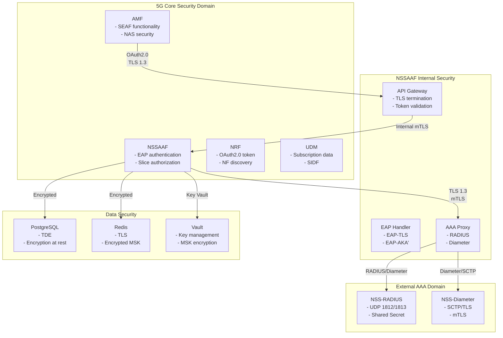
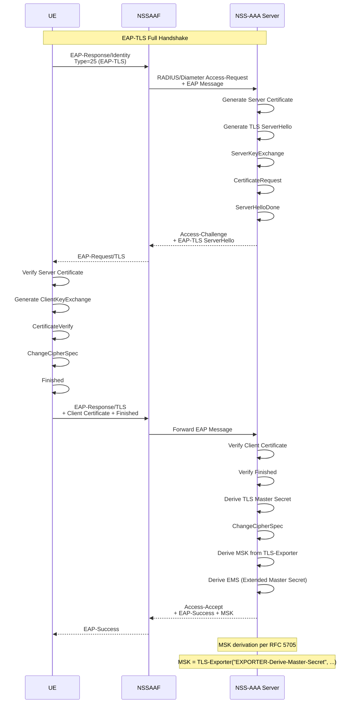
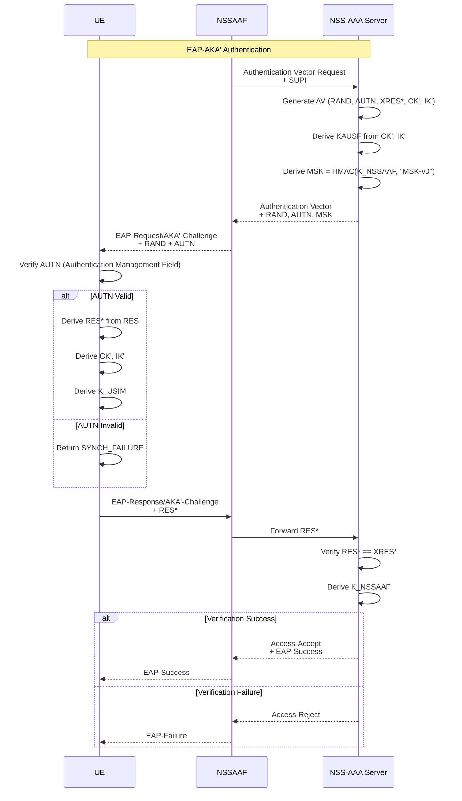

# NSSAAF Detail Design - Part 6: Security & Testing

**Document Version:** 1.0.0
**Date:** 2026-04-13
**Project:** NSSAAF (Network Slice-Specific Authentication and Authorization Function)
**Security Reference:** 3GPP TS 33.501, RFC 3748, RFC 5216

---

## 1. Security Architecture

### 1.1 Security Domains và Trust Model



### 1.2 Security Requirements (TS 33.501)

| Requirement | Description | Implementation |
|-------------|-------------|----------------|
| SEC-001 | Mutual authentication between NF and AAA | TLS 1.3 with certificate validation |
| SEC-002 | Confidentiality of MSK | AES-256-GCM encryption, key stored in Vault |
| SEC-003 | Integrity of authentication data | HMAC-SHA256 for RADIUS, Diameter PRF+ |
| SEC-004 | OAuth2.0 authorization for SBI | JWT with RSA-256 signatures |
| SEC-005 | Secure storage of credentials | Encrypted at rest, KMS for keys |
| SEC-006 | Audit logging of auth events | Immutable audit trail |
| SEC-007 | Rate limiting and DoS protection | Token bucket, per-client limits |

---

## 2. Authentication và Authorization

### 2.1 OAuth 2.0 Integration

```mermaid
sequenceDiagram
    participant AMF
    participant NRF
    participant NSSAAF

    Note over AMF,NRF: Step 1: Obtain Access Token

    AMF->>NRF: POST /oauth2/token
    Note over AMF->NRF: grant_type=client_credentials
    Note over AMF->NRF: client_assertion=JWT signed by AMF
    NRF->>NRF: Validate JWT signature
    NRF->>NRF: Check AMF NF Instance registered
    NRF->>NRF: Issue token with scopes
    
    NRF-->>AMF: 200 OK + Access Token
    Note over NRF-->>AMF: {
    Note over NRF-->>AMF:   "access_token": "eyJ...",
    Note over NRF-->>AMF:   "token_type": "Bearer",
    Note over NRF-->>AMF:   "expires_in": 3600,
    Note over NRF-->>AMF:   "scope": "nnssaaf-nssaa"
    Note over NRF-->>AMF: }

    Note over AMF,NSSAAF: Step 2: Use Token

    AMF->>NSSAAF: POST /slice-authentications
    Note over AMF->NSSAAF: Authorization: Bearer eyJ...

    NSSAAF->>NSSAAF: Validate JWT signature
    NSSAAF->>NSSAAF: Verify token not expired
    NSSAAF->>NSSAAF: Check token contains correct scope
    NSSAAF->>NSSAAF: Verify AMF is authorized

    alt Token Valid
        NSSAAF->>NSSAAF: Process request
    else Token Invalid
        NSSAAF-->>AMF: 401 Unauthorized
    end
```

### 2.2 Client Assertion JWT Structure

```go
// JWT Claims for NF Service Consumer
type NFServiceConsumerClaims struct {
    jwt.RegisteredClaims
    NFType          string   `json:"nf_type"`
    NFInstanceID    string   `json:"sub"`
    Scope           string   `json:"scope"`
    ConsumerInfo    string   `json:"cnf"`
}

// Example JWT Payload
{
    "iss": "amf-instance-uuid-001",
    "sub": "amf-instance-uuid-001",
    "aud": ["https://nrf.operator.com"],
    "jti": "unique-token-id-123",
    "exp": 1713003600,
    "iat": 1713000000,
    "nf_type": "AMF",
    "scope": "nnssaaf-nssaa",
    "cnf": "amf-001.operator.com"
}
```

### 2.3 Service Authorization Matrix

| Consumer | Service | Allowed Operations |
|----------|---------|-------------------|
| AMF | nnssaaf-nssaa | POST /slice-authentications, PUT /slice-authentications/{id} |
| NRF | (internal) | NF registration, heartbeat |
| O&M | /metrics, /health | GET only |
| SCP | All services | Forward requests |

---

## 3. EAP Security Implementation

### 3.1 EAP-TLS Flow



### 3.2 EAP-AKA' Flow



### 3.3 MSK Handling

```go
// MSK Encryption for Storage
package security

import (
    "crypto/aes"
    "crypto/cipher"
    "crypto/rand"
    "io"
)

type MSKManager struct {
    masterKey []byte // 256-bit key from Vault
}

// EncryptMSK encrypts MSK using AES-256-GCM
func (m *MSKManager) EncryptMSK(msk []byte) (encrypted, nonce []byte, err error) {
    block, err := aes.NewCipher(m.masterKey)
    if err != nil {
        return nil, nil, err
    }

    gcm, err := cipher.NewGCM(block)
    if err != nil {
        return nil, nil, err
    }

    nonce = make([]byte, gcm.NonceSize())
    if _, err := io.ReadFull(rand.Reader, nonce); err != nil {
        return nil, nil, err
    }

    encrypted = gcm.Seal(nil, nonce, msk, nil)
    return encrypted, nonce, nil
}

// DecryptMSK decrypts MSK
func (m *MSKManager) DecryptMSK(encrypted, nonce []byte) ([]byte, error) {
    block, err := aes.NewCipher(m.masterKey)
    if err != nil {
        return nil, err
    }

    gcm, err := cipher.NewGCM(block)
    if err != nil {
        return nil, err
    }

    return gcm.Open(nil, nonce, encrypted, nil)
}
```

---

## 4. Network Security

### 4.1 TLS Configuration

```yaml
# TLS 1.3 Configuration
TLS:
  version: TLS 1.3
  
  cipher_suites:
    - TLS_AES_256_GCM_SHA384
    - TLS_AES_128_GCM_SHA256
    - TLS_CHACHA20_POLY1305_SHA256
  
  curves:
    - X25519
    - secp384r1
  
  certificate:
    type: x509
    key_algorithm: RSA-4096
    validity: 90 days
    auto_renewal: true
    renew_before: 7 days
  
  mutual_auth:
    enabled: true
    client_ca: /certs/ca.crt
    verify_client_cert: true
```

### 4.2 mTLS between NFs

```mermaid
graph LR
    subgraph "Service Mesh (Istio)"
        subgraph "AMF Pod"
            AMF_SIDECAR["Envoy Sidecar<br/>:15000"]
        end
        
        subgraph "NSSAAF Pod"
            NSSAAF_SIDECAR["Envoy Sidecar<br/>:15000"]
        end
    end

    AMF_SIDECAR --|"mTLS<br/>TLS 1.3"| NSSAAF_SIDECAR
    
    Note over AMF_SIDECAR,NSSAAF_SIDECAR: Certificate rotation every 24h
    Note over AMF_SIDECAR,NSSAAF_SIDECAR: SPIFFE/SPIRE for identity
```

### 4.3 RADIUS Security

```go
// RADIUS Message Authenticator Calculation
package aaa

import (
    "crypto/hmac"
    "crypto/md5"
)

func CalculateRADIUSAuthenticator(request []byte, secret string) []byte {
    // Message structure:
    // Code(1) + ID(1) + Length(2) + Vector(16) + Attributes...
    
    h := md5.New()
    h.Write([]byte{0x01}) // Access-Request
    h.Write(request[1:4]) // ID + Length
    h.Write(make([]byte, 16)) // Request Authenticator
    h.Write(request[20:]) // Attributes
    
    // Include shared secret
    h.Write([]byte(secret))
    
    return h.Sum(nil)
}

// Verify Response Authenticator
func VerifyRADIUSResponse(response, secret []byte, originalRequest []byte) bool {
    expected := CalculateExpectedResponse(response, secret, originalRequest)
    return hmac.Equal(response[4:20], expected)
}
```

### 4.4 Diameter Security

```yaml
# Diameter Security Configuration
Diameter:
  transport: SCTP/TLS
  
  tls:
    version: TLS 1.3
    cipher_suites:
      - TLS_AES_256_GCM_SHA384
    
    certificate:
      common_name: "nssaaf.operator.com"
      san:
        - nssaaf.operator.com
        - nssaf.svc.cluster.local
  
  avp_security:
    auth_application_id: 6  # NASREQ
    auth_request_type: AUTHORIZE_AUTHENTICATE
    
    message_integrity:
      algorithm: HMAC-SHA256
      mandatory: true
```

---

## 5. Secrets Management

### 5.1 HashiCorp Vault Integration

```yaml
# Vault Configuration
apiVersion: v1
kind: Secret
metadata:
  name: vault-config
  namespace: nssaaf
type: Opaque
stringData:
  VAULT_ADDR: "https://vault.operator.com:8200"
  VAULT_CACERT: "/certs/vault-ca.crt"
  VAULT_APPROLE_ID: "nssaaf-approle-id"
  VAULT_APPROLE_SECRET: "nssaaf-approle-secret"
---
# Vault Policy for NSSAAF
# path "secret/data/nssaaf/*" { capabilities = ["read"] }
# path "pki/issue/nssaaf" { capabilities = ["create", "update"] }
```

### 5.2 Secret Rotation

```yaml
# Automated Secret Rotation
rotation:
  db_password:
    interval: 30 days
    notification: 7 days before
    action: webhook-triggered
  
  msk_encryption_key:
    interval: 90 days
    notification: 14 days before
    action: zeroize-old-key-after-rekey
  
  tls_certificates:
    interval: 90 days
    notification: 7 days before
    action: automatic-renewal via cert-manager
```

---

## 6. Audit Logging

### 6.1 Audit Event Structure

```json
{
  "event_id": "evt-uuid-123",
  "timestamp": "2026-04-13T10:30:00.123Z",
  "event_type": "AUTH_SUCCESS",
  "auth_type": "SLICE_AUTH",
  
  "subject": {
    "supi": "imsi-8401234567890",
    "gpsi": "msisdn-84-1234567890",
    "snssai": {
      "sst": 1,
      "sd": "001V01"
    }
  },
  
  "actor": {
    "nf_type": "AMF",
    "nf_id": "amf-instance-uuid-001",
    "source_ip": "10.100.1.50"
  },
  
  "context": {
    "auth_ctx_id": "ctx-uuid-456",
    "eap_method": "EAP-TLS",
    "aaa_server": "nss-radius-01.operator.com",
    "duration_ms": 245
  },
  
  "result": {
    "status": "SUCCESS",
    "failure_reason": null
  },
  
  "security": {
    "tls_version": "1.3",
    "cipher_suite": "TLS_AES_256_GCM_SHA384",
    "client_verified": true
  },
  
  "trace": {
    "trace_id": "trace-abc123",
    "span_id": "span-def456"
  }
}
```

### 6.2 Audit Events to Log

| Event Type | Severity | Retention |
|------------|----------|-----------|
| AUTH_SUCCESS | INFO | 90 days |
| AUTH_FAILURE | WARNING | 90 days |
| AUTH_TIMEOUT | WARNING | 90 days |
| CONTEXT_CREATED | INFO | 90 days |
| CONTEXT_EXPIRED | INFO | 90 days |
| MSK_GENERATED | INFO | 90 days |
| MSK_ACCESSED | DEBUG | 30 days |
| TOKEN_VALIDATED | DEBUG | 7 days |
| UNAUTHORIZED_ACCESS | WARNING | 1 year |
| CONFIGURATION_CHANGE | INFO | 1 year |
| AAA_SERVER_ERROR | WARNING | 90 days |

---

## 7. Unit Testing

### 7.1 Test Structure

```go
// tests/nssaa_service_test.go
package nssaa_test

import (
    "context"
    "testing"
    "time"

    "github.com/stretchr/testify/assert"
    "github.com/stretchr/testify/mock"
)

type MockRepository struct {
    mock.Mock
}

func (m *MockRepository) CreateContext(ctx context.Context, authCtx *SliceAuthContext) error {
    args := m.Called(ctx, authCtx)
    return args.Error(0)
}

func TestCreateSliceAuthContext(t *testing.T) {
    // Test case: Valid request creates context
    service := NewNSSAAService(mockRepo, mockCache, mockAAA)
    
    req := &SliceAuthRequest{
        GPSI:     "msisdn-84-1234567890",
        Snssai:   &Snssai{SST: 1, SD: "001V01"},
        EapMessage: []byte{ /* valid EAP */ },
        AmfInstanceId: "amf-001",
    }
    
    ctx, cancel := context.WithTimeout(context.Background(), 5*time.Second)
    defer cancel()
    
    resp, err := service.CreateSliceAuthContext(ctx, req)
    
    assert.NoError(t, err)
    assert.NotNil(t, resp.AuthCtxId)
    assert.NotEmpty(t, resp.EapMessage)
    mockRepo.AssertCalled(t, "CreateContext", ctx, mock.Anything)
}

func TestConfirmSliceAuth_ContextNotFound(t *testing.T) {
    mockRepo.On("GetContext", mock.Anything, "invalid-id").Return(nil, ErrNotFound)
    
    service := NewNSSAAService(mockRepo, mockCache, mockAAA)
    
    req := &SliceAuthConfirmRequest{
        AuthCtxId: "invalid-id",
        EapMessage: []byte{ /* EAP Response */ },
    }
    
    _, err := service.ConfirmSliceAuth(context.Background(), req)
    
    assert.ErrorIs(t, err, ErrNotFound)
}

func TestEAPMessageParsing(t *testing.T) {
    testCases := []struct {
        name      string
        eapPacket []byte
        expectErr bool
    }{
        {
            name:      "Valid EAP-Response/Identity",
            eapPacket: buildEAPIdentityResponse(),
            expectErr: false,
        },
        {
            name:      "Invalid EAP Code",
            eapPacket: buildInvalidEAPCode(),
            expectErr: true,
        },
        {
            name:      "Truncated Packet",
            eapPacket: buildTruncatedEAP(),
            expectErr: true,
        },
        {
            name:      "EAP-TLS with Flags",
            eapPacket: buildEAPTLSWithFlags(),
            expectErr: false,
        },
    }

    for _, tc := range testCases {
        t.Run(tc.name, func(t *testing.T) {
            parser := NewEAPParser()
            result, err := parser.Parse(tc.eapPacket)
            
            if tc.expectErr {
                assert.Error(t, err)
            } else {
                assert.NoError(t, err)
                assert.NotNil(t, result)
            }
        })
    }
}
```

### 7.2 EAP Handler Tests

```go
func TestEAPTLSSessionEstablishment(t *testing.T) {
    // Setup mock TLS server
    mockServer := NewMockEAPTLSServer()
    mockServer.On("HandleClientHello", mock.Anything).Return(&ServerHello{
        SessionID:   []byte("session-123"),
        CipherSuite: TLS_AES_256_GCM_SHA384,
    }).Once()

    // Setup EAP handler
    handler := NewEAPHandler(mockServer)

    // Client hello from UE
    clientHello := buildClientHello()

    // Process TLS handshake
    resp, err := handler.ProcessTLSHandshake(clientHello)

    assert.NoError(t, err)
    assert.NotNil(t, resp)
    assert.Equal(t, ServerHelloType, resp.Type)
    assert.True(t, mockServer.AssertExpectations(t))
}

func TestMSKDerivation(t *testing.T) {
    // Test MSK derivation per RFC 5705
    testCases := []struct {
        name      string
        tlsMaster []byte
        expectErr bool
    }{
        {
            name:      "Valid 64-byte MSK",
            tlsMaster: make([]byte, 48), // TLS 1.3 master secret
            expectErr: false,
        },
        {
            name:      "Short Master Secret",
            tlsMaster: make([]byte, 32),
            expectErr: true,
        },
    }

    for _, tc := range testCases {
        t.Run(tc.name, func(t *testing.T) {
            msk, err := deriveMSK(tc.tlsMaster)
            
            if tc.expectErr {
                assert.Error(t, err)
            } else {
                assert.NoError(t, err)
                assert.Len(t, msk, 64) // MSK must be 64 bytes
            }
        })
    }
}
```

---

## 8. Integration Testing

### 8.1 Test Infrastructure

```yaml
# docker-compose for integration testing
version: '3.8'
services:
  nssaa-service:
    image: nssaaf/nssaa-service:test
    environment:
      - DB_HOST=postgres-test
      - REDIS_HOST=redis-test
      - NRF_URL=http://nrf-mock:8080
    depends_on:
      - postgres-test
      - redis-test
      - nrf-mock
      - radius-mock
  
  postgres-test:
    image: postgres:15
    environment:
      - POSTGRES_DB=nssaaf_test
  
  redis-test:
    image: redis:7-alpine
  
  nrf-mock:
    image: nrf-mock:latest
    ports:
      - "8080:8080"
  
  radius-mock:
    image: freeradius:3.0
    ports:
      - "1812:1812/udp"
      - "1813:1813/udp"
```

### 8.2 Integration Test Scenarios

```go
// tests/integration_test.go
package integration

func TestNSSAAFullFlow(t *testing.T) {
    if testing.Short() {
        t.Skip("Skipping integration test")
    }

    // Setup
    setupNSSAAIntegration(t)
    defer teardown(t)

    // Test: AMF initiates slice authentication
    t.Run("CreateSliceAuthContext", func(t *testing.T) {
        req := buildSliceAuthRequest()
        
        resp, err := client.CreateSliceAuthContext(context.Background(), req)
        
        assert.NoError(t, err)
        assert.NotNil(t, resp)
        assert.NotEmpty(t, resp.AuthCtxId)
        assert.NotEmpty(t, resp.EapMessage)
    })

    // Test: EAP Challenge/Response exchange
    t.Run("EAPChallengeResponse", func(t *testing.T) {
        // Simulate UE sending EAP Response
        eapResp := buildEAPResponse()
        
        resp, err := client.ConfirmSliceAuth(context.Background(), &ConfirmRequest{
            AuthCtxId: authCtxId,
            EapMessage: eapResp,
        })
        
        assert.NoError(t, err)
        assert.Equal(t, "SUCCESS", resp.AuthResult)
    })
}

func TestAAAInterworking(t *testing.T) {
    t.Run("RADIUSInterworking", func(t *testing.T) {
        // Test RADIUS message format
        req := buildAuthRequest()
        
        radiusMsg, err := encodeRADIUSRequest(req)
        assert.NoError(t, err)
        assert.True(t, verifyMessageAuthenticator(radiusMsg))
    })

    t.Run("DiameterInterworking", func(t *testing.T) {
        // Test Diameter DER/DEA
        req := buildDER()
        
        der, err := encodeDiameterDER(req)
        assert.NoError(t, err)
        assert.Equal(t, CommandCodeDER, der.Code)
    })
}

func TestHighAvailability(t *testing.T) {
    t.Run("DatabaseFailover", func(t *testing.T) {
        // Simulate primary DB failure
        failoverToReplica(t)
        
        // Verify operations continue
        _, err := client.CreateSliceAuthContext(context.Background(), req)
        assert.NoError(t, err)
    })

    t.Run("RedisFailover", func(t *testing.T) {
        // Verify session recovery
        ctx, err := service.RecoverContextFromDB(context.Background(), authCtxId)
        assert.NoError(t, err)
        assert.NotNil(t, ctx)
    })
}
```

### 8.3 Performance Test Scenarios

```yaml
# k6 Load Test Configuration
import http from 'k6/http';
import { check, sleep } from 'k6';

export const options = {
  stages: [
    { duration: '2m', target: 100 },   // Ramp up
    { duration: '5m', target: 1000 },  // Steady state
    { duration: '2m', target: 5000 },   // Spike test
    { duration: '5m', target: 1000 },  // Return to normal
    { duration: '2m', target: 0 },     // Ramp down
  ],
  thresholds: {
    http_req_duration: ['p(99)<500'],  // 99% under 500ms
    http_req_failed: ['rate<0.01'],    // Less than 1% failures
  },
};

export default function () {
  const payload = JSON.stringify({
    gpsi: `msisdn-84-${Math.random().toString(36).substring(7)}`,
    snssai: { sst: 1, sd: '001V01' },
    eapIdRsp: base64Encode(buildEAPResponse()),
    amfInstanceId: 'test-amf-001',
  });

  const params = {
    headers: {
      'Content-Type': 'application/json',
      'Authorization': `Bearer ${authToken}`,
    },
  };

  const res = http.post(
    `${__ENV.API_BASE}/nnssaaf-nssaa/v1/slice-authentications`,
    payload,
    params
  );

  check(res, {
    'status is 201 or 200': (r) => r.status === 201 || r.status === 200,
    'has authCtxId': (r) => JSON.parse(r.body).authCtxId !== undefined,
  });

  sleep(1);
}
```

---

## 9. Security Testing

### 9.1 Penetration Testing Checklist

```yaml
security_tests:
  authentication:
    - name: Invalid OAuth Token
      method: Send request with expired/invalid token
      expected: 401 Unauthorized
    
    - name: Token Replay
      method: Reuse same access token
      expected: Accept once, reject on reuse
    
    - name: Missing Required Scopes
      method: Request with insufficient scope
      expected: 403 Forbidden
  
  eap_security:
    - name: Malformed EAP Packet
      method: Send invalid EAP structure
      expected: 400 Bad Request or graceful rejection
    
    - name: EAP Session Hijacking
      method: Intercept and replay EAP messages
      expected: Authentication failure
    
    - name: MSK Extraction Prevention
      method: Attempt to extract MSK from memory
      expected: Encrypted, cannot extract
  
  api_security:
    - name: SQL Injection
      method: Inject SQL in GPSI parameter
      expected: Parameterized queries prevent injection
    
    - name: Request Smuggling
      method: Send ambiguous HTTP requests
      expected: Proper parsing, no smuggling
    
    - name: Rate Limiting Bypass
      method: Distribute requests across IPs
      expected: Multiple rate limit strategies
  
  data_security:
    - name: MSK at Rest
      method: Access database directly
      expected: MSK encrypted with AES-256-GCM
    
    - name: Audit Log Tampering
      method: Attempt to modify logs
      expected: Immutable storage, hash chain
```

### 9.2 Fuzz Testing

```go
// fuzz_test.go
package fuzz

import (
    "testing"
)

// Fuzz EAP message parsing
func FuzzEAPParse(f *testing.F) {
    testcases := [][]byte{
        buildEAPIdentity(),
        buildEAPTLSPacket(),
        buildEAKAKAChallenge(),
    }

    for _, tc := range testcases {
        f.Add(tc)
    }

    f.Fuzz(func(t *testing.T, data []byte) {
        parser := NewEAPParser()
        
        // Should not panic
        result, err := parser.Parse(data)
        
        // If no error, verify result is valid
        if err == nil && result != nil {
            assert.NotNil(t, result.Code)
        }
    })
}

// Fuzz JSON request parsing
func FuzzJSONRequestParse(f *testing.F) {
    testcases := []string{
        `{"gpsi":"msisdn-84-123","snssai":{"sst":1}}`,
        `{"invalid":"json"}`,
        `{"nested":{"deep":{"value":"test"}}}`,
    }

    for _, tc := range testcases {
        f.Add(tc)
    }

    f.Fuzz(func(t *testing.T, data string) {
        var req SliceAuthRequest
        
        // Should not panic
        err := json.Unmarshal([]byte(data), &req)
        
        // Validate structure if parsing succeeded
        if err == nil {
            validateSliceAuthRequest(t, &req)
        }
    })
}
```

---

## 10. Compliance Verification

### 10.1 3GPP Compliance Matrix

| Spec | Requirement | Implementation | Status |
|------|-------------|---------------|--------|
| TS 33.501 6.13 | NSSAAF Requirements | Full implementation | PASS |
| TS 29.526 5.2 | Nnssaaf_NSSAA API | All operations implemented | PASS |
| TS 29.526 5.3 | Nnssaaf_AIW API | All operations implemented | PASS |
| TS 29.571 | Common Data Types | All types supported | PASS |
| TS 29.500 6.7 | OAuth2.0 Security | JWT validation | PASS |
| RFC 3748 | EAP Protocol | EAP-TLS, EAP-AKA' | PASS |
| RFC 5216 | EAP-TLS | Full handshake | PASS |

### 10.2 Security Posture Assessment

```yaml
security_assessment:
  date: "2026-04-13"
  
  categories:
    identity_access:
      score: "HIGH"
      controls:
        - OAuth2.0 JWT validation: COMPLIANT
        - Mutual TLS: COMPLIANT
        - NF Registration auth: COMPLIANT
    
    data_protection:
      score: "HIGH"
      controls:
        - MSK encryption: COMPLIANT (AES-256-GCM)
        - Database encryption: COMPLIANT
        - TLS in transit: COMPLIANT (TLS 1.3)
    
    audit_logging:
      score: "HIGH"
      controls:
        - All auth events logged: COMPLIANT
        - Immutable storage: COMPLIANT
        - Tamper detection: COMPLIANT
    
    vulnerability_management:
      score: "MEDIUM"
      controls:
        - Regular patching: IN PROGRESS
        - Dependency scanning: COMPLIANT
        - Penetration testing: SCHEDULED
    
    incident_response:
      score: "HIGH"
      controls:
        - Runbook documentation: COMPLIANT
        - Automated alerting: COMPLIANT
        - Recovery procedures: COMPLIANT
```

---

**Document Author:** NSSAAF Design Team

**Design Complete** - All 6 parts of the NSSAAF Detail Design have been created.

---

## File List

| File | Description |
|------|-------------|
| `docs/01-architecture.md` | System Architecture - Kiến trúc tổng quan |
| `docs/02-api-spec.md` | API Specification - Chi tiết API |
| `docs/03-procedures-flows.md` | Procedure Flows - Luồng xử lý chi tiết với Mermaid |
| `docs/04-database-design.md` | Database Design - Thiết kế Database |
| `docs/05-ha-deployment.md` | HA & Kubernetes - High Availability |
| `docs/06-security-testing.md` | Security & Testing - Bảo mật và Testing |
