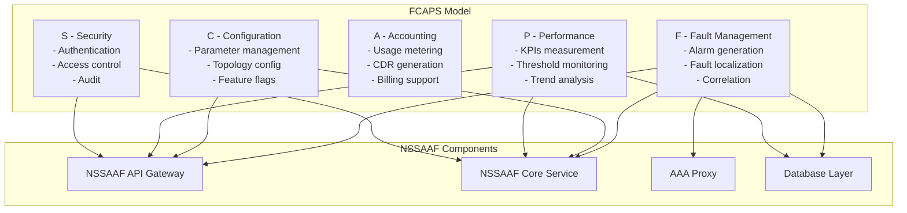
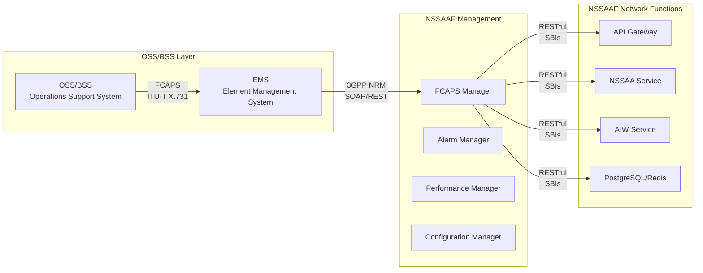
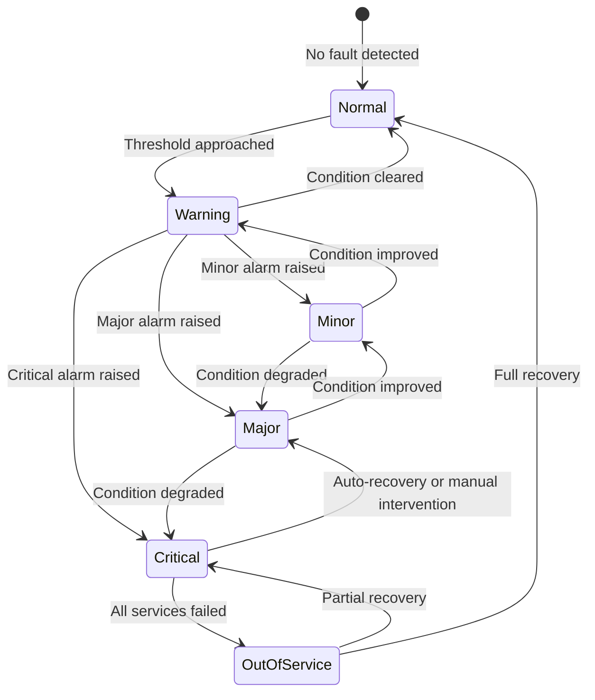

# NSSAAF Detail Design - Part 7: FCAPS & Operations Management

**Document Version:** 1.0.0
**Date:** 2026-04-13
**Project:** NSSAAF (Network Slice-Specific Authentication and Authorization Function)
**Reference:** 3GPP TS 28.532, TS 28.541, GSMA NESG FMO

---

## 1. FCAPS Framework Overview

### 1.1 FCAPS Model for NSSAAF



### 1.2 Integration with 3GPP Management Framework



---

## 2. Fault Management (F)

### 2.1 Alarm Definitions

#### 2.1.1 Critical Alarms

```yaml
# Critical Alarms - Immediate action required
CriticalAlarms:
  NSSAAF_ALARM_001:
    name: "NSSAAF_SERVICE_DOWN"
    description: "NSSAAF service is completely unavailable"
    severity: CRITICAL
    probableCause: "SERVICE_DEGRADATION"
    affectedObject: "NSSAAFService"
    alarmType: "COMMUNICATION_ALARM"
    specificProblem: "nssaafServiceNotResponding"
    backedUpObject: "NSSAAF_Backup_Service"
    backupProcedure: "Automatic failover to standby"
    notificationType: "EQUIPMENT_ALARM"
    
    triggeringConditions:
      - condition: "Health check fails 3 consecutive times"
        timeToDetect: "30 seconds"
      - condition: "HTTP error rate > 50% for 1 minute"
        timeToDetect: "60 seconds"
      - condition: "No response to heartbeat for 60 seconds"
        timeToDetect: "60 seconds"
    
    proposedRepairActions:
      - "Check pod status: kubectl get pods -n nssaaf"
      - "Review logs: kubectl logs -n nssaaf -l app=nssaa-service"
      - "Check resource usage: kubectl top pods -n nssaaf"
      - "Check dependent services connectivity"
      - "Consider scaling up or restart"

  NSSAAF_ALARM_002:
    name: "DATABASE_CONNECTION_FAILURE"
    description: "Unable to connect to primary database"
    severity: CRITICAL
    probableCause: "SOFTWARE_ABNORMAL"
    affectedObject: "PostgreSQL_Primary"
    alarmType: "ENVIRONMENTAL_ALARM"
    specificProblem: "databaseConnectionLost"
    
    triggeringConditions:
      - condition: "Connection pool exhausted"
        timeToDetect: "10 seconds"
      - condition: "Database query timeout > 30 seconds"
        timeToDetect: "30 seconds"
      - condition: "Database unreachable"
        timeToDetect: "5 seconds"
    
    proposedRepairActions:
      - "Check database pod: kubectl get pods -n nssaaf-infra"
      - "Verify database connectivity"
      - "Check disk space on database node"
      - "Review long-running queries"
      - "Initiate failover if primary unavailable"

  NSSAAF_ALARM_003:
    name: "AAA_SERVER_UNREACHABLE"
    description: "All configured AAA servers are unreachable"
    severity: CRITICAL
    probableCause: "COMMUNICATION_SUBSYSTEM_FAILURE"
    affectedObject: "AAAServerPool"
    alarmType: "COMMUNICATION_ALARM"
    specificProblem: "aaaServerNotResponding"
    
    triggeringConditions:
      - condition: "0 available AAA servers"
        timeToDetect: "5 seconds"
      - condition: "AAA response timeout > 60 seconds consistently"
        timeToDetect: "60 seconds"
    
    proposedRepairActions:
      - "Check AAA server status via management interface"
      - "Verify network connectivity to AAA servers"
      - "Check AAA server logs for errors"
      - "Consider switching to backup AAA pool"

  NSSAAF_ALARM_004:
    name: "AUTHENTICATION_FAILURE_RATE_EXCEEDED"
    description: "Authentication failure rate exceeds critical threshold"
    severity: CRITICAL
    probableCause: "SERVICE_DEGRADATION"
    affectedObject: "AuthenticationService"
    alarmType: "QUALITY_OF_SERVICE_ALARM"
    specificProblem: "authFailureRateExceeded"
    
    triggeringConditions:
      - condition: "Failure rate > 20% for 5 minutes"
        timeToDetect: "5 minutes"
      - condition: "Success rate < 80% for 5 minutes"
        timeToDetect: "5 minutes"
    
    proposedRepairActions:
      - "Check AAA server configuration"
      - "Review authentication logs for patterns"
      - "Verify NSS-AAA server synchronization"
      - "Check for potential attack/DOS"
```

#### 2.1.2 Major Alarms

```yaml
# Major Alarms - Degraded operation, attention required
MajorAlarms:
  NSSAAF_ALARM_101:
    name: "DATABASE_REPLICATION_LAG"
    description: "Database replication lag exceeds threshold"
    severity: MAJOR
    probableCause: "PERFORMANCE_DEGRADATION"
    affectedObject: "PostgreSQL_Replica"
    alarmType: "COMMUNICATION_ALARM"
    specificProblem: "replicationLagHigh"
    
    triggeringConditions:
      condition: "Replication lag > 100MB for 5 minutes"
      threshold: "100 MB"
      timeToDetect: "5 minutes"
    
    proposedRepairActions:
      - "Monitor replication status"
      - "Check network latency between nodes"
      - "Review database workload"

  NSSAAF_ALARM_102:
    name: "REDIS_CACHE_UNAVAILABLE"
    description: "Redis cache cluster is unavailable"
    severity: MAJOR
    probableCause: "SOFTWARE_ABNORMAL"
    affectedObject: "Redis_Cluster"
    alarmType: "ENVIRONMENTAL_ALARM"
    specificProblem: "cacheClusterDown"
    
    triggeringConditions:
      condition: "Redis cluster < 50% nodes available"
      timeToDetect: "30 seconds"

  NSSAAF_ALARM_103:
    name: "HIGH_AUTHENTICATION_LATENCY"
    description: "Authentication latency exceeds threshold"
    severity: MAJOR
    probableCause: "PERFORMANCE_DEGRADATION"
    affectedObject: "AuthenticationService"
    alarmType: "QUALITY_OF_SERVICE_ALARM"
    specificProblem: "authLatencyExceeded"
    
    triggeringConditions:
      condition: "p99 latency > 500ms for 10 minutes"
      threshold: "500 ms"
      timeToDetect: "10 minutes"

  NSSAAF_ALARM_104:
    name: "CERTIFICATE_EXPIRING"
    description: "TLS certificate will expire soon"
    severity: MAJOR
    probableCause: "EQUIPMENT_INDICATION"
    affectedObject: "TLSCertificate"
    alarmType: "EQUIPMENT_ALARM"
    specificProblem: "certificateExpiring"
    
    triggeringConditions:
      condition: "Certificate expires in < 14 days"
      threshold: "14 days"
      timeToDetect: "Immediate on detection"
    
    proposedRepairActions:
      - "Initiate certificate renewal via cert-manager"
      - "Verify new certificate deployment"
```

#### 2.1.3 Minor Alarms

```yaml
MinorAlarms:
  NSSAAF_ALARM_201:
    name: "AAA_SERVER_DEGRADED"
    description: "One or more AAA servers are degraded"
    severity: MINOR
    triggeringConditions:
      condition: "AAA response time > threshold"
    
  NSSAAF_ALARM_202:
    name: "RATE_LIMIT_APPROACHING"
    description: "Rate limit threshold approaching"
    severity: MINOR
    triggeringConditions:
      condition: "Rate limit usage > 80%"
    
  NSSAAF_ALARM_203:
    name: "SESSION_CACHE_HIT_RATE_LOW"
    description: "Redis cache hit rate below threshold"
    severity: MINOR
    triggeringConditions:
      condition: "Cache hit rate < 80%"
    
  NSSAAF_ALARM_204:
    name: "LOGGING_BACKLOG"
    description: "Logging system has pending entries"
    severity: MINOR
```

### 2.2 Alarm State Machine



### 2.3 Alarm Correlation Rules

```yaml
# Alarm Correlation Rules for NSSAAF
CorrelationRules:
  rule_001:
    name: "Database failure cascade"
    triggerAlarm: "DATABASE_CONNECTION_FAILURE"
    correlatedAlarms:
      - "AUTHENTICATION_FAILURE_RATE_EXCEEDED"
      - "HIGH_AUTHENTICATION_LATENCY"
    suppression: True  # Suppress correlated alarms during trigger
    description: "Database failure causes auth issues"

  rule_002:
    name: "AAA server pool failure"
    triggerAlarm: "AAA_SERVER_UNREACHABLE"
    correlatedAlarms:
      - "AUTHENTICATION_FAILURE_RATE_EXCEEDED"
    suppression: True

  rule_003:
    name: "Service pod failure cascade"
    triggerAlarm: "NSSAAF_SERVICE_DOWN"
    correlatedAlarms:
      - "HIGH_AUTHENTICATION_LATENCY"
      - "DATABASE_CONNECTION_FAILURE"
    suppression: True
    description: "Pod failure may cause connection issues"
```

### 2.4 Alarm Management API

```yaml
# Alarm API Endpoints
AlarmManagementAPI:
  basePath: "/nssaaf-ncm/v1"
  
  endpoints:
    GetAlarmList:
      GET /alarms
      queryParams:
        - severity: "CRITICAL|MAJOR|MINOR|WARNING"
        - status: "ACTIVE|CLEARED"
        - timeRange: "last1h|last24h|last7d"
        - affectedObject: string
      response: List of alarms

    GetAlarmDetails:
      GET /alarms/{alarmId}
      response: Alarm details with history

    AcknowledgeAlarm:
      PUT /alarms/{alarmId}/acknowledge
      body:
        acknowledgedBy: string
        comment: string
      response: Updated alarm

    ClearAlarm:
      PUT /alarms/{alarmId}/clear
      body:
        clearedBy: string
        reason: string
        repairAction: string
      response: Cleared alarm

    GetAlarmStatistics:
      GET /alarms/statistics
      response:
        totalActive: number
        bySeverity: object
        byAffectedObject: object

    GetAlarmHistory:
      GET /alarms/{alarmId}/history
      response: Alarm state change history
```

---

## 3. Configuration Management (C)

### 3.1 Configuration Data Model

```yaml
# NSSAAF Configuration Structure
NSSAFFConfiguration:
  nssaaService:
    general:
      instanceId: string          # Auto-generated UUID
      fqdn: string                # nssaaf.operator.com
      region: string              # Primary/DR
      capacity: integer          # Max concurrent auths
      priority: integer          # For load balancing
    
    authentication:
      defaultAuthTimeout: integer   # seconds (default: 30)
      maxAuthTimeout: integer       # seconds (default: 120)
      authRetryAttempts: integer    # default: 2
      eapMethods:
        - EAP-TLS
        - EAP-AKA
        - EAP-AKA-PRIME
      mskEncryptionEnabled: boolean
      mskEncryptionAlgorithm: AES-256-GCM
    
    aaaProxy:
      defaultTimeout: integer      # seconds (default: 10)
      connectionPoolSize: integer
      circuitBreaker:
        enabled: boolean
        failureThreshold: integer   # default: 5
        timeout: integer          # seconds (default: 60)
        halfOpenAttempts: integer  # default: 3
      
      radiusConfig:
        authPort: 1812
        acctPort: 1813
        messageTimeout: 5
        maxRetries: 3
        messageAuthenticator: HMAC-MD5
      
      diameterConfig:
        realm: operator.com
        applicationId: 6  # NASREQ
        host: nssaaf.operator.com
        port: 3868
        transport: SCTP
  
  performance:
    connectionPool:
      maxOpen: 100
      maxIdle: 20
      maxLifetime: 30m
    cache:
      sessionTTL: 3600           # seconds
      maxCacheEntries: 1000000
      evictionPolicy: LRU
  
  security:
    tokenValidation:
      issuerValidation: true
      audienceValidation: true
      clockSkewTolerance: 60    # seconds
    rateLimiting:
      enabled: boolean
      defaultLimit: 1000        # per minute
      byAmfLimit: 10000         # per minute
      byGpsiLimit: 100          # per minute

  featureFlags:
    enableEAPTTLS: boolean       # default: false
    enableMultiSliceAuth: boolean # default: true
    enableParallelAuth: boolean   # default: false
    enableRevocationNotify: boolean # default: true
    enableReauthNotify: boolean    # default: true
```

### 3.2 Configuration API

```yaml
# Network Configuration Management API
ConfigurationAPI:
  basePath: "/nssaaf-ncm/v1"
  
  endpoints:
    GetCurrentConfiguration:
      GET /configurations/current
      response: Full configuration snapshot
      note: "Sensitive values masked"

    ModifyConfiguration:
      PUT /configurations
      body: ConfigurationUpdate
      response: Applied configuration
      auditLog: true

    ResetConfiguration:
      POST /configurations/reset
      body:
        scope: FULL | PARTIAL
        parameterGroups: [string]
      response: Reset confirmation

    ValidateConfiguration:
      POST /configurations/validate
      body: ConfigurationUpdate
      response:
        valid: boolean
        errors: [ConfigurationError]
        warnings: [ConfigurationWarning]

    GetConfigurationHistory:
      GET /configurations/history
      queryParams:
        - timeRange: string
        - parameter: string
      response: Configuration change history

    CompareConfiguration:
      POST /configurations/compare
      body:
        version1: string
        version2: string
      response: Diff between versions
```

### 3.3 Hot Configuration Reload

```yaml
# Dynamic Configuration Reload Mechanism
DynamicConfigReload:
  triggerMethods:
    - API call (PUT /configurations)
    - ConfigMap watch (Kubernetes)
    - Management system push
    - Scheduled reload
  
  reloadableParameters:
    - rateLimiting thresholds
    - AAA server timeouts
    - cache TTL values
    - log levels
    - feature flags (with consent)
  
  nonReloadableParameters:
    - instance ID
    - database connection settings
    - TLS certificates (require restart)
    - listener ports
  
  reloadProcess:
    steps:
      1. Validate new configuration
      2. Create configuration backup
      3. Apply to memory structures
      4. Update metrics with new config
      5. Send notification of change
      6. Log configuration change
    
  rollback:
    automatic: true  # On validation failure
    manual: Available via API
```

### 3.4 Feature Flags

```yaml
# Feature Flags Configuration
FeatureFlags:
  nssaa_rollout:
    flags:
      - name: "enable_eap_ttls"
        description: "Enable EAP-TTLS authentication"
        enabled: false
        rolloutPercentage: 0
        targetGroups: ["beta_users"]
      
      - name: "enable_parallel_slice_auth"
        description: "Enable parallel slice authentication"
        enabled: false
        rolloutPercentage: 0
        canary: true
      
      - name: "enable_reduced_latency_mode"
        description: "Enable reduced latency mode"
        enabled: false
        rolloutPercentage: 0
      
      - name: "enable_new_aaa_load_balancer"
        description: "Use new AAA load balancer algorithm"
        enabled: false
        rolloutPercentage: 0
  
  a_b_testing:
    enabled: true
    defaultVariant: "control"
    variants:
      control: 80%    # Current implementation
      variant_a: 20%  # New implementation
    
    metrics:
      - auth_latency_p99
      - auth_success_rate
      - error_rate
```

---

## 4. Accounting (A)

### 4.1 Usage Metering

```yaml
# Authentication Usage Records
UsageMetering:
  dataToCollect:
    authenticationAttempt:
      timestamp: ISO8601
      gpsi: string
      supi: string
      snssaiSst: integer
      snssaiSd: string
      authMethod: EAP-TLS | EAP-AKA | EAP-AKA-PRIME
      authResult: SUCCESS | FAILURE
      failureReason: string
      responseTimeMs: integer
      amfInstanceId: string
      aaaServerUsed: string
    
    sessionMetrics:
      sessionId: string
      startTime: ISO8601
      endTime: ISO8601
      durationSeconds: integer
      reauthCount: integer
      revocationReceived: boolean
  
  aggregationPeriods:
    - 5_minutes
    - 15_minutes
    - 1_hour
    - 1_day
    - 1_month
  
  storage:
    hotStorage: 7 days (PostgreSQL)
    warmStorage: 90 days (Time-series DB)
    coldStorage: 1 year (Object Storage)
```

### 4.2 CDR Generation

```yaml
# Charging Data Record Structure
ChargingDataRecord:
  recordHeader:
    recordType: NSSAA_AUTH_RECORD
    recordId: UUID
    recordSequenceNumber: integer
    startTime: ISO8601
    endTime: ISO8601
    sdfId: string
    chargingId: UUID
  
  nssaaChargingInfo:
    gpsi: string
    supi: string
    snssai:
      sst: integer
      sd: string
    authMethodUsed: string
    authAttempts: integer
    authSuccesses: integer
    authFailures: integer
    totalSessionTime: integer  # seconds
    mskGenerated: boolean
    
    aaaServerInfo:
      serverType: RADIUS | DIAMETER
      serverAddress: string
      transactionCount: integer
    
    volumeCounters:
      incomingOctets: integer
      outgoingOctets: integer
  
  locationInfo:
    plmnId: string
    tac: string
    ecgi: string
  
  resultCode: integer
  failureHandling: string
```

### 4.3 Accounting API

```yaml
# Accounting API
AccountingAPI:
  basePath: "/nssaaf-nacm/v1"
  
  endpoints:
    GetUsageRecords:
      GET /accounting/usage
      queryParams:
        - startTime: ISO8601
        - endTime: ISO8601
        - gpsi: string
        - aggregationLevel: RAW | 5MIN | 15MIN | 1HOUR | 1DAY
      
      response:
        records: [UsageRecord]
        pagination:
          offset: integer
          limit: integer
          total: integer

    GetChargingDataRecords:
      GET /accounting/cdrs
      queryParams:
        - startTime: ISO8601
        - endTime: ISO8601
        - format: JSON | CSV | XML
      
      response: CDR file or stream

    GetAccountingStatistics:
      GET /accounting/statistics
      queryParams:
        - period: string
        - groupBy: string
      
      response:
        totalAuthentications: integer
        successRate: float
        avgResponseTime: float
        byAuthMethod: object
        bySnssai: object
```

---

## 5. Performance Management (P)

### 5.1 Key Performance Indicators (KPIs)

```yaml
# NSSAAF KPIs per 3GPP TS 28.532
KPIs:
  authenticationPerformance:
    NSSAA_KPI_001:
      name: "AuthRequestSuccessRate"
      description: "Percentage of successful authentications"
      formula: "(Success / Total) * 100"
      unit: PERCENTAGE
      target: "> 99.5%"
      alertThreshold:
        warning: "99.0%"
        minor: "98.5%"
        major: "98.0%"
        critical: "97.0%"
    
    NSSAA_KPI_002:
      name: "AuthRequestLatencyAverage"
      description: "Average authentication request latency"
      formula: "SUM(responseTime) / COUNT(requests)"
      unit: MILLISECOND
      target: "< 100ms"
      alertThreshold:
        warning: "150ms"
        minor: "200ms"
        major: "300ms"
        critical: "500ms"
    
    NSSAA_KPI_003:
      name: "AuthRequestLatencyP99"
      description: "99th percentile authentication latency"
      formula: "PERCENTILE(responseTime, 0.99)"
      unit: MILLISECOND
      target: "< 500ms"
      alertThreshold:
        warning: "700ms"
        minor: "900ms"
        major: "1200ms"
        critical: "1500ms"
    
    NSSAA_KPI_004:
      name: "AuthRequestLatencyP999"
      description: "99.9th percentile authentication latency"
      formula: "PERCENTILE(responseTime, 0.999)"
      unit: MILLISECOND
      target: "< 1000ms"
    
    NSSAA_KPI_005:
      name: "AuthThroughput"
      description: "Authentication requests per second"
      formula: "COUNT(requests) / DURATION"
      unit: REQUESTS_PER_SECOND
      target: "> 1000 RPS"
      alertThreshold:
        warning: "800 RPS"
        critical: "500 RPS"

  serviceAvailability:
    NSSAA_KPI_010:
      name: "ServiceAvailability"
      description: "Service uptime percentage"
      formula: "(UP_TIME / TOTAL_TIME) * 100"
      unit: PERCENTAGE
      target: "> 99.999%"
      measurementPeriod: 1 year
    
    NSSAA_KPI_011:
      name: "ServiceMeanTimeToRepair"
      description: "Average time to restore service"
      formula: "SUM(downtime) / INCIDENT_COUNT"
      unit: MINUTE
      target: "< 5 minutes"
    
    NSSAA_KPI_012:
      name: "ServiceMeanTimeBetweenFailures"
      description: "Average time between failures"
      formula: "TOTAL_UPTIME / INCIDENT_COUNT"
      unit: HOUR
      target: "> 720 hours"

  databasePerformance:
    NSSAA_KPI_020:
      name: "DatabaseQueryLatency"
      description: "Average database query time"
      unit: MILLISECOND
      target: "< 10ms"
    
    NSSAA_KPI_021:
      name: "DatabaseConnectionPoolUsage"
      description: "Percentage of connection pool used"
      unit: PERCENTAGE
      target: "< 70%"
    
    NSSAA_KPI_022:
      name: "DatabaseReplicationLag"
      description: "Replication lag in MB"
      unit: MEGABYTE
      target: "< 10 MB"

  aaaProxyPerformance:
    NSSAA_KPI_030:
      name: "AAAServerResponseTime"
      description: "Average AAA server response time"
      unit: MILLISECOND
      target: "< 50ms"
    
    NSSAA_KPI_031:
      name: "AAAServerAvailability"
      description: "AAA server pool availability"
      unit: PERCENTAGE
      target: "> 99.9%"
    
    NSSAA_KPI_032:
      name: "AAAServerFailoverCount"
      description: "Number of AAA server failovers"
      unit: COUNT
      target: 0 per day
```

### 5.2 Performance Counters (3GPP NRM)

```yaml
# 3GPP Network Resource Model (NRM) for NSSAAF
# Based on TS 28.541
ManagedObject:
  nssafFunction:
    objectClass: NssafFunction
    objectInstance: "NSSAAF-001"
    
    attributes:
      # Common Attributes
      id: NSSAAF-001
      userLabel: "NSSAAF Primary"
      administrativeState: UNLOCKED | LOCKED
      operationalState: ENABLED | DISABLED
      usageState: IDLE | ACTIVE | BUSY
      vendorName: string
      softwareVersion: string
      
      # NSSAAF Specific
      nssafFunctionRole: PRIMARY | BACKUP
      maxSupportedAuthentications: integer
      supportedAuthMethods: [EAP-TLS, EAP-AKA, EAP-AKA-PRIME]
      maxAuthTimeout: integer
      
    counters:
      # Authentication Counters
      nssafAuthReqReceived: Counter
      nssafAuthReqAccepted: Counter
      nssafAuthReqRejected: Counter
      nssafAuthReqTimeout: Counter
      
      nssafAuthMethodEapTls: Counter
      nssafAuthMethodEapAka: Counter
      nssafAuthMethodEapAkaPrime: Counter
      
      # Latency Counters
      nssafAuthReqMinLatency: Gauge
      nssafAuthReqMaxLatency: Gauge
      nssafAuthReqAvgLatency: Gauge
      
      # AAA Proxy Counters
      nssafAaaReqSent: Counter
      nssafAaaReqSuccess: Counter
      nssafAaaReqFailure: Counter
      nssafAaaReqTimeout: Counter
      
      # Session Counters
      nssafActiveContexts: Gauge
      nssafContextCreated: Counter
      nssafContextExpired: Counter
      nssafContextRevoked: Counter
```

### 5.3 Performance Monitoring API

```yaml
# Performance Management API
PerformanceAPI:
  basePath: "/nssaaf-npms/v1"
  
  endpoints:
    GetPerformanceMetrics:
      GET /metrics
      queryParams:
        - kpiNames: [string]
        - startTime: ISO8601
        - endTime: ISO8601
        - aggregation: RAW | AVG | SUM | MIN | MAX
        - granularity: 1SEC | 5SEC | 1MIN | 5MIN | 15MIN
      
      response:
        metrics: [MetricDataPoint]
        metadata:
          totalRecords: integer
          processingTime: integer

    GetCurrentMetrics:
      GET /metrics/current
      queryParams:
        - kpiNames: [string]
      
      response: Current metric values

    SubscribeMetrics:
      POST /subscriptions
      body:
        kpiNames: [string]
        callbackUri: string
        reportingInterval: integer
        granularity: string
      
      response:
        subscriptionId: string
        status: ACTIVE

    GetKPIThresholds:
      GET /thresholds
      response: Current threshold configuration

    UpdateKPIThreshold:
      PUT /thresholds/{kpiName}
      body:
        warning: number
        minor: number
        major: number
        critical: number
      response: Updated threshold

    GetMetricHistory:
      GET /metrics/{kpiName}/history
      queryParams:
        - startTime: ISO8601
        - endTime: ISO8601
        - limit: integer
      
      response: Historical metric data with trend
```

### 5.4 Performance Dashboard Structure

```yaml
# Grafana Dashboard Definition
GrafanaDashboard:
  title: "NSSAAF Performance Overview"
  
  panels:
    - title: "Authentication Success Rate"
      type: stat
      targets:
        - expr: "nssafAuthReqAccepted / nssafAuthReqReceived * 100"
      thresholds:
        - value: 99.5
          color: green
        - value: 99.0
          color: yellow
        - value: 97.0
          color: red
    
    - title: "Authentication Latency (p99)"
      type: graph
      targets:
        - expr: "histogram_quantile(0.99, rate(nssaf_auth_duration_bucket[5m]))"
      units: milliseconds
    
    - title: "Throughput"
      type: graph
      targets:
        - expr: "rate(nssafAuthReqReceived[1m])"
      units: reqps
    
    - title: "Active Authentication Contexts"
      type: gauge
      targets:
        - expr: "nssafActiveContexts"
      max: 1000000
    
    - title: "AAA Server Health"
      type: table
      targets:
        - expr: "aaa_server_availability"
    
    - title: "Database Performance"
      type: graph
      targets:
        - expr: "rate(postgresql_queries_total[5m])"
        - expr: "postgresql_connection_pool_used"
    
    - title: "Error Rate by Type"
      type: pie chart
      targets:
        - expr: "sum by (error_type) (rate(nssaf_auth_errors[5m]))"
```

---

## 6. Security Management (S)

### 6.1 Security Configuration

```yaml
# Security Configuration Management
SecurityConfig:
  authentication:
    oauth2:
      tokenValidation:
        validateSignature: true
        validateIssuer: true
        validateAudience: true
        clockSkewTolerance: 60
        allowedAlgorithms: [RS256, RS384, RS512]
      
      tokenIssuance:
        issuer: "https://nrf.operator.com"
        audience: "nssaaf.operator.com"
        expirationTime: 3600
        allowedScopes:
          - nnssaaf-nssaa
          - nnssaaf-aiw
    
    apiSecurity:
      requireTLS: true
      minTLSVersion: "1.3"
      requireClientCertificate: true
      allowedCipherSuites: [TLS_AES_256_GCM_SHA384, TLS_CHACHA20_POLY1305_SHA256]
  
  authorization:
    roleBasedAccess:
      roles:
        - name: "nssaaf_operator"
          permissions:
            - "*"  # Full access
        
        - name: "nssaaf_consumer"
          permissions:
            - "slice-authentications:create"
            - "slice-authentications:update"
            - "authentications:create"
            - "authentications:update"
        
        - name: "nssaaf_monitor"
          permissions:
            - "metrics:read"
            - "health:read"
            - "alarms:read"
  
  audit:
    logLevel: INFO
    logSensitiveData: false
    logRequestBodies: false
    logResponseBodies: false
    logHeaders: true
    retentionDays: 365
```

### 6.2 Access Control Lists

```yaml
# ACL Configuration
AccessControlLists:
  ipWhitelist:
    enabled: true
    allowedSources:
      - 10.0.0.0/8         # Internal networks
      - 172.16.0.0/12      # Management network
      - 192.168.0.0/16     # DMZ (for testing only)
  
  nfTypeAccess:
    AMF:
      allowedPaths:
        - /slice-authentications
        - /authentications
      rateLimit: 10000/minute
    
    NRF:
      allowedPaths:
        - /nf-instances
      rateLimit: 1000/minute
    
    OMC:
      allowedPaths:
        - "/*"
      rateLimit: unlimited
  
  geographicRestrictions:
    enabled: false
    allowedRegions: []
```

### 6.3 Security Audit API

```yaml
# Security Management API
SecurityAPI:
  basePath: "/nssaaf-nsecm/v1"
  
  endpoints:
    GetAuditLogs:
      GET /audit-logs
      queryParams:
        - startTime: ISO8601
        - endTime: ISO8601
        - eventType: string
        - userId: string
        - result: SUCCESS | FAILURE
      
      response: List of audit log entries

    GetSecurityEvents:
      GET /security-events
      queryParams:
        - severity: CRITICAL | HIGH | MEDIUM | LOW
        - type: ATTACK | VIOLATION | ERROR
      
      response: Security events requiring attention

    GetAccessStatistics:
      GET /access-statistics
      queryParams:
        - period: string
        - groupBy: string
      
      response:
        totalRequests: integer
        blockedRequests: integer
        topSources: [SourceStat]
        topTargets: [TargetStat]
```

---

## 7. Operations Runbook

### 7.1 Common Operations Procedures

```yaml
# Standard Operating Procedures
Procedures:
  service_restart:
    title: "Restart NSSAAF Service"
    estimatedTime: "5 minutes"
    steps:
      1. Check current service status
         command: "kubectl get pods -n nssaaf -l app=nssaa-service"
      
      2. Verify load is manageable on other pods
         command: "kubectl top pods -n nssaaf"
      
      3. Initiate rolling restart
         command: "kubectl rollout restart deployment/nssaa-service -n nssaaf"
      
      4. Monitor rollout status
         command: "kubectl rollout status deployment/nssaa-service -n nssaaf"
      
      5. Verify service health
         command: "curl -k https://nssaaf.operator.com/health/ready"
      
      6. Check for alarms
         action: "Verify no new alarms generated"

  database_failover:
    title: "PostgreSQL Failover Procedure"
    estimatedTime: "10 minutes"
    steps:
      1. Identify current primary
         command: "kubectl exec -it postgres-0 -n nssaaf-infra -- pg_isready"
      
      2. Check replica status
         command: "kubectl exec -it postgres-replica-0 -n nssaaf-infra -- pg_createsubscriber_slot_existing"
      
      3. Promote replica to primary
         command: "kubectl exec -it postgres-replica-0 -n nssaaf-infra -- pg_ctl promote"
      
      4. Update connection string in ConfigMap
         command: "kubectl patch configmap nssaaf-config -n nssaaf ..."
      
      5. Restart NSSAAF pods
         command: "kubectl rollout restart deployment -n nssaaf"
      
      6. Verify replication to old primary
         action: "Monitor replication status"

  scale_up:
    title: "Scale Up NSSAAF Service"
    estimatedTime: "3 minutes"
    steps:
      1. Check current replica count
         command: "kubectl get deployment nssaa-service -n nssaaf"
      
      2. Update HPA max replicas if needed
         command: "kubectl patch hpa nssaa-service-hpa -n nssaaf -p '{\"spec\":{\"maxReplicas\":30}}'"
      
      3. Scale deployment
         command: "kubectl scale deployment nssaa-service -n nssaaf --replicas=10"
      
      4. Verify new pods running
         command: "kubectl get pods -n nssaaf -l app=nssaa-service -w"
      
      5. Check load distribution
         command: "kubectl top pods -n nssaaf"
```

### 7.2 Emergency Response Procedures

```yaml
EmergencyProcedures:
  major_outage:
    title: "Major NSSAAF Outage Response"
    severity: CRITICAL
    escalationPath:
      - Level 1: On-call engineer (5 minutes)
      - Level 2: Team lead (15 minutes)
      - Level 3: NOC manager (30 minutes)
      - Level 4: VP Engineering (1 hour)
    
    steps:
      1. Acknowledge alarm and assess scope
         question: "Is this NSSAAF specific or affecting multiple services?"
      
      2. Check Kubernetes cluster health
         command: "kubectl get nodes -o wide"
         command: "kubectl get pods --all-namespaces | grep -v Running"
      
      3. Check NSSAAF pod status
         command: "kubectl describe pods -n nssaaf -l app=nssaa-service"
      
      4. Check resource usage
         command: "kubectl top nodes"
         command: "kubectl top pods -n nssaaf"
      
      5. Review recent logs
         command: "kubectl logs -n nssaaf -l app=nssaa-service --tail=100"
      
      6. Check dependent services
         question: "Are NRF, UDM, AAA servers healthy?"
      
      7. Implement recovery actions
         - Restart failed pods
         - Scale up if under capacity
         - Failover database if needed
      
      8. Verify recovery
         command: "curl -k https://nssaaf.operator.com/health/ready"
      
      9. Update stakeholders
         action: "Send status update to escalation path"

  auth_storm:
    title: "Authentication Storm Response"
    description: "Sudden spike in authentication requests"
    steps:
      1. Identify spike source
         command: "Check metrics for request source distribution"
      
      2. Check if legitimate traffic
         question: "Is this new service launch or attack pattern?"
      
      3. If legitimate:
         - Scale up NSSAAF replicas
         - Contact AMF teams for traffic reduction
         - Enable rate limiting if needed
      
      4. If attack:
         - Block source IPs via network policy
         - Enable stricter rate limiting
         - Contact security team
```

---

## 8. Monitoring Integration

### 8.1 Prometheus Alerting Rules

```yaml
# Prometheus Alert Rules for NSSAAF
groups:
  - name: nssaa_alerts
    interval: 30s
    rules:
      # Critical Alerts
      - alert: NSSAAFServiceDown
        expr: up{job="nssaa-service"} == 0
        for: 1m
        labels:
          severity: critical
          team: nssaa-oncall
        annotations:
          summary: "NSSAAF service is down"
          description: "All NSSAAF pods are unavailable"
          runbook_url: "https://wiki.operator.com/runbooks/nssaaf-down"
      
      - alert: NSSAAFAuthFailureRateHigh
        expr: |
          (sum(rate(nssaf_auth_result{result="FAILURE"}[5m])) by (job) 
          / sum(rate(nssaf_auth_result[5m])) by (job)) > 0.2
        for: 5m
        labels:
          severity: critical
        annotations:
          summary: "Authentication failure rate > 20%"
      
      - alert: NSSAAFLatencyCritical
        expr: |
          histogram_quantile(0.99, sum(rate(nssaf_auth_duration_bucket[5m])) by (le)) > 1
        for: 5m
        labels:
          severity: critical
        annotations:
          summary: "Auth latency p99 > 1 second"
      
      # Major Alerts
      - alert: NSSAAFLatencyWarning
        expr: |
          histogram_quantile(0.99, sum(rate(nssaf_auth_duration_bucket[5m])) by (le)) > 0.5
        for: 10m
        labels:
          severity: major
        annotations:
          summary: "Auth latency p99 > 500ms"
      
      - alert: NSSAAFHighAuthRate
        expr: |
          sum(rate(nssaf_auth_result[5m])) by (job) > 10000
        for: 5m
        labels:
          severity: major
        annotations:
          summary: "High authentication rate detected"
      
      - alert: NSSAAFDatabaseConnectionFailure
        expr: |
          nssaf_database_connection_errors_total > 0
        for: 1m
        labels:
          severity: critical
        annotations:
          summary: "Database connection failures detected"
      
      - alert: NSSAAFDatabaseReplicationLag
        expr: |
          pg_replication_lag_bytes > 100000000
        for: 5m
        labels:
          severity: major
        annotations:
          summary: "Database replication lag > 100MB"
      
      # AAA Server Alerts
      - alert: NSSAAALLAAAServerUnavailable
        expr: |
          nssaf_aaa_servers_available == 0
        for: 1m
        labels:
          severity: critical
        annotations:
          summary: "All AAA servers are unavailable"
      
      - alert: NSSAAFLatencyFromAAAHigh
        expr: |
          histogram_quantile(0.99, sum(rate(nssaf_aaa_request_duration_bucket[5m])) by (le)) > 0.2
        for: 5m
        labels:
          severity: major
        annotations:
          summary: "AAA server response time > 200ms"
```

### 8.2 SNMP Trap Configuration

```yaml
# SNMP Trap Configuration for NMS Integration
SNMPConfiguration:
  version: SNMPv2c
  community: public
  
  trapOids:
    # Alarm OIDs (enterprise-specific)
    enterprises:
      operatorNMS:
        nssaaModule:
          1: nssaaServiceDown
          2: nssaaDatabaseFailure
          3: nssaaAuthFailureRateHigh
          4: nssaaAaaServerUnreachable
          5: nssaaCertificateExpiring
          6: nssaaHighLatency
  
  informConfiguration:
    enabled: true
    retryCount: 3
    timeout: 5
    managerAddress: nms.operator.com
    managerPort: 162
  
  trapMapping:
    NSSAAF_ALARM_001:
      oid: "1.3.6.1.4.1.xxxx.1"
      severity: critical
      varbinds:
        - name: alarmId
          oid: "1.3.6.1.4.1.xxxx.1.1"
        - name: alarmTime
          oid: "1.3.6.1.4.1.xxxx.1.2"
        - name: affectedObject
          oid: "1.3.6.1.4.1.xxxx.1.3"
        - name: probableCause
          oid: "1.3.6.1.4.1.xxxx.1.4"
```

---

## 9. Compliance Checklist

### 9.1 FCAPS Implementation Checklist

```yaml
FCAPSChecklist:
  Fault_Management:
    - [x] Alarm definitions created
    - [ ] Alarm state machine implemented
    - [ ] Alarm correlation rules configured
    - [ ] Alarm notification integration (email/SMS/SNMP)
    - [ ] Alarm history retention configured
    - [ ] Auto-remediation scripts prepared
  
  Configuration_Management:
    - [x] Configuration data model defined
    - [ ] Configuration API implemented
    - [ ] Configuration versioning enabled
    - [ ] Configuration validation logic
    - [ ] Configuration rollback capability
    - [ ] Dynamic configuration reload (hot reload)
    - [ ] Configuration audit trail
  
  Accounting:
    - [ ] Usage metering implemented
    - [ ] CDR generation enabled
    - [ ] CDR export functionality
    - [ ] Billing interface integration
    - [ ] Volume tracking
  
  Performance_Management:
    - [x] KPI definitions created
    - [ ] Performance counters implemented
    - [ ] Performance API endpoints
    - [ ] Performance dashboard deployed
    - [ ] Threshold alerting configured
    - [ ] Performance trend analysis
  
  Security_Management:
    - [x] Authentication configured
    - [ ] Authorization (RBAC) implemented
    - [ ] Audit logging enabled
    - [ ] Security audit API
    - [ ] Security event alerting
```

---

**Document Author:** NSSAAF Design Team
**Next Document:** Part 8 - SVD/SVI Test Plan
