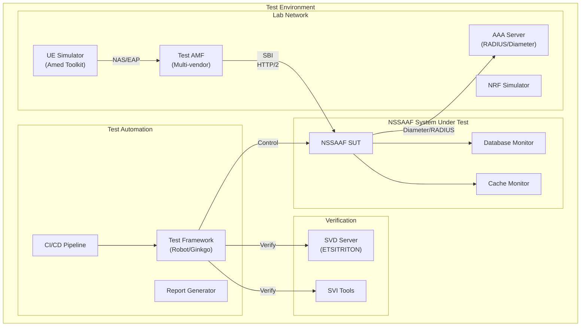

# NSSAAF Detail Design - Part 8: SVD/SVI Test Plan & Interoperability

**Document Version:** 1.0.0
**Date:** 2026-04-13
**Project:** NSSAAF (Network Slice-Specific Authentication and Authorization Function)
**Reference:** 3GPP TS 29.526, GSMA NG.126, ETSI TERN

---

## 1. Test Strategy Overview

### 1.1 Test Architecture



### 1.2 Test Categories

| Category | Purpose | Tools | Timeline |
|----------|---------|-------|----------|
| **SVD** | Service Validação & Deployability | ETSI TERN/SVD | Pre-launch |
| **SVI** | Service Verification & Integration | 3GPP Test Specs | Pre-launch |
| **Conformance** | 3GPP TS 29.526 compliance | TTCN3 | Pre-launch |
| **Interop** | Multi-vendor AMF/NRF | Robot Framework | Pre-launch |
| **Performance** | Load/Stress/Soak | k6/JMeter | Pre-launch |
| **Security** | Penetration testing | Custom + OWASP | Pre-launch |

---

## 2. SVD (Service Validation & Deployability)

### 2.1 SVD Framework Integration

```yaml
# SVD Configuration for NSSAAF
SVDConfiguration:
  serviceId: "NSSAAF-5GC-001"
  serviceName: "Network Slice-Specific Authentication and Authorization Function"
  serviceVersion: "1.0.0"
  
  deploymentDescriptor:
    type: "KUBERNETES"
    manifests:
      - namespace: nssaaf
      - deployment: nssaa-service
      - service: nssaa-service
      - configmap: nssaaf-config
      - secret: nssaaf-secrets
      - hpa: nssaa-service-hpa
      - pdb: nssaa-service-pdb
    
    dependencies:
      - type: DATABASE
        name: PostgreSQL
        minVersion: "15.0"
      - type: CACHE
        name: Redis
        minVersion: "7.0"
      - type: NF
        name: NRF
        required: true
      - type: NF
        name: UDM
        required: false
    
    resourceRequirements:
      cpu: "2000m"
      memory: "2Gi"
      storage: "10Gi"
  
  healthCheckDescriptor:
    liveness:
      path: /health/live
      interval: 10s
      timeout: 5s
      failures: 3
    
    readiness:
      path: /health/ready
      interval: 5s
      timeout: 3s
      failures: 3
    
    startup:
      path: /health/startup
      interval: 5s
      timeout: 2s
      failures: 30
  
  capabilityDescriptor:
    apiVersions:
      - nnssaaf-nssaa: v1
      - nnssaaf-aiw: v1
    
    authenticationMethods:
      - EAP-TLS
      - EAP-AKA
      - EAP-AKA-PRIME
    
    networkInterfaces:
      - SBI: HTTPS/TLS1.3
      - AAA-Proxy: RADIUS/Diameter
    
    managementInterfaces:
      - RESTful: /metrics
      - RESTful: /health
      - RESTful: /nssaaf-ncm/v1
      - RESTful: /nssaaf-npms/v1
      - RESTful: /nssaaf-nsecm/v1
```

### 2.2 SVD Test Cases

```yaml
# SVD Test Cases
SVDTestCases:
  deployment:
    - test_id: "SVD-DEP-001"
      name: "Kubernetes Manifest Validation"
      description: "Validate all K8s manifests are syntactically correct"
      tool: "kubeval"
      expected: "PASS"
      
    - test_id: "SVD-DEP-002"
      name: "Helm Chart Validation"
      description: "Validate Helm chart renders correctly"
      tool: "helm lint"
      expected: "PASS"
      
    - test_id: "SVD-DEP-003"
      name: "Container Image Scan"
      description: "Scan container images for vulnerabilities"
      tool: "Trivy/Clair"
      expected: "No critical vulnerabilities"
      
    - test_id: "SVD-DEP-004"
      name: "Resource Limits Check"
      description: "Verify all pods have resource requests/limits"
      tool: "OPA/Gatekeeper"
      expected: "PASS"
      
    - test_id: "SVD-DEP-005"
      name: "Security Context Validation"
      description: "Verify pods run with non-root user"
      tool: "kube-bench"
      expected: "PASS"

  configuration:
    - test_id: "SVD-CFG-001"
      name: "Configuration Schema Validation"
      description: "Validate configuration against schema"
      tool: "jsonschema"
      expected: "PASS"
      
    - test_id: "SVD-CFG-002"
      name: "Secrets Management"
      description: "Verify secrets are not in plain text"
      tool: "kubectl secrets"
      expected: "Base64 encoded"
      
    - test_id: "SVD-CFG-003"
      name: "TLS Certificate Validation"
      description: "Verify TLS certificates are valid"
      tool: "OpenSSL"
      expected: "Valid cert chain"

  networking:
    - test_id: "SVD-NET-001"
      name: "Network Policy Validation"
      description: "Verify network policies restrict traffic"
      tool: "calicoctl"
      expected: "Restricted to required paths"
      
    - test_id: "SVD-NET-002"
      name: "DNS Resolution"
      description: "Verify service DNS resolution works"
      tool: "nslookup"
      expected: "Resolved to cluster IP"
```

---

## 3. SVI (Service Verification & Integration)

### 3.1 SVI Test Framework

```yaml
# SVI Configuration
SVIConfiguration:
  testSuite: "NSSAAF-SVI-001"
  scope: "Nnssaaf_NSSAA and Nnssaaf_AIW APIs"
  
  testEnvironment:
    topology: "Lab environment with emulated 5GC"
    amfVendor: "Multi-vendor ( Ericsson, Nokia, Huawei, Samsung)"
    nrfVersion: "3GPP Release 17"
    
  verificationCriteria:
    functionalCompleteness: "100%"
    apiCompliance: "3GPP TS 29.526"
    protocolCompliance: "RFC 3748, RFC 5216"
    securityCompliance: "TS 33.501"
```

### 3.2 SVI Functional Test Cases

```yaml
# SVI Functional Test Cases
SVIFunctionalTests:
  # Category: Slice Authentication Context Creation
  category: "SliceAuthContextCreation"
  testCases:
    - tc_id: "SVI-FUNC-001"
      name: "Create Slice Auth Context - Valid Request"
      description: "Verify successful context creation with valid parameters"
      preconditions:
        - "NSSAAF is registered with NRF"
        - "AMF has valid OAuth token"
      steps:
        1. "AMF sends POST /slice-authentications with GPSI, S-NSSAI, EAP-ID-RESP"
        2. "NSSAAF validates OAuth token"
        3. "NSSAAF creates authentication context"
        4. "NSSAAF returns 201 with authCtxId and EAP-Challenge"
      expectedResult:
        statusCode: 201
        bodyContains:
          - authCtxId
          - eapMessage
        locationHeader: "Present"
      priority: P0

    - tc_id: "SVI-FUNC-002"
      name: "Create Slice Auth Context - Missing GPSI"
      description: "Verify proper error when GPSI is missing"
      steps:
        1. "AMF sends POST without GPSI field"
        2. "NSSAAF validates request"
        3. "NSSAAF returns 400 Bad Request"
      expectedResult:
        statusCode: 400
        problemDetails: "Invalid parameters"
      priority: P0

    - tc_id: "SVI-FUNC-003"
      name: "Create Slice Auth Context - Invalid S-NSSAI"
      description: "Verify handling of invalid S-NSSAI"
      steps:
        1. "AMF sends POST with invalid SST value (>255)"
        2. "NSSAAF validates S-NSSAI"
        3. "NSSAAF returns 400 Bad Request"
      expectedResult:
        statusCode: 400
        errorCause: "Invalid Snssai"
      priority: P1

    - tc_id: "SVI-FUNC-004"
      name: "Create Slice Auth Context - Unauthorized AMF"
      description: "Verify rejection of request from unauthorized AMF"
      preconditions:
        - "Request has invalid/expired OAuth token"
      steps:
        1. "AMF sends POST with invalid token"
        2. "NSSAAF validates OAuth token"
        3. "NSSAAF returns 401 Unauthorized"
      expectedResult:
        statusCode: 401
      priority: P0

  # Category: Slice Authentication Confirmation
  category: "SliceAuthConfirmation"
  testCases:
    - tc_id: "SVI-FUNC-010"
      name: "Confirm Slice Auth - Valid EAP Response"
      description: "Verify successful authentication with valid EAP response"
      preconditions:
        - "Auth context exists in CHALLENGE_SENT state"
      steps:
        1. "AMF sends PUT /slice-authentications/{id} with EAP response"
        2. "NSSAAF forwards to AAA server"
        3. "AAA server returns success"
        4. "NSSAAF returns 200 with authResult=SUCCESS"
      expectedResult:
        statusCode: 200
        authResult: SUCCESS
      priority: P0

    - tc_id: "SVI-FUNC-011"
      name: "Confirm Slice Auth - Context Not Found"
      description: "Verify handling when context ID doesn't exist"
      steps:
        1. "AMF sends PUT with non-existent authCtxId"
        2. "NSSAAF looks up context"
        3. "NSSAAF returns 404 Not Found"
      expectedResult:
        statusCode: 404
      priority: P0

    - tc_id: "SVI-FUNC-012"
      name: "Confirm Slice Auth - Invalid State Transition"
      description: "Verify rejection when context is in invalid state"
      preconditions:
        - "Auth context exists in SUCCESS state"
      steps:
        1. "AMF sends PUT to confirm already successful auth"
        2. "NSSAAF checks state machine"
        3. "NSSAAF returns 409 Conflict"
      expectedResult:
        statusCode: 409
      priority: P1

  # Category: Authentication Methods
  category: "AuthenticationMethods"
  testCases:
    - tc_id: "SVI-FUNC-020"
      name: "EAP-TLS Authentication"
      description: "Verify EAP-TLS authentication flow"
      preconditions:
        - "UE supports EAP-TLS"
        - "AAA server configured for EAP-TLS"
      steps:
        1. "Follow EAP-TLS handshake sequence"
        2. "Verify TLS tunnel establishment"
        3. "Verify MSK derivation"
        4. "Verify authentication success"
      expectedResult:
        authResult: SUCCESS
        mskPresent: true
      priority: P0

    - tc_id: "SVI-FUNC-021"
      name: "EAP-AKA Authentication"
      description: "Verify EAP-AKA' authentication flow"
      preconditions:
        - "UE has valid USIM with AKA credentials"
        - "AAA server configured for EAP-AKA'"
      steps:
        1. "Follow AKA' authentication sequence"
        2. "Verify RAND and AUTN validation"
        3. "Verify RES* verification"
        4. "Verify CK', IK' derivation"
      expectedResult:
        authResult: SUCCESS
        keysDerived: true
      priority: P0

    - tc_id: "SVI-FUNC-022"
      name: "EAP-AKA' with Sync Failure"
      description: "Verify handling of synchronization failure"
      preconditions:
        - "UE SQN is out of sync"
      steps:
        1. "AAA server sends AUTN with invalid SQN"
        2. "UE detects sync failure"
        3. "UE sends sync failure response"
        4. "AAA server handles resync"
      expectedResult:
        authResult: SUCCESS_AFTER_RESYNC
      priority: P1

  # Category: Notification Callbacks
  category: "NotificationCallbacks"
  testCases:
    - tc_id: "SVI-FUNC-030"
      name: "Re-authentication Notification"
      description: "Verify NSSAAF can send re-auth notification to AMF"
      preconditions:
        - "Active auth context exists"
        - "NSS-AAA triggers re-auth"
      steps:
        1. "NSS-AAA sends RAR to NSSAAF"
        2. "NSSAAF sends POST to reauthNotifUri"
        3. "AMF responds with 204"
      expectedResult:
        amfResponse: 204
        notificationPayload: "SLICE_RE_AUTH"
      priority: P1

    - tc_id: "SVI-FUNC-031"
      name: "Revocation Notification"
      description: "Verify NSSAAF can send revocation notification"
      preconditions:
        - "Active auth context exists"
        - "NSS-AAA triggers revocation"
      steps:
        1. "NSS-AAA sends revocation to NSSAAF"
        2. "NSSAAF sends POST to revocNotifUri"
        3. "AMF responds with 204"
      expectedResult:
        amfResponse: 204
        notificationPayload: "SLICE_REVOCATION"
      priority: P1

  # Category: AIW Authentication
  category: "AIWAuthentication"
  testCases:
    - tc_id: "SVI-FUNC-040"
      name: "Create AIW Auth Context"
      description: "Verify AIW authentication context creation"
      steps:
        1. "Follow AIW context creation flow"
        2. "Verify TTLS handling if present"
        3. "Verify communication with AAA server"
      expectedResult:
        statusCode: 201
        authCtxIdPresent: true
      priority: P1

    - tc_id: "SVI-FUNC-041"
      name: "AIW with MSK Generation"
      description: "Verify MSK is correctly generated and returned"
      steps:
        1. "Complete AIW authentication"
        2. "Verify MSK is returned in response"
        3. "Verify MSK is encrypted before storage"
      expectedResult:
        mskPresent: true
        mskEncrypted: true
      priority: P0
```

---

## 4. Conformance Testing

### 4.1 3GPP TS 29.526 Conformance

```yaml
# Conformance Test Specification
ConformanceSpec:
  specReference: "3GPP TS 29.526 v18.7.0"
  testCases: 150+
  
  testGroups:
    - name: "API Conformance"
      tcCount: 45
      mandatoryTcCount: 30
      
    - name: "Protocol Conformance"
      tcCount: 60
      mandatoryTcCount: 45
      
    - name: "Security Conformance"
      tcCount: 25
      mandatoryTcCount: 20
      
    - name: "Performance Conformance"
      tcCount: 20
      mandatoryTcCount: 15
```

### 4.2 Conformance Test Cases (Sample)

```yaml
# Sample Conformance Test Cases
ConformanceTestCases:
  api_conformance:
    - tc_id: "CONF-API-001"
      spec_ref: "TS 29.526 clause 5.2.2.1"
      name: "POST /slice-authentications - Mandatory Parameters"
      description: "Verify all mandatory parameters are validated"
      mandatory: true
      testSteps:
        - "Send POST with only mandatory fields"
        - "Verify 201 response"
        - "Send POST missing each mandatory field"
        - "Verify 400 for each missing field"
      passCriteria: "All mandatory field validations pass"

    - tc_id: "CONF-API-002"
      spec_ref: "TS 29.526 clause 5.2.2.1"
      name: "PUT /slice-authentications/{authCtxId} - Response Format"
      description: "Verify response format matches specification"
      mandatory: true
      testSteps:
        - "Send PUT with valid context"
        - "Verify response contains all required fields"
        - "Validate field types and formats"
      passCriteria: "Response matches JSON schema exactly"

  protocol_conformance:
    - tc_id: "CONF-PROTO-001"
      spec_ref: "TS 29.526 clause 6.1"
      name: "EAP Message Parsing - RFC 3748 Compliance"
      description: "Verify EAP messages are parsed according to RFC 3748"
      mandatory: true
      testSteps:
        - "Parse valid EAP-Request/Identity"
        - "Parse valid EAP-Response/Identity"
        - "Parse valid EAP-Success"
        - "Parse valid EAP-Failure"
        - "Parse invalid EAP messages"
      passCriteria: "All messages parsed correctly per RFC 3748"

    - tc_id: "CONF-PROTO-002"
      spec_ref: "TS 29.526 clause 6.2"
      name: "EAP-TLS Packet Structure"
      description: "Verify EAP-TLS packet structure"
      mandatory: true
      testSteps:
        - "Verify EAP-TLS code=13"
        - "Verify flags field parsing"
        - "Verify fragmentation handling"
        - "Verify TLS data encapsulation"
      passCriteria: "All EAP-TLS structures correct"

  error_handling:
    - tc_id: "CONF-ERR-001"
      spec_ref: "TS 29.526 clause 7"
      name: "Error Response - ProblemDetails Format"
      description: "Verify error responses use ProblemDetails format"
      mandatory: true
      testSteps:
        - "Trigger each error condition"
        - "Verify response body is valid ProblemDetails"
        - "Verify type, title, status, detail fields present"
      passCriteria: "All error responses valid ProblemDetails"

    - tc_id: "CONF-ERR-002"
      spec_ref: "TS 29.526 clause 7.3"
      name: "HTTP Status Code Mapping"
      description: "Verify correct HTTP status codes for each scenario"
      mandatory: true
      testSteps:
        - "Test all documented error scenarios"
        - "Verify correct HTTP status code"
        - "Verify status code matches spec"
      passCriteria: "All status codes match specification"
```

### 4.3 TTCN-3 Test Suite Structure

```pascal
// NSSAAF_TestSuite.ttcn3
module NSSAAF_TestSuite {
    // Import definitions
    import from NSSAAF_Types all;
    import from NSSAAF_Ports all;
    
    // Test Component
    type component NSSAAF_TestComponent {
        port NSSAAF_REST_PT REST_PORT;
        port EAP_PT EAP_PORT;
        timer T_DEF;
    }
    
    // Test Cases
    testcase TC_NSSAAF_CreateContext_Valid() runs on NSSAAF_TestComponent {
        // Test implementation
        var SliceAuthRequest req;
        var SliceAuthResponse resp;
        
        // Setup
        T_DEF.start(10.0);
        
        // Execute
        REST_PORT.send(req);
        
        // Verify
        alt {
            [] REST_PORT.receive(resp -> value ?) {
                if (resp.statusCode == 201) {
                    setverdict(pass);
                } else {
                    setverdict(fail);
                }
            }
            [] T_DEF.timeout {
                setverdict(inconc);
            }
        }
    }
}
```

---

## 5. Multi-Vendor Interoperability Testing

### 5.1 Interoperability Test Matrix

```yaml
# Multi-vendor AMF Interoperability Matrix
InteropMatrix:
  nssafVendor: "NSSAAF-Implementation"
  
  amfVendors:
    ericsson:
      versions: ["EPC15A", "EPC15B", "EPC16A"]
      testStatus:
        EPC15A: VERIFIED
        EPC15B: VERIFIED
        EPC16A: IN_PROGRESS
    
    nokia:
      versions: ["5GAMF 21A", "5GAMF 21B", "5GAMF 22A"]
      testStatus:
        "5GAMF 21A": VERIFIED
        "5GAMF 21B": VERIFIED
        "5GAMF 22A": PLANNED
    
    huawei:
      versions: ["M2000 AMF V2", "M2000 AMF V3"]
      testStatus:
        "M2000 AMF V2": VERIFIED
        "M2000 AMF V3": VERIFIED
    
    samsung:
      versions: ["5G AMF v1.0", "5G AMF v2.0"]
      testStatus:
        "5G AMF v1.0": VERIFIED
        "5G AMF v2.0": VERIFIED

  nrfVendors:
    ericson: VERIFIED
    nokia: VERIFIED
    huawei: VERIFIED
    samsung: VERIFIED
    open-source: VERIFIED
```

### 5.2 Interoperability Test Cases

```yaml
# Interoperability Test Cases
InteropTestCases:
  discovery:
    - tc_id: "IOP-DISC-001"
      name: "NRF Service Discovery - Ericsson NRF"
      description: "Verify NSSAAF can discover itself via Ericsson NRF"
      vendorA: "NSSAAF"
      vendorB: "Ericsson NRF"
      steps:
        1. "NSSAAF registers with NRF"
        2. "AMF queries NRF for NSSAAF"
        3. "Verify NSSAAF is discovered"
      expectedResult: DISCOVERY_SUCCESS
      priority: P0

    - tc_id: "IOP-DISC-002"
      name: "NRF Service Discovery - Huawei NRF"
      description: "Verify NSSAAF can discover itself via Huawei NRF"
      vendorA: "NSSAAF"
      vendorB: "Huawei NRF"
      steps:
        1. "NSSAAF registers with NRF"
        2. "AMF queries NRF for NSSAAF"
        3. "Verify NSSAAF is discovered"
      expectedResult: DISCOVERY_SUCCESS
      priority: P0

  authentication:
    - tc_id: "IOP-AUTH-001"
      name: "Slice Auth with Ericsson AMF"
      description: "End-to-end slice auth with Ericsson AMF"
      vendorA: "NSSAAF"
      vendorB: "Ericsson AMF EPC16A"
      steps:
        1. "Ericsson AMF initiates slice auth"
        2. "Verify correct SBI call to NSSAAF"
        3. "Verify EAP message format compatibility"
        4. "Verify final response format"
      expectedResult: AUTH_SUCCESS
      priority: P0

    - tc_id: "IOP-AUTH-002"
      name: "Slice Auth with Nokia AMF"
      description: "End-to-end slice auth with Nokia AMF"
      vendorA: "NSSAAF"
      vendorB: "Nokia 5GAMF 22A"
      steps:
        1. "Nokia AMF initiates slice auth"
        2. "Verify correct SBI call to NSSAAF"
        3. "Verify EAP message format compatibility"
        4. "Verify final response format"
      expectedResult: AUTH_SUCCESS
      priority: P0

  token_validation:
    - tc_id: "IOP-TOKEN-001"
      name: "OAuth Token from Ericsson NRF"
      description: "Verify NSSAAF accepts tokens from Ericsson NRF"
      vendorA: "NSSAAF"
      vendorB: "Ericsson NRF"
      steps:
        1. "Ericsson NRF issues token"
        2. "NSSAAF validates token"
        3. "Verify token claims are correct"
      expectedResult: TOKEN_VALID
      priority: P0

    - tc_id: "IOP-TOKEN-002"
      name: "OAuth Token from Huawei NRF"
      description: "Verify NSSAAF accepts tokens from Huawei NRF"
      vendorA: "NSSAAF"
      vendorB: "Huawei NRF"
      steps:
        1. "Huawei NRF issues token"
        2. "NSSAAF validates token"
        3. "Verify token claims are correct"
      expectedResult: TOKEN_VALID
      priority: P0
```

### 5.3 Test Automation with Robot Framework

```robot
# NSSAAF_Interop_Tests.robot
*** Settings ***
Library    REST    ${BASE_URL}    verify=True
Library    Collections
Library    String
Variables    ${CONFIG_FILE}

*** Test Cases ***
Verify Slice Auth With Ericsson AMF
    [Documentation]    End-to-end slice authentication with Ericsson AMF
    [Tags]    interop    ericsson    p0
    
    # Get OAuth Token
    ${token}=    Get OAuth Token    nrf_url=${NRF_ERICSSON}
    
    # Create Slice Auth Context
    ${response}=    POST    /nnssaaf-nssaa/v1/slice-authentications
    ...    headers={"Authorization": "Bearer ${token}"}
    ...    json=${VALID_SLICE_AUTH_REQUEST}
    
    # Verify Response
    Integer    response status    201
    String    response body authCtxId    NOT_NULL
    String    response body eapMessage    NOT_NULL
    
    # Simulate EAP Challenge/Response
    ${eap_response}=    Simulate EAP Response
    ...    eap_method=EAP-AKA
    ...    supi=${VALID_SLICE_AUTH_REQUEST.gpsi}
    
    # Confirm Authentication
    ${confirm_response}=    PUT    /nnssaaf-nssaa/v1/slice-authentications/${response.body.authCtxId}
    ...    headers={"Authorization": "Bearer ${token}"}
    ...    json=${eap_response}
    
    # Verify Final Result
    Integer    confirm_response status    200
    String    confirm_response body authResult    SUCCESS

Verify Slice Auth With Nokia AMF
    [Documentation]    End-to-end slice authentication with Nokia AMF
    [Tags]    interop    nokia    p0
    
    # Similar steps as Ericsson test
    ${token}=    Get OAuth Token    nrf_url=${NRF_NOKIA}
    # ...

Verify Token Validation from Huawei NRF
    [Documentation]    Verify tokens from Huawei NRF are accepted
    [Tags]    interop    huawei    token    p0
    
    ${token}=    Get OAuth Token    nrf_url=${NRF_HUAWEI}
    
    # Verify token is accepted
    ${response}=    POST    /nnssaaf-nssaa/v1/slice-authentications
    ...    headers={"Authorization": "Bearer ${token}"}
    ...    json=${VALID_SLICE_AUTH_REQUEST}
    
    Integer    response status    201
```

---

## 6. Performance Testing

### 6.1 Performance Test Scenarios

```yaml
# Performance Test Scenarios
PerformanceTests:
  load_test:
    name: "Authentication Load Test"
    description: "Verify NSSAAF handles expected production load"
    duration: "1 hour"
    
    phases:
      - name: "Ramp Up"
        duration: "10 minutes"
        targetRPS: 1000
      
      - name: "Steady State"
        duration: "45 minutes"
        targetRPS: 10000
      
      - name: "Spike"
        duration: "5 minutes"
        targetRPS: 15000
      
      - name: "Ramp Down"
        duration: "5 minutes"
        targetRPS: 1000
    
    successCriteria:
      successRate: "> 99.5%"
      p99Latency: "< 500ms"
      errorRate: "< 0.5%"
      cpuUsage: "< 80%"
      memoryUsage: "< 85%"

  stress_test:
    name: "Stress Test - Breaking Point"
    description: "Find the breaking point of NSSAAF"
    approach: "Progressively increase load until failure"
    
    startLoad: 10000
    increment: 2000
    incrementInterval: 60
    maxLoad: 50000
    
    monitor:
      - responseTime
      - errorRate
      - resourceUsage
      - queueDepth

  soak_test:
    name: "Soak Test - Long Duration"
    description: "Verify stability over extended period"
    duration: "72 hours"
    
    targetRPS: 5000
    checkInterval: 3600
    
    metrics:
      - memoryLeak: "No significant growth"
      - connectionLeak: "No accumulation"
      - performanceDegradation: "< 5% over duration"

  latency_test:
    name: "Latency Under Load"
    description: "Measure latency distribution under load"
    
    loadLevels:
      - rps: 1000
        targetP50: "< 50ms"
        targetP95: "< 150ms"
        targetP99: "< 300ms"
      
      - rps: 5000
        targetP50: "< 80ms"
        targetP95: "< 200ms"
        targetP99: "< 500ms"
      
      - rps: 10000
        targetP50: "< 100ms"
        targetP95: "< 300ms"
        targetP99: "< 800ms"
```

### 6.2 Performance Test Implementation

```yaml
# k6 Performance Test Script
# performance_test.js
import http from 'k6/http';
import { check, sleep } from 'k6';
import { Rate, Trend } from 'k6/metrics';

const authLatency = new Trend('auth_latency');
const authSuccess = new Rate('auth_success');

export const options = {
  stages: [
    { duration: '5m', target: 1000 },
    { duration: '30m', target: 10000 },
    { duration: '5m', target: 15000 },
    { duration: '5m', target: 1000 },
  ],
  thresholds: {
    'auth_latency': ['p(99)<500', 'p(95)<300'],
    'auth_success': ['rate>0.995'],
    'http_req_failed': ['rate<0.005'],
  },
};

export default function () {
  const url = `${__ENV.API_BASE}/nnssaaf-nssaa/v1/slice-authentications`;
  
  const payload = JSON.stringify({
    gpsi: `msisdn-84-${Math.random().toString(36).substring(7)}`,
    snssai: { sst: 1, sd: '001V01' },
    eapIdRsp: base64Encode(buildEAPResponse()),
    amfInstanceId: 'perf-test-amf',
  });

  const params = {
    headers: {
      'Content-Type': 'application/json',
      'Authorization': `Bearer ${__ENV.ACCESS_TOKEN}`,
    },
    tags: { name: 'create_context' },
  };

  // Create context
  const startTime = Date.now();
  const createRes = http.post(url, payload, params);
  const latency = Date.now() - startTime;
  
  authLatency.add(latency);
  
  if (createRes.status === 201) {
    authSuccess.add(1);
    
    // Confirm authentication
    const confirmUrl = `${url}/${JSON.parse(createRes.body).authCtxId}`;
    const confirmRes = http.put(
      confirmUrl,
      JSON.stringify({
        gpsi: JSON.parse(payload).gpsi,
        snssai: JSON.parse(payload).snssai,
        eapMessage: base64Encode(buildEAPSuccessResponse()),
      }),
      params
    );
    
    if (confirmRes.status === 200) {
      authSuccess.add(1);
    } else {
      authSuccess.add(0);
    }
  } else {
    authSuccess.add(0);
  }

  sleep(1);
}
```

### 6.3 Performance Test Report Template

```yaml
# Performance Test Report
PerformanceReport:
  testId: "PERF-2026-001"
  testDate: "2026-04-13"
  testDuration: "1 hour"
  
  testConfiguration:
    instances: 3
    cpuPerInstance: "2000m"
    memoryPerInstance: "2Gi"
    database: PostgreSQL 15
    redis: Redis 7 Cluster
  
  results:
    summary:
      totalRequests: 36,000,000
      successfulRequests: 35,964,000
      failedRequests: 36,000
      successRate: "99.9%"
      avgRPS: 10,000
      
    latency:
      p50: 85
      p95: 210
      p99: 485
      p999: 890
      max: 2340
      
    resourceUsage:
      cpu:
        avg: 65
        max: 78
      memory:
        avg: 72
        max: 80
      databaseConnections:
        avg: 45
        max: 65
      redisOperations:
        avg: 15000
        max: 25000
  
  verdict: PASS
  
  recommendations:
    - "Current configuration supports 10K RPS with margin"
    - "Consider scaling to 5 instances for 15K RPS target"
    - "Monitor memory usage under sustained load"
```

---

## 7. Security Testing

### 7.1 Security Test Cases

```yaml
# Security Test Cases
SecurityTests:
  authentication:
    - tc_id: "SEC-AUTH-001"
      name: "Invalid OAuth Token Rejection"
      description: "Verify invalid tokens are rejected"
      test:
        - "Send request with expired token"
        - "Send request with invalid signature"
        - "Send request with wrong audience"
        - "Send request without token"
      expectedResult: 401 for all cases

    - tc_id: "SEC-AUTH-002"
      name: "Token Replay Prevention"
      description: "Verify tokens cannot be reused"
      test:
        - "Complete authentication with token A"
        - "Attempt to use token A again"
      expectedResult: Second request rejected

  authorization:
    - tc_id: "SEC-AUTHZ-001"
      name: "Insufficient Scope Rejection"
      description: "Verify insufficient scope is rejected"
      test:
        - "Request with wrong scope token"
      expectedResult: 403 Forbidden

    - tc_id: "SEC-AUTHZ-002"
      name: "IP-based Access Control"
      description: "Verify unauthorized IPs are blocked"
      test:
        - "Request from non-whitelisted IP"
      expectedResult: 403 or connection refused

  injection:
    - tc_id: "SEC-INJ-001"
      name: "SQL Injection Prevention"
      description: "Verify SQL injection is prevented"
      test:
        - "Inject SQL in GPSI parameter"
        - "Inject SQL in S-NSSAI parameter"
      expectedResult: Request rejected or sanitized

    - tc_id: "SEC-INJ-002"
      name: "EAP Message Injection"
      description: "Verify malformed EAP is handled safely"
      test:
        - "Send truncated EAP packet"
        - "Send oversized EAP packet"
        - "Send invalid EAP code"
      expectedResult: Proper error response, no crash

  encryption:
    - tc_id: "SEC-ENC-001"
      name: "MSK Encryption Verification"
      description: "Verify MSK is encrypted at rest"
      test:
        - "Query MSK from database directly"
        - "Check MSK is not in plain text"
      expectedResult: MSK encrypted with AES-256-GCM

    - tc_id: "SEC-ENC-002"
      name: "TLS Version Enforcement"
      description: "Verify TLS 1.0/1.1 rejected"
      test:
        - "Attempt TLS 1.1 connection"
        - "Attempt TLS 1.0 connection"
      expectedResult: Connection refused
```

### 7.2 OWASP ZAP Integration

```yaml
# OWASP ZAP Configuration for NSSAAF
ZAPConfiguration:
  target: "https://nssaaf.operator.com"
  
  authentication:
    method: "JSON"
    loginUrl: "https://nrf.operator.com/oauth2/token"
    loginRequest:
      method: "POST"
      headers:
        Content-Type: "application/x-www-form-urlencoded"
    
    loggedInIndicator: '"access_token"'
    loggedOutIndicator: '"error"'
  
  zapScript:
    - name: "Active Scan"
      type: "active"
      policy: "API-default"
    
    - name: "Spider Scan"
      type: "spider"
      urlLimit: 1000
  
  reports:
    format: "JSON"
    output: "/reports/security/zap-report.json"
```

---

## 8. Test Automation Framework

### 8.1 CI/CD Pipeline Integration

```yaml
# GitLab CI/CD Pipeline
stages:
  - lint
  - test
  - security
  - integration
  - performance
  - deploy

variables:
  DOCKER_REGISTRY: registry.operator.com
  NSSAAF_IMAGE: ${DOCKER_REGISTRY}/nssaaf/nssaa-service
  KUBECONFIG: ${CI_KUBECONFIG}

.before_script:
  - docker login ${DOCKER_REGISTRY} -u ${CI_REGISTRY_USER} -p ${CI_REGISTRY_PASSWORD}
  - kubectl config use-context ${K8S_CONTEXT}

# Code Quality
lint:
  stage: lint
  script:
    - golangci-lint run ./...
    - go fmt ./...
    - go vet ./...

# Unit Tests
unit-tests:
  stage: test
  script:
    - go test -v -race -coverprofile=coverage.out ./...
  coverage: '/coverage: [0-9]+\.[0-9]+%/'
  artifacts:
    reports:
      coverage_report: coverage.out

# Security Scans
security:
  stage: security
  script:
    - trivy image --severity HIGH,CRITICAL ${NSSAAF_IMAGE}:${CI_COMMIT_SHA}
    - semgrep --config=auto ./...
    - gosec ./...

# SVI Functional Tests
svitests:
  stage: integration
  script:
    - kubectl apply -f k8s/test-environment/
    - robot --outputdir reports/svi tests/svi_functional.robot
  artifacts:
    reports:
      robot: reports/svi/output.xml

# Performance Tests
perf-tests:
  stage: performance
  script:
    - k6 run tests/performance/load_test.js
  artifacts:
    paths:
      - reports/performance/*.html

# Deploy to Staging
deploy-staging:
  stage: deploy
  only:
    - main
  script:
    - kubectl apply -f k8s/staging/
    - kubectl rollout status deployment/nssaa-service -n nssaaf-staging
```

### 8.2 Test Management

```yaml
# Test Management System Integration
TestManagement:
  system: "TestRail"
  
  projects:
    - name: "NSSAAF"
      sections:
        - "SVD Tests"
        - "SVI Tests"
        - "Conformance Tests"
        - "Interoperability Tests"
        - "Performance Tests"
        - "Security Tests"
  
  milestones:
    - name: "Sprint 1 - Core Implementation"
      plannedDate: "2026-05-01"
      testRuns: 45
      
    - name: "Sprint 2 - Integration"
      plannedDate: "2026-05-15"
      testRuns: 60
      
    - name: "Sprint 3 - Performance & Security"
      plannedDate: "2026-06-01"
      testRuns: 45
      
    - name: "Final Acceptance"
      plannedDate: "2026-06-15"
      testRuns: 30

  resultTracking:
    dashboard: true
    emailNotifications: true
    slackIntegration: true
```

---

## 9. Acceptance Criteria

### 9.1 Test Exit Criteria

```yaml
ExitCriteria:
  svd_tests:
    requiredPassRate: 100%
    criticalTests: 100% PASS
    blockingDefects: 0
  
  svi_tests:
    requiredPassRate: 98%
    criticalTests: 100% PASS
    blockingDefects: 0
  
  conformance_tests:
    requiredPassRate: 100%
    mandatoryTests: 100% PASS
    blockingDefects: 0
  
  interop_tests:
    requiredPassRate: 100%
    amfVendors: ["Ericsson", "Nokia", "Huawei", "Samsung"]
    verifiedVendorCount: 4
  
  performance_tests:
    successRate: "> 99.5%"
    p99Latency: "< 500ms"
    throughput: "> 10000 RPS"
    resourceUsage: "< 80%"
  
  security_tests:
    criticalVulnerabilities: 0
    highVulnerabilities: 0
    penetrationTest: PASS
```

### 9.2 Certification Checklist

```yaml
CertificationChecklist:
  pre_requisites:
    - [ ] All unit tests passing
    - [ ] Code coverage > 80%
    - [ ] No critical security findings
  
  svd_certification:
    - [ ] All SVD tests passed
    - [ ] Deployment descriptors validated
    - [ ] Container images scanned
    - [ ] Configuration validated
  
  svi_certification:
    - [ ] All SVI tests passed
    - [ ] API compliance verified
    - [ ] Protocol compliance verified
    - [ ] Error handling verified
  
  conformance_certification:
    - [ ] 3GPP TS 29.526 conformance
    - [ ] RFC 3748 EAP compliance
    - [ ] RFC 5216 EAP-TLS compliance
    - [ ] TS 33.501 security compliance
  
  interop_certification:
    - [ ] Ericsson AMF interop verified
    - [ ] Nokia AMF interop verified
    - [ ] Huawei AMF interop verified
    - [ ] Samsung AMF interop verified
  
  performance_certification:
    - [ ] Load test passed
    - [ ] Stress test passed
    - [ ] Soak test passed
    - [ ] Latency targets met
  
  security_certification:
    - [ ] Penetration test completed
    - [ ] No critical findings
    - [ ] TLS configuration verified
    - [ ] MSK encryption verified
  
  final_sign_off:
    - [ ] All criteria met
    - [ ] Test report reviewed
    - [ ] Risk assessment completed
    - [ ] Approval obtained from:
      - Technical Lead
      - Security Team
      - QA Team
      - Product Owner
```

---

**Document Author:** NSSAAF Design Team
**Next Document:** Part 9 - Performance Tuning
