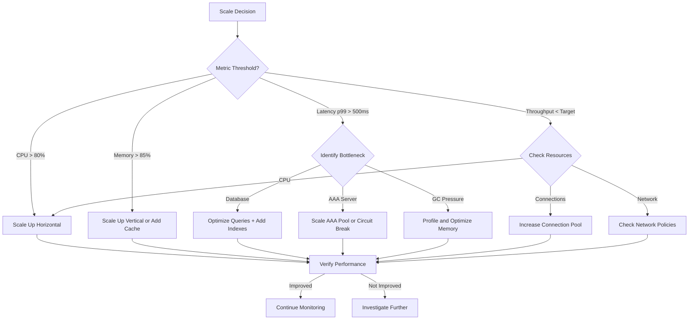

# NSSAAF Detail Design - Part 9: Performance Tuning & Optimization

**Document Version:** 1.0.0
**Date:** 2026-04-13
**Project:** NSSAAF (Network Slice-Specific Authentication and Authorization Function)
**Reference:** 3GPP TS 28.532, GSMA FS.15, ETSI EN 303 640

---

## 1. Performance Targets

### 1.1 SLA Requirements

```yaml
# Service Level Agreement
SLA:
  availability:
    target: 99.999%
    downtimeAllowed: 5.26 minutes/year
    downtimeAllowedMonthly: 26.3 seconds
    
  latency:
    authLatencyP50:
      target: "< 50ms"
      measurement: "End-to-end"
    
    authLatencyP95:
      target: "< 150ms"
      measurement: "End-to-end"
    
    authLatencyP99:
      target: "< 300ms"
      measurement: "End-to-end"
    
    authLatencyP999:
      target: "< 500ms"
      measurement: "End-to-end"
    
    aaaServerLatencyP99:
      target: "< 100ms"
      measurement: "AAA proxy to AAA server"
  
  throughput:
    maxThroughput: "> 10,000 RPS"
    sustainedThroughput: "8,000 RPS for 24 hours"
    burstCapacity: "15,000 RPS for 60 seconds"
  
  scalability:
    scaleUpTime: "< 2 minutes"
    scaleDownTime: "< 5 minutes"
    autoScaleMetric: CPU 70%, Memory 80%
  
  recovery:
    rto: "< 5 minutes"
    rpo: "< 1 minute"
    failbackTime: "< 10 minutes"
```

### 1.2 Capacity Planning

```yaml
# Capacity Planning Matrix
CapacityPlanning:
  baseline:
    instanceCount: 3
    cpuPerInstance: "2000m"
    memoryPerInstance: "2Gi"
    maxConcurrentContexts: 50,000
    
  capacity_per_instance:
    authPerSecond: 3,333
    concurrentConnections: 10,000
    databaseConnections: 20
    memoryContextStorage: 100MB
    
  scaling:
    horizontal:
      minReplicas: 3
      maxReplicas: 20
      scaleUpThreshold: 70% CPU for 2 minutes
      scaleDownThreshold: 30% CPU for 10 minutes
    
    vertical:
      cpuBurst: "3000m"
      memoryBurst: "4Gi"
      
  projections:
    # Based on 10M subscribers, 5% active at peak
    peakAuthRate: 10,000 RPS
    requiredInstances: 3
    requiredCpuTotal: "6000m"
    requiredMemoryTotal: "6Gi"
    
    # Future growth (2x)
    growthScenario:
      peakAuthRate: 20,000 RPS
      requiredInstances: 6
      requiredCpuTotal: "12,000m"
      requiredMemoryTotal: "12Gi"
```

---

## 2. Performance Benchmarks

### 2.1 Benchmark Definitions

```yaml
# Performance Benchmark Scenarios
Benchmarks:
  benchmark_001:
    id: "AUTH-LATENCY-BASE"
    name: "Base Authentication Latency"
    description: "Measure baseline authentication latency"
    
    testSetup:
      instances: 3
      load: 1,000 RPS
      duration: 60 seconds
      
    metrics:
      p50:
        target: 30
        acceptable: 50
        unit: ms
      
      p95:
        target: 100
        acceptable: 150
        unit: ms
      
      p99:
        target: 200
        acceptable: 300
        unit: ms

  benchmark_002:
    id: "AUTH-LATENCY-LOAD"
    name: "Authentication Latency Under Load"
    description: "Measure latency at peak load"
    
    testSetup:
      instances: 3
      load: 10,000 RPS
      duration: 300 seconds
      
    metrics:
      p50:
        target: 50
        acceptable: 80
        unit: ms
      
      p99:
        target: 300
        acceptable: 500
        unit: ms
      
      successRate:
        target: "> 99.9%"
        acceptable: "> 99.5%"

  benchmark_003:
    id: "AUTH-THROUGHPUT-MAX"
    name: "Maximum Throughput"
    description: "Find maximum sustained throughput"
    
    testSetup:
      instances: 3
      load: Start 1,000, increase by 1,000 every 60s
      maxLoad: 30,000 RPS
      abortCondition: "successRate < 99%"
      
    metrics:
      maxThroughput:
        target: "> 10,000 RPS"
        unit: RPS
        
      maxThroughputWithLatency:
        target: "> 8,000 RPS at p99 < 500ms"
        unit: RPS

  benchmark_004:
    id: "EAP-TLS-PERF"
    name: "EAP-TLS Performance"
    description: "Measure EAP-TLS handshake performance"
    
    testSetup:
      instances: 3
      load: 1,000 RPS
      authMethod: EAP-TLS
      duration: 60 seconds
      
    metrics:
      avgHandshakeTime:
        target: "< 200ms"
        unit: ms
        
      handshakeSuccessRate:
        target: "> 99.9%"

  benchmark_005:
    id: "DB-PERF"
    name: "Database Performance"
    description: "Measure database layer performance"
    
    testSetup:
      queryTypes:
        - "INSERT auth_context"
        - "SELECT auth_context by ID"
        - "SELECT auth_context by GPSI"
        - "UPDATE auth_context status"
        - "DELETE expired contexts"
      
      load: 10,000 ops/sec
      
    metrics:
      avgQueryTime:
        target: "< 10ms"
        acceptable: "< 50ms"
        
      p99QueryTime:
        target: "< 50ms"
        acceptable: "< 100ms"
```

### 2.2 Benchmark Results Template

```yaml
# Benchmark Result Report
BenchmarkResult:
  benchmarkId: string
  benchmarkDate: ISO8601
  environment:
    nssafVersion: string
    instanceCount: integer
    instanceType: string
    databaseVersion: string
    redisVersion: string
    
  results:
    overall:
      verdict: PASS | FAIL | CONDITIONAL_PASS
      
    latency:
      p50: number
      p90: number
      p95: number
      p99: number
      p999: number
      max: number
      
    throughput:
      achievedRPS: number
      successRate: percentage
      errorRate: percentage
      
    resourceUsage:
      avgCPU: percentage
      maxCPU: percentage
      avgMemory: percentage
      maxMemory: percentage
      avgDBConnections: number
      maxDBConnections: number
      
    comparison:
      vsPreviousVersion: percentage
      vsTarget: percentage
      
  issues:
    - issueId: string
      description: string
      severity: CRITICAL | MAJOR | MINOR
      workAround: string
      
  recommendations:
    - recommendation: string
      priority: HIGH | MEDIUM | LOW
      
  signOff:
    engineer: string
    date: ISO8601
    status: APPROVED | REJECTED
```

---

## 3. Optimization Strategies

### 3.1 Application-Level Optimization

```go
// Optimization: Connection Pool Tuning
package config

type DatabaseConfig struct {
    // Connection pool settings optimized for NSSAAF
    MaxOpenConns int           // 100 - max connections to DB
    MaxIdleConns int           // 20 - idle connections to keep
    ConnMaxLifetime int         // 30 minutes
    ConnMaxIdleTime int         // 10 minutes
    ConnMinConns int            // 10 - minimum connections
    HealthCheckPeriod int       // 30 seconds
}

// Optimization: Context Cache Settings
type CacheConfig struct {
    // Session cache settings
    SessionTTL int              // 3600 seconds (1 hour)
    MaxCacheSize int64          // 1GB max cache size
    EvictionPolicy string       // "lru"
    EvictBatchSize int          // 100 entries per eviction
    
    // Connection settings
    PoolSize int                // 100 connections
    MinIdleConns int            // 10
    ReadTimeout int             // 100ms
    WriteTimeout int            // 100ms
    
    // Pipeline settings
    PipelineWindow int         // 10ms pipeline window
    PipelineCapacity int        // 1000 commands in pipeline
}

// Optimization: HTTP Client Settings
type HTTPClientConfig struct {
    MaxIdleConns int           // 100
    MaxIdleConnsPerHost int    // 100
    IdleConnTimeout int         // 90 seconds
    DialTimeout int            // 5 seconds
    TLSHandshakeTimeout int    // 10 seconds
    ResponseHeaderTimeout int  // 30 seconds
    ExpectContinueTimeout int // 1 second
}
```

### 3.2 Database Optimization

```sql
-- Optimization: Connection Pool Sizing
-- Rule: (Number of CPU cores * 2) + effective_spindle_count
-- For NSSAAF with 8 cores and SSD: ~20 connections per pod

-- PostgreSQL Configuration for NSSAAF
ALTER SYSTEM SET max_connections = 500;
ALTER SYSTEM SET shared_buffers = '4GB';
ALTER SYSTEM SET effective_cache_size = '12GB';
ALTER SYSTEM SET maintenance_work_mem = '512MB';
ALTER SYSTEM SET checkpoint_completion_target = 0.9;
ALTER SYSTEM SET wal_buffers = '64MB';
ALTER SYSTEM SET default_statistics_target = 100;
ALTER SYSTEM SET random_page_cost = 1.1;  -- For SSD
ALTER SYSTEM SET effective_io_concurrency = 200;  -- For SSD
ALTER SYSTEM SET work_mem = '64MB';
ALTER SYSTEM SET min_wal_size = '1GB';
ALTER SYSTEM SET max_wal_size = '4GB';

-- Optimization: Index Creation for Performance
-- Covering indexes for common queries

-- Query 1: Get active context by GPSI (hot path)
CREATE INDEX CONCURRENTLY idx_auth_active_gpsi 
ON slice_auth_context(gpsi, status) 
WHERE status IN ('PENDING', 'CHALLENGE_SENT', 'AUTHENTICATING', 'SUCCESS')
INCLUDE (auth_ctx_id, created_at);

-- Query 2: Cleanup expired contexts
CREATE INDEX CONCURRENTLY idx_auth_expire_lookup
ON slice_auth_context(expires_at) 
WHERE status NOT IN ('ARCHIVED', 'REVOKED');

-- Query 3: Statistics by SNSSAI
CREATE INDEX CONCURRENTLY idx_auth_snssai_stats
ON slice_auth_context(snssai_sst, snssai_sd, date_trunc('hour', created_at))
INCLUDE (status, auth_result);

-- Optimization: Partitioning Strategy
-- Partition by time for efficient data management

CREATE TABLE slice_auth_context_partitioned (
    LIKE slice_auth_context INCLUDING ALL
) PARTITION BY RANGE (created_at);

-- Monthly partitions
CREATE TABLE slice_auth_context_2026_04 
PARTITION OF slice_auth_context_partitioned
FOR VALUES FROM ('2026-04-01') TO ('2026-05-01')
PARTITION BY HASH (auth_ctx_id);

-- Optimization: Materialized Views for Statistics
CREATE MATERIALIZED VIEW mv_auth_hourly_stats AS
SELECT 
    date_trunc('hour', created_at) as hour,
    snssai_sst,
    snssai_sd,
    auth_result,
    COUNT(*) as total_count,
    AVG(EXTRACT(EPOCH FROM (updated_at - created_at))) as avg_duration_ms,
    PERCENTILE_CONT(0.99) WITHIN GROUP (
        ORDER BY EXTRACT(EPOCH FROM (updated_at - created_at))
    ) as p99_duration_ms
FROM slice_auth_context
WHERE created_at >= NOW() - INTERVAL '7 days'
GROUP BY 1, 2, 3, 4
WITH DATA;

CREATE UNIQUE INDEX ON mv_auth_hourly_stats(hour, snssai_sst, snssai_sd, auth_result);

REFRESH MATERIALIZED VIEW CONCURRENTLY mv_auth_hourly_stats;

-- Optimization: Query hints for critical queries
-- Use prepared statements for hot path queries
PREPARE auth_insert AS
INSERT INTO slice_auth_context (
    auth_ctx_id, gpsi, supi, snssai_sst, snssai_sd,
    amf_instance_id, eap_method, status, created_at, updated_at, expires_at
) VALUES ($1, $2, $3, $4, $5, $6, $7, $8, $9, $10, $11)
ON CONFLICT (gpsi, snssai_sst, snssai_sd, amf_instance_id) 
DO NOTHING;

PREPARE auth_get_by_id AS
SELECT * FROM slice_auth_context 
WHERE auth_ctx_id = $1;

PREPARE auth_update_status AS
UPDATE slice_auth_context 
SET status = $2, updated_at = NOW(), auth_result = $3
WHERE auth_ctx_id = $1
RETURNING *;
```

### 3.3 Redis Optimization

```yaml
# Redis Configuration Optimization
redis:
  # Memory optimization
  maxmemory: "2gb"
  maxmemory-policy: "allkeys-lru"
  maxmemory-samples: 5
  
  # Persistence optimization (for durability vs performance)
  save: ""  # Disable RDB snapshots, rely on AOF
  appendonly: yes
  appendfsync: everysec  # Balance durability and performance
  
  # Network optimization
  tcp-backlog: 511
  tcp-keepalive: 300
  timeout: 0
  
  # Client optimization
  maxclients: 10000
  client-output-buffer-limit: 32mb 8mb 60
  
  # Slow log configuration
  slowlog-log-slower-than: 10000  # Log queries > 10ms
  slowlog-max-len: 128
  
  # Cluster optimization
  cluster-enabled: yes
  cluster-node-timeout: 15000
  cluster-replica-validity-factor: 10
  
  # Lua scripting
  lua-time-limit: 5000

# Pipeline optimizations in application
pipeline_config:
  # Batch similar commands
  batch_size: 100
  batch_timeout: 1ms
  
  # Use EVALSHA instead of EVAL for repeated scripts
  script_caching: yes
  
  # Connection multiplexing
  multiplex_connections: yes
```

### 3.4 Network Optimization

```yaml
# HTTP/2 Connection Optimization
http2:
  # Connection settings
  max_concurrent_streams: 1000
  initial_window_size: 6291456  # 6MB
  max_frame_size: 16384
  
  # Keepalive
  max_keepalive_requests: 1000
  keepalive_timeout: 30s
  
  # Compression
  compression: "gzip"
  compression_level: 6
  
  # Buffer sizes
  read_buffer_size: 32KB
  write_buffer_size: 32KB

# Service Mesh (Istio) Optimization
istio:
  pilot:
    # Connection pooling
    connection_pool:
      http:
        http1MaxPendingRequests: 10000
        http2MaxRequests: 10000
        maxRequestsPerConnection: 10000
    
    # Load balancing
    lbPolicy: LEAST_CONN
    
    # Circuit breaker
    circuit_breaker:
      consecutiveErrors: 10
      interval: 30s
      baseEjectionTime: 30s
      maxEjectionPercent: 50

  # Envoy resource limits
  envoy:
    runtime:
      # Overcommit for burst handling
      envoy.resource_override_thread.count: 8
      
      # Buffer limits
      upstream.websocket.default_buffer_kb: 64
      upstream.websocket.max_buffer_kb: 1024

# Load Balancer Optimization
loadBalancer:
  algorithm: "least_connections"
  
  healthCheck:
    interval: 10s
    timeout: 5s
    unhealthyThreshold: 3
    healthyThreshold: 2
  
  connectionDraining:
    enabled: true
    drainingTimeout: 30s
  
  sessionPersistence:
    enabled: false  # NSSAAF is stateless
```

---

## 4. Profiling and Diagnostics

### 4.1 Profiling Configuration

```yaml
# Application Profiling
profiling:
  enabled: true
  
  pprof:
    # HTTP endpoint for pprof
    httpEndpoint: ":6060"
    
    # CPU profiling
    cpuProfileRate: 100  # 100Hz
    cpuProfileDuration: 30s
    
    # Memory profiling
    memProfileRate: 4096  # Every 4096 allocations
    
    # Block profiling
    blockProfileRate: 10000  # Every 10ms blocked
    
    # Mutex profiling
    mutexProfileFraction: 10
  
  tracing:
    # OpenTelemetry configuration
    enabled: true
    exporterEndpoint: "otlp.operator.com:4317"
    samplingRate: 0.1  # 10% sampling
    
    # Span attributes
    customAttributes:
      - service.name
      - deployment.environment
      - auth.method
      - auth.result
    
    # Backpressure handling
    queueSize: 10000
    batchSize: 512
    batchTimeout: 5s

# Database Query Profiling
database:
  slowQueryThreshold: 100ms
  
  queryLogging:
    enabled: true
    logLevel: DEBUG
    logQueries: true
    logParams: false  # Don't log sensitive params
  
  explainPlans:
    # Log EXPLAIN plans for slow queries
    logPlanThreshold: 50ms
```

### 4.2 Diagnostic Commands

```bash
#!/bin/bash
# NSSAAF Performance Diagnostics Script

# 1. Check pod status and resource usage
kubectl top pods -n nssaaf
kubectl describe pods -n nssaaf | grep -A 5 "Conditions"

# 2. Check database performance
kubectl exec -it postgres-0 -n nssaaf-infra -- \
  psql -U postgres -d nssaaf -c "SELECT * FROM pg_stat_activity WHERE state = 'active';"

kubectl exec -it postgres-0 -n nssaaf-infra -- \
  psql -U postgres -d nssaaf -c "SELECT wait_event, COUNT(*) FROM pg_stat_activity GROUP BY wait_event;"

# 3. Check slow queries
kubectl exec -it postgres-0 -n nssaaf-infra -- \
  psql -U postgres -d nssaaf -c "SELECT query, calls, mean_time, total_time FROM pg_stat_statements ORDER BY mean_time DESC LIMIT 10;"

# 4. Check Redis performance
redis-cli -h redis-cluster INFO stats | grep -E "instantaneous_ops|total_commands|rejected_connections"

redis-cli -h redis-cluster INFO clients

redis-cli -h redis-cluster --latency-stats

# 5. Check connection pool status
curl -s localhost:8081/metrics | grep -E "db_pool_|redis_pool_"

# 6. Generate pprof
curl -s "http://localhost:6060/debug/pprof/profile?seconds=30" > cpu.prof
curl -s "http://localhost:6060/debug/pprof/heap" > heap.prof
curl -s "http://localhost:6060/debug/pprof/goroutine?debug=1" > goroutines.txt

# 7. Check network stats
netstat -s | grep -E "retransmit|error|failed"

# 8. Check kernel parameters
sysctl net.ipv4.tcp_tw_reuse
sysctl net.core.somaxconn
```

---

## 5. Performance Monitoring

### 5.1 Key Metrics Dashboard

```yaml
# Grafana Dashboard - Performance Deep Dive
GrafanaDashboard:
  title: "NSSAAF Performance Deep Dive"
  
  rows:
    - title: "Authentication Performance"
      panels:
        - title: "Auth Latency Distribution"
          type: histogram
          targets:
            - expr: "sum(rate(nssaf_auth_duration_bucket[5m])) by (le)"
              legendFormat: "{{le}}"
        
        - title: "Latency by Percentile"
          type: timeseries
          targets:
            - expr: "quantile_over_time(0.50, nssaf_auth_duration[5m])"
              legendFormat: "P50"
            - expr: "quantile_over_time(0.95, nssaf_auth_duration[5m])"
              legendFormat: "P95"
            - expr: "quantile_over_time(0.99, nssaf_auth_duration[5m])"
              legendFormat: "P99"
    
    - title: "Throughput"
      panels:
        - title: "Requests Per Second"
          type: timeseries
          targets:
            - expr: "sum(rate(nssaf_http_requests_total[1m]))"
              legendFormat: "Total RPS"
            - expr: "sum(rate(nssaf_http_requests_total{status=~\"2..\"}[1m]))"
              legendFormat: "Success RPS"
            - expr: "sum(rate(nssaf_http_requests_total{status=~\"4..|5..\"}[1m]))"
              legendFormat: "Error RPS"
        
        - title: "Success Rate"
          type: gauge
          targets:
            - expr: "sum(rate(nssaf_http_requests_total{status=~\"2..\"}[5m])) / sum(rate(nssaf_http_requests_total[5m])) * 100"
          thresholds:
            - value: 99.5
              color: green
            - value: 99.0
              color: yellow
            - value: 95.0
              color: red
    
    - title: "Resource Utilization"
      panels:
        - title: "CPU Usage"
          type: timeseries
          targets:
            - expr: "sum(rate(container_cpu_usage_seconds_total{pod=~\"nssaa-.*\"}[5m])) by (pod)"
        
        - title: "Memory Usage"
          type: timeseries
          targets:
            - expr: "sum(container_memory_usage_bytes{pod=~\"nssaa-.*\"}) by (pod)"
        
        - title: "Goroutine Count"
          type: timeseries
          targets:
            - expr: "go_goroutines{job=\"nssaa-service\"}"
    
    - title: "Database Performance"
      panels:
        - title: "Query Latency"
          type: heatmap
          targets:
            - expr: "rate(postgresql_query_duration_seconds_bucket[5m])"
        
        - title: "Connection Pool Usage"
          type: gauge
          targets:
            - expr: "postgresql_pool_connections_used / postgresql_pool_connections_max * 100"
        
        - title: "Slow Queries Rate"
          type: timeseries
          targets:
            - expr: "rate(postgresql_slow_queries_total[5m])"
    
    - title: "Cache Performance"
      panels:
        - title: "Cache Hit Rate"
          type: gauge
          targets:
            - expr: "redis_keyspace_hits / (redis_keyspace_hits + redis_keyspace_misses) * 100"
          thresholds:
            - value: 90
              color: green
            - value: 80
              color: yellow
            - value: 70
              color: red
        
        - title: "Redis Memory"
          type: timeseries
          targets:
            - expr: "redis_memory_used_bytes"
```

### 5.2 Performance Alerts

```yaml
# Performance Alert Rules
alertRules:
  # Latency Alerts
  - alert: NSSAAFLatencyP99Critical
    expr: |
      histogram_quantile(0.99, sum(rate(nssaf_auth_duration_bucket[5m])) by (le)) > 0.5
    for: 5m
    labels:
      severity: critical
    annotations:
      summary: "Auth latency p99 > 500ms"
      description: "Current p99: {{ $value }}s"

  - alert: NSSAAFLatencyP95Warning
    expr: |
      histogram_quantile(0.95, sum(rate(nssaf_auth_duration_bucket[5m])) by (le)) > 0.2
    for: 10m
    labels:
      severity: warning
    annotations:
      summary: "Auth latency p95 > 200ms"

  # Throughput Alerts
  - alert: NSSAAFThroughputNearCapacity
    expr: |
      sum(rate(nssaf_http_requests_total[5m])) > 9000
    for: 5m
    labels:
      severity: warning
    annotations:
      summary: "Approaching max throughput capacity"
      description: "Current RPS: {{ $value }}, Target: 10,000"

  # Resource Alerts
  - alert: NSSAAFCPUHigh
    expr: |
      sum(rate(container_cpu_usage_seconds_total{pod=~"nssaa-.*"}[5m])) / 
      sum(kube_pod_container_resource_limits{pod=~"nssaa-.*", resource="cpu"}) > 0.85
    for: 5m
    labels:
      severity: warning
    annotations:
      summary: "CPU usage above 85%"

  # Database Alerts
  - alert: NSSAAFDatabaseLatencyHigh
    expr: |
      rate(postgresql_query_duration_seconds_sum[5m]) / 
      rate(postgresql_query_duration_seconds_count[5m]) > 0.05
    for: 5m
    labels:
      severity: warning
    annotations:
      summary: "Average DB query latency > 50ms"

  - alert: NSSAAFDatabaseConnectionPoolExhausted
    expr: |
      postgresql_pool_connections_used / postgresql_pool_connections_max > 0.9
    for: 1m
    labels:
      severity: critical
    annotations:
      summary: "Database connection pool > 90% utilized"
```

---

## 6. Troubleshooting Guide

### 6.1 Common Performance Issues

```yaml
# Performance Troubleshooting Matrix
TroubleshootingMatrix:
  issue_001:
    symptom: "High Auth Latency (> 500ms p99)"
    
    rootCauses:
      - cause: "Database query slow"
        indicators:
          - "pg_stat_statements shows high query time"
          - "Slow query log has entries"
        resolution:
          - "Add/verify indexes"
          - "Optimize query"
          - "Increase connection pool"
          - "Enable query caching"
      
      - cause: "AAA server slow"
        indicators:
          - "AAA proxy latency high"
          - "AAA server response time > 100ms"
        resolution:
          - "Check AAA server load"
          - "Review AAA server configuration"
          - "Scale AAA server or pool"
          - "Add circuit breaker with shorter timeout"
      
      - cause: "GC pressure"
        indicators:
          - "go_gc_pause_seconds high"
          - "Goroutine count spikes"
        resolution:
          - "Reduce memory allocations"
          - "Use sync.Pool for frequent allocations"
          - "Upgrade to larger instance"
          - "Profile and optimize hot paths"
      
      - cause: "Network latency"
        indicators:
          - "DNS resolution slow"
          - "High TCP retransmits"
        resolution:
          - "Check network policies"
          - "Verify MTU settings"
          - "Enable TCP BBR congestion control"

  issue_002:
    symptom: "Low Throughput (< Expected RPS)"
    
    rootCauses:
      - cause: "CPU saturation"
        indicators:
          - "CPU usage > 85%"
        resolution:
          - "Scale horizontally"
          - "Optimize CPU-intensive code"
          - "Upgrade to larger instance"
      
      - cause: "Connection pool exhausted"
        indicators:
          - "Database connection wait time > 0"
          - "DB pool utilization > 90%"
        resolution:
          - "Increase pool size"
          - "Optimize queries to be faster"
          - "Reduce idle time"
      
      - cause: "Rate limiting"
        indicators:
          - "Rate limit metrics increasing"
        resolution:
          - "Verify rate limits are appropriate"
          - "Scale to handle load"

  issue_003:
    symptom: "High Memory Usage"
    
    rootCauses:
      - cause: "Memory leak"
        indicators:
          - "Memory grows continuously"
          - "No GC reclaim"
        resolution:
          - "Profile heap"
          - "Check for leaked goroutines"
          - "Review resource cleanup
      
      - cause: "Cache too large"
        indicators:
          - "Redis memory growing"
        resolution:
          - "Reduce cache TTL"
          - "Lower max cache size"
          - "Review eviction policy"

  issue_004:
    symptom: "Connection Errors"
    
    rootCauses:
      - cause: "Database connection failure"
        indicators:
          - "DB connection errors in logs"
        resolution:
          - "Check DB health"
          - "Verify credentials"
          - "Check connection string"
          - "Review firewall rules"
      
      - cause: "Redis connection failure"
        indicators:
          - "Redis errors in logs"
        resolution:
          - "Check Redis cluster health"
          - "Verify cluster quorum"
          - "Check network connectivity"
```

### 6.2 Diagnostic Procedures

```bash
#!/bin/bash
# Performance Diagnostic Procedure

# Step 1: Collect Basic Metrics
echo "=== Basic Metrics ==="
kubectl top pods -n nssaaf
curl -s localhost:8081/metrics > /tmp/metrics.txt

# Step 2: Check Recent Logs for Errors
echo "=== Error Logs ==="
kubectl logs -n nssaaf -l app=nssaa-service --since=15m | grep -iE "error|warning|timeout" | tail -50

# Step 3: Check Database Status
echo "=== Database Status ==="
kubectl exec -it postgres-0 -n nssaaf-infra -- psql -U postgres -d nssaaf -c "
SELECT 
    count(*) as active_connections,
    count(*) filter (where state = 'idle') as idle_connections,
    count(*) filter (where waiting) as waiting_connections
FROM pg_stat_activity;
"

# Step 4: Check Slow Queries
echo "=== Slow Queries ==="
kubectl exec -it postgres-0 -n nssaaf-infra -- psql -U postgres -d nssaaf -c "
SELECT query, calls, mean_time, total_time, rows
FROM pg_stat_statements 
ORDER BY mean_time DESC 
LIMIT 10;
"

# Step 5: Check Redis Status
echo "=== Redis Status ==="
redis-cli -h redis-cluster INFO stats
redis-cli -h redis-cluster INFO clients
redis-cli -h redis-cluster --latency-history

# Step 6: Generate CPU Profile
echo "=== CPU Profile ==="
curl -s "http://localhost:6060/debug/pprof/profile?seconds=30" > /tmp/cpu.prof
echo "CPU profile saved to /tmp/cpu.prof"

# Step 7: Analyze with go tool
go tool pprof -top /tmp/cpu.prof
```

---

## 7. Capacity Planning Guide

### 7.1 Capacity Calculation

```yaml
# Capacity Planning Formulas
CapacityPlanning:
  # Base Calculations
  formulas:
    required_instances: |
      ceil(peak_rps / rps_per_instance)
    
    rps_per_instance: |
      (cpu_cores * instructions_per_second) / instructions_per_auth
    
    memory_per_instance: |
      base_memory + (concurrent_contexts * memory_per_context)
    
    db_connections_per_instance: |
      ceil(max_concurrent_auths * db_ops_per_auth / auth_duration_seconds)
  
  # Example Calculation
  example:
    inputs:
      peak_rps: 10000
      rps_per_core: 1666
      available_cores: 2
      memory_per_context: 2KB
      max_concurrent: 10000
      db_ops_per_auth: 5
      auth_duration_ms: 100
    
    calculations:
      rps_per_instance: 2 * 1666 = 3332
      required_instances: ceil(10000 / 3332) = 3
      memory_per_instance: 512MB + (10000 * 2KB) = 532MB
      db_connections_per_instance: ceil(10000 * 5 / 10) = 5000  # This is too high!
    
    conclusion: |
      Need connection pooling and caching to reduce DB load
      Actual needed: ceil(5000 / 50) = 100 connections per instance
```

### 7.2 Scaling Decision Tree



---

## 8. Performance Test Report Template

```yaml
# Performance Test Report
PerformanceTestReport:
  header:
    testId: string
    testName: string
    testDate: ISO8601
    testEngineer: string
    environment: string
  
  executiveSummary:
    overallVerdict: PASS | FAIL | CONDITIONAL_PASS
    summaryText: string
    
  testConfiguration:
    nssafVersion: string
    instanceCount: integer
    instanceType: string
    testDuration: string
    loadProfile:
      pattern: "constant | ramp | burst"
      values: [number]
    
  results:
    latencyResults:
      p50: {actual: number, target: number, status: PASS | FAIL}
      p95: {actual: number, target: number, status: PASS | FAIL}
      p99: {actual: number, target: number, status: PASS | FAIL}
      p999: {actual: number, target: number, status: PASS | FAIL}
    
    throughputResults:
      achievedRPS: {actual: number, target: number, status: PASS | FAIL}
      successRate: {actual: number, target: number, status: PASS | FAIL}
    
    resourceResults:
      cpu: {actual: number, target: number, status: PASS | FAIL}
      memory: {actual: number, target: number, status: PASS | FAIL}
      dbConnections: {actual: number, target: number, status: PASS | FAIL}
    
  bottlenecks:
    - id: string
      location: string
      severity: CRITICAL | MAJOR | MINOR
      description: string
      recommendation: string
  
  recommendations:
    - priority: HIGH | MEDIUM | LOW
      recommendation: string
      
  appendices:
    - rawMetrics: [string]
    - graphs: [string]
    - logs: [string]
```

---

**Document Author:** NSSAAF Design Team
**Next Document:** Part 10 - Production Deployment Guide
