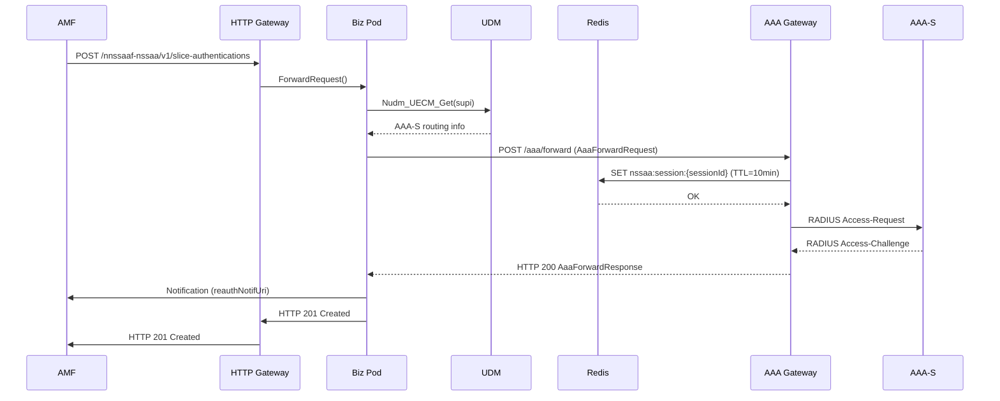
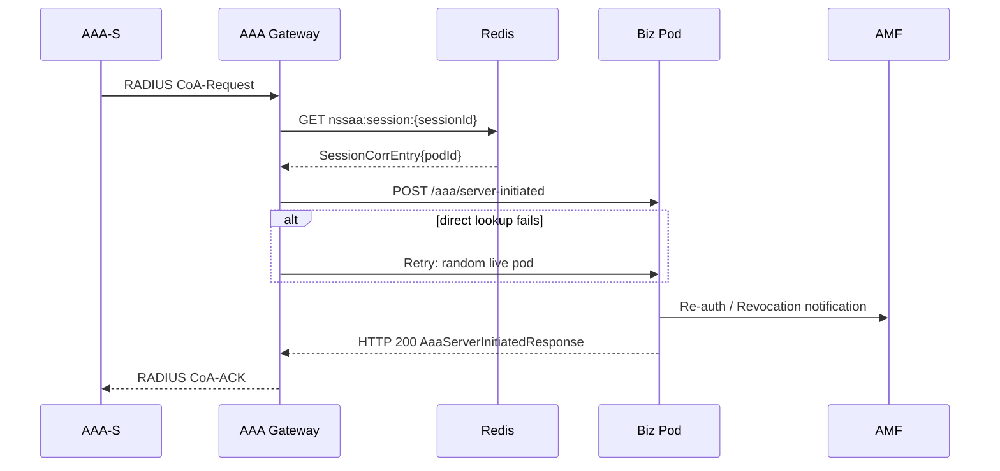

# NSSAAF Internal Communication — Comprehensive Design

## 1. System Overview

### Quick Summary

NSSAAF is deployed as 3 components: HTTP Gateway (stateless TLS terminator), Biz Pod (EAP engine + N58/N60 handlers, stateless), and AAA Gateway (RADIUS/Diameter proxy, exactly 2 replicas in active-standby via keepalived VRRP). Biz Pod and AAA Gateway communicate via HTTP on the internal network. All session state lives in Redis (correlation/routing) and PostgreSQL (source of truth). Both communication modes are supported: Native (in-app circuit breaker + retry + mTLS) and Istio (mesh-delegated resilience).

### Component Model

```
┌─────────────────────────────────────────────────────────────────┐
│                         External Network                          │
│              (AMF, AUSF, UDM, AAA-S via RADIUS/Diameter)        │
└───────┬─────────────────┬─────────────────┬─────────────────────┘
        │ N58/N60 TLS     │ N59 TLS          │ RADIUS/Diameter
        ▼                 ▼                  ▼
┌───────────────────┐         ┌─────────────────────────────┐
│   HTTP Gateway    │         │        AAA Gateway          │
│   (stateless)     │         │  (2 replicas, active-standby) │
│   N replicas       │         │         VIP :9091/9092      │
└─────────┬─────────┘         └──────────────┬──────────────┘
          │ HTTP POST                        │ HTTP POST
          │ (proto.BizServiceClient)         │ /aaa/server-initiated
          │                                  │ (retry ×3 + DLQ)
          ▼                                  ▼
┌─────────────────────────────────────────────────────────────┐
│                      Biz Pod (stateless)                      │
│                    N replicas (HPA)                           │
│  ┌──────────┐  ┌──────────┐  ┌──────────┐                   │
│  │ N58/N60  │  │   EAP    │  │   UDM    │                   │
│  │ Handlers │  │  Engine  │  │  Client  │                   │
│  └──────────┘  └──────────┘  └──────────┘                   │
└──────┬──────────────────────────────┬──────────────────────┘
       │                              │
       ▼                              ▼
┌─────────────┐              ┌─────────────────┐
│   Redis     │              │  PostgreSQL     │
│ (session    │              │  (source of     │
│  registry)  │              │   truth)        │
└─────────────┘              └─────────────────┘
```

### Why 3 Components?

| Concern | Solution |
|---------|----------|
| TLS termination | HTTP Gateway handles TLS offload, certificate management |
| RADIUS/Diameter lifecycle | AAA Gateway owns UDP/TCP listeners, exactly 2 replicas via keepalived |
| Stateless EAP handling | Biz Pod is stateless — any replica handles any request |
| Internal routing | Redis session registry correlates sessions to pods |
| State persistence | PostgreSQL stores complete session state |
| Zero-downtime upgrades | HPA on Biz Pod and HTTP Gateway; rolling updates |

### Communication Modes

Mode is selected by `ISTIO_MTLS=1` env var or `cfg.Mode == "istio"`.

| Mode | Trigger | Biz ↔ AAA GW | HTTP GW ↔ Biz | UDM/AUSF |
|------|---------|-------------|---------------|---------|
| **Native** | Default | `NativeAAAClient` — in-app CB + retry ×2 + VIP health check + mTLS | `nativeBizClient` — in-app CB + retry ×3 + mTLS | otelhttp, CB + retry |
| **Istio** | `ISTIO_MTLS=1` | `IstioAAAClient` — plain HTTP, Envoy sidecar handles CB + retry | `istioBizClient` — plain HTTP, Envoy sidecar handles CB + retry | otelhttp, Envoy handles everything |

Mode is selected in `internal/httpclient/factory.go`:
```go
func (f *Factory) NewBizServiceClient(bizServiceURL string) proto.BizServiceClient {
    switch f.mode {
    case ModeIstio:
        return newIstioBizClient(bizServiceURL)
    default:
        return newNativeBizClient(bizServiceURL, f.cfg.Native)
    }
}
```

---

## 2. Component Inventory

### 2.1 Binaries (`cmd/`)

| Binary | Role | Stateful? | Replicas | Protocol | Entry Point |
|--------|------|-----------|----------|----------|-------------|
| `biz` | EAP engine + N58/N60 API handlers | Yes (PG + Redis) | N (HPA) | HTTP/2 | `cmd/biz/main.go` |
| `http-gateway` | TLS terminator + request router | No | N (HPA) | HTTP/2 | `cmd/http-gateway/main.go` |
| `aaa-gateway` | RADIUS/Diameter proxy + session correlation | Yes (Redis) | 2 (active-standby) | RADIUS/Diameter + HTTP | `cmd/aaa-gateway/main.go` |
| `nrm` | NRM/FCAPS RESTCONF server | No | 1 | HTTP/2 | `cmd/nrm/main.go` |
| `nrf-mock` | NRF mock for testing | No | — | HTTP/2 | `cmd/nrf-mock/main.go` |
| `udm-mock` | UDM mock for testing | No | — | HTTP/2 | `cmd/udm-mock/main.go` |
| `aaa-sim` | AAA-S mock (RADIUS/Diameter) for testing | No | — | RADIUS/Diameter | `cmd/aaa-sim/main.go` |

### 2.2 Internal Packages

#### API Layer

| Package | Role | Key Types |
|---------|------|-----------|
| `internal/api/nssaa/` | N58 (Nnssaaf_NSSAA) handler | `POST /slice-authentications`, `PUT /slice-authentications/{authCtxId}` |
| `internal/api/aiw/` | N60 (Nnssaaf_AIW) handler | `POST /authentications` for SNPN credential holder auth |
| `internal/api/common/` | Shared middleware + ProblemDetails | Recovery, Request-ID, metrics, logging, CORS |

#### Protocol Layer

| Package | Role | Spec |
|---------|------|------|
| `internal/eap/` | EAP state machine, session manager, fragment reassembly, TLS | TS 33.501 §16 |
| `internal/aaa/gateway/` | RADIUS/Diameter listeners, forwarding, session correlation, VIP-aware startup, DLQ consumer | TS 29.561 Ch.16/17 |
| `internal/aaa/` | Shared AAA types and Prometheus metrics | — |
| `internal/radius/` | RADIUS encoding/decoding (RFC 2865/3579) | RFC 2865/3579 |
| `internal/diameter/` | Diameter encoding/decoding (RFC 6733) | RFC 6733 |

#### Communication Layer

| Package | Role |
|---------|------|
| `internal/httpclient/` | HTTP client factory — `NativeBizClient`, `IstioBizClient`, `NativeAAAClient`, `IstioAAAClient` |
| `internal/proto/` | Wire protocol types exchanged between components — zero internal dependencies |

#### Resilience Layer

| Package | Role |
|---------|------|
| `internal/resilience/` | Circuit breaker registry (per host:port, CLOSED/OPEN/HALF_OPEN), exponential backoff retry |

#### Integration Layer

| Package | Role | External Call |
|---------|------|--------------|
| `internal/nrf/` | NRF service discovery client | NRF (HTTP/2) |
| `internal/amf/` | AMF notifier — sends re-auth/revocation notifications | AMF (HTTP/2) |
| `internal/udm/` | UDM client — `Nudm_UECM_Get` (gates AAA routing), `Nudm_UECM_UpdateAuthContext` | UDM (HTTP/2) |
| `internal/ausf/` | AUSF client — forwards MSK to AUSF after EAP-TLS | AUSF (HTTP/2) |

#### Storage Layer

| Package | Role |
|---------|------|
| `internal/storage/postgres/` | Pool, session store, AIW store, Patroni-aware reconnect, migrations, at-rest encryption |
| `internal/cache/redis/` | Session cache, idempotency, rate limiting, locks, AMF notification DLQ, Redis Sentinel/Cluster HA |

#### Observability

| Package | Role |
|---------|------|
| `internal/metrics/` | Prometheus metrics |
| `internal/tracing/` | OpenTelemetry initialization, trace propagation |
| `internal/config/` | Config loading (YAML), `InternalCommConfig` (native/istio modes), env var binding |

---

## 3. Communication Map

### 3.1 External Interfaces (3GPP SBI)

| Direction | Protocol | Interface | Role |
|-----------|----------|-----------|------|
| AMF → NSSAAF | HTTP/2 TLS | N58 (Nnssaaf_NSSAA) | Slice authentication requests |
| AUSF → NSSAAF | HTTP/2 TLS | N60 (Nnssaaf_AIW) | SNPN credential holder auth |
| NSSAAF → UDM | HTTP/2 TLS | N59 (Nudm_UECM) | Routing info (AAA-S address) |
| NSSAAF → AMF | HTTP/2 TLS | Notifications | Re-auth/revocation notifications |
| NSSAAF → AUSF | HTTP/2 TLS | N60 | MSK forwarding after EAP-TLS |
| NSSAAF → AAA-S | RADIUS UDP | UDP :1812 | EAP authentication |
| NSSAAF → AAA-S | Diameter TCP/SCTP | TCP :3868 | EAP authentication |
| AAA-S → NSSAAF | RADIUS UDP | UDP :1812 | CoA/DM |
| AAA-S → NSSAAF | Diameter TCP/SCTP | TCP :3868 | ASR/RAR/STR |

### 3.2 Internal Channels

| Direction | Mechanism | Path | Native Mode | Istio Mode |
|-----------|-----------|------|------------|-----------|
| HTTP GW → Biz Pod | HTTP POST | bizServiceURL + path | `nativeBizClient` (CB + retry ×3, mTLS) | `istioBizClient` (Envoy sidecar) |
| Biz Pod → AAA GW | HTTP POST | aaaGatewayURL + /aaa/forward | `NativeAAAClient` (CB + retry ×2 + VIP health check, mTLS) | `IstioAAAClient` (Envoy sidecar) |
| Biz Pod → UDM | HTTP/2 | Nudm_UECM_Get | otelhttp, CB + retry ×3, mTLS | otelhttp, Envoy sidecar |
| Biz Pod → AUSF | HTTP/2 | MSK forwarding | otelhttp, CB + retry ×3, mTLS | otelhttp, Envoy sidecar |
| Biz Pod → AMF | HTTP POST | amfNotifUri | CB + retry ×3 + DLQ | Envoy sidecar + DLQ |
| AAA GW → Biz Pod | HTTP POST | /aaa/server-initiated | Retry ×3 (1s/2s/3s) + DLQ | Same |
| AAA GW → Redis | go-redis | nssaa:session:\*, nssaa:biz:pod:\* | Sentinel/Cluster HA | Same |
| Biz Pod → Redis | go-redis | Session cache, locks | Sentinel/Cluster HA | Same |

### 3.3 Redis Keys

| Key | Type | Content | TTL | Written By | Read By |
|-----|------|---------|-----|-----------|---------|
| `nssaa:session:{sessionID}` | STRING (JSON) | `SessionCorrEntry{authCtxId, podId, sst, sd, createdAt}` | 10 min | AAA GW (client-initiated) | AAA GW (server-initiated) |
| `nssaa:biz:pod:{podID}` | STRING (JSON) | `BizPodEntry{url, lastSeen}` | 60s | Biz Pod (startup) | AAA GW (server-initiated retry) |
| `nssaa:dlq:server-initiated` | LIST | Failed server-initiated messages | None | AAA GW (after 3 retries) | DLQ consumer |
| `nssAAF:dlq:amf-notifications` | LIST | Failed AMF notifications | None | Biz Pod AMF notifier (after 3 retries) | AMF DLQ consumer |

---

## 4. Message Flows

### 4a. Client-Initiated: NSSAA Procedure (Normal Path)

```
AMF ──N58──► HTTP GW ──HTTP──► Biz Pod ──N59──► UDM
                                                  │
                                                  ▼
                                           Biz Pod ◄──── Redis
                                                  │  (SessionCorrEntry)
                                                  ▼
                                           AAA GW ──RADIUS──► AAA-S
                                                          ◄───
                                                              │
                                             ◄────────────────┘
                                                        (EAP exchange)

AAA-S ──RADIUS──► AAA GW ──HTTP──► Biz Pod ──HTTP──► AMF
                                                        (reauth/revocation notification)

Biz Pod ──HTTP──► HTTP GW ──N58──► AMF (HTTP 201)
```

**Step-by-step:**

```
Step  1. AMF      → HTTP GW:   POST /nnssaaf-nssaa/v1/slice-authentications
Step  2. HTTP GW  → Biz Pod:   proto.BizServiceClient.ForwardRequest()
                               Native: nativeBizClient (CB + retry)
                               Istio:  istioBizClient (Envoy sidecar, no CB)
Step  3. Biz Pod  → UDM:       Nudm_UECM_Get(supi) — gates AAA routing
Step  4. Biz Pod  → AAA GW:    POST /aaa/forward (AaaForwardRequest)
                               {eapPayload, authCtxId, sessionId}
                               Native: NativeAAAClient (CB + retry + VIP health check)
                               Istio:  IstioAAAClient (mesh-delegated)
Step  5. AAA GW:              Write nssaa:session:{sessionID} → SessionCorrEntry
                               TTL = 10 min
Step  6. AAA GW  → AAA-S:     RADIUS Access-Request (UDP :1812)
                               or Diameter DER (TCP :3868)
Step  7. AAA-S   → AAA GW:    RADIUS Access-Challenge/Accept/Reject
                               or Diameter DEA/STR
Step  8. AAA GW  → Biz Pod:   HTTP 200 AaaForwardResponse {eapPayload}
Step  9. Biz Pod  → AMF:      Notification via AMF notifier
                               (reauthNotifUri or revocNotifUri)
                               CB + retry ×3 + DLQ on exhaustion
Step 10. Biz Pod  → HTTP GW → AMF: HTTP 201 Created + Location header
```

### 4b. Server-Initiated: CoA / ASR / RAR (Normal Path)

```
AAA-S ──CoA/DM──► AAA GW ──GET──► Redis
                              (SessionCorrEntry lookup)
                                  │
                                  ▼
                             AAA GW ──HTTP──► Biz Pod
                                            /aaa/server-initiated
                                               │
                                               ▼
                                          Biz Pod → AMF
                                          (handleReAuth/Revocation/CoA)
                                               │
                                               ▼
                                          Biz Pod ──HTTP──► AAA GW
                                          (AaaServerInitiatedResponse)
                                               │
                                               ▼
                                          AAA GW ──CoA-NAK──► AAA-S
```

**Step-by-step:**

```
Step  1. AAA-S   → AAA GW:   RADIUS CoA-Request (UDP :1812)
                               or Diameter ASR/RAR (TCP :3868)
Step  2. AAA GW:             Extract sessionID from RADIUS State attribute
                               or Diameter Session-Id AVP
Step  3. AAA GW  → Redis:     GET nssaa:session:{sessionID}
                               → SessionCorrEntry{authCtxId, podId}
Step  4. AAA GW  → Biz Pod:  POST /aaa/server-initiated
                               {authCtxId, sessionId, messageType, payload}
                               Retry ×3 with backoff: 1s, 2s, 3s
                               Target selection per retry (see below)
Step  5. Biz Pod:             handleReAuth / handleRevocation / handleCoA
                               Load session from PostgreSQL
                               Dispatch to AMF via AMF notifier
Step  6. Biz Pod  → AAA GW:  HTTP 200 AaaServerInitiatedResponse
Step  7. AAA GW  → AAA-S:   RADIUS CoA-NAK/CoA-ACK
                               or Diameter ASA/STR-Answer
```

**Target selection (Step 4 retry logic):**

```
Retry 1: GET nssaa:biz:pod:{podId}      → direct URL (original pod)
Retry 2: KEYS nssaa:biz:pod:*           → random live pod (load balanced)
Retry 3: static BizServiceURL           → config fallback (last resort)
After 3 failures: LPUSH nssaa:dlq:server-initiated
```

**DLQ consumer (polls every 30s):**
```
1.  RPOP nssaa:dlq:server-initiated → message
2.  attemptCount++ (max 10)
3.  Re-execute Step 4 target selection
4.  On success: LPOP from DLQ
5.  On failure (attemptCount >= 10):
        log.Fatalf — alert, keep in DLQ for manual intervention
```

### 4c. Mermaid Diagrams

#### Client-Initiated Flow



#### Server-Initiated Flow



### 4d. Failure at Each Hop

#### Client-Initiated Failure Matrix

| Step | Failure | Behavior |
|------|---------|----------|
| 1 | AMF sends malformed request | HTTP GW: 400 Bad Request |
| 2 | Biz Pod unreachable | HTTP GW: 502 Bad Gateway (CB opens, retry with backoff) |
| 3 | UDM timeout (5s) | Biz Pod: 504 Gateway Timeout |
| 4 | AAA GW unreachable | Biz Pod: CB opens → retry ×2 → DLQ |
| 6 | AAA-S no response | AAA GW: timeout → circuit opens on AAA GW side |
| 7 | AAA-S rejects (Access-Reject) | Biz Pod: EAP_FAILURE → HTTP 403 Forbidden |
| 9 | AMF unreachable | Biz Pod: retry ×3 → `nssAAF:dlq:amf-notifications` |

#### Server-Initiated Failure Matrix

| Step | Failure | Behavior |
|------|---------|----------|
| 2 | Malformed packet | AAA GW: NAK to AAA-S, log error |
| 3 | Redis: session not found | AAA GW: NAK to AAA-S (session expired or never created) |
| 4 | All 3 retries fail | AAA GW: `LPUSH nssaa:dlq:server-initiated`, NAK to AAA-S |
| 5 | Biz Pod crashes mid-handling | AMF notification fails → DLQ, response already sent |
| 7 | AAA-S timeout | AAA-S responsible for retry; Biz Pod is idempotent |

### 4e. Native vs Istio Side-by-Side

| Aspect | Native Mode | Istio Mode |
|--------|-----------|-----------|
| **Biz → AAA GW** | `NativeAAAClient` — in-app CB (3 fails, 15s recovery) + retry ×2 (500ms/1s) + mTLS + VIP health check every 5s | `IstioAAAClient` — plain HTTP, Envoy sidecar handles CB + retry |
| **HTTP GW → Biz Pod** | `nativeBizClient` — in-app CB (5 fails, 30s recovery) + retry ×3 (1s/2s/4s) + mTLS | `istioBizClient` — plain HTTP, Envoy sidecar handles CB + retry |
| **AAA GW → Biz Pod** | Retry ×3 (1s/2s/3s) + DLQ | Same (DLQ is in-app, not mesh-delegated) |
| **Biz → UDM/AUSF** | `otelhttp` client, CB + retry ×3, mTLS | `otelhttp`, Envoy sidecar handles CB/retry/mTLS |
| **Circuit breaker** | go-resilience in-app | Envoy sidecar |
| **mTLS** | Config-driven certs (volumes) | Istio auto-cert-rotation |
| **Observability** | Prometheus metrics + OTEL spans | Envoy spans + Istio telemetry |
| **Ops complexity** | Higher (manage your own CB/retry) | Lower (mesh handles it) |
| **Portability** | Works on any K8s cluster | Requires Istio |

---

## 5. HA & Failure Handling

### 5a. Biz Pod Dies (PodCrash / OOMKill / Preemption)

**Detection:** Redis key `nssaa:biz:pod:{podID}` has TTL=60s. Pod death is detected within 60s via key expiration.

#### Client-Initiated Impact

```
AMF sends NSSAA request
    ↓
HTTP GW forwards to Biz Pod
    ↓
Request lands on dead pod → connection refused
    ↓
Native mode: CB opens → retry to another pod (1s/2s/4s backoff)
Istio mode:  Envoy sidecar retries transparently
    ↓
Result: ZERO DOWNTIME for client-initiated flows
Any surviving Biz Pod handles the request
```

#### Server-Initiated Impact

```
AAA GW has pending POST /aaa/server-initiated to dead pod
    ↓
Retry 1 (1s):  direct pod lookup → pod gone → try next
Retry 2 (2s):  random live pod → succeeds ✓
Retry 3 (3s):  static fallback → succeeds ✓
    ↓
After 3 failures: LPUSH nssaa:dlq:server-initiated
    ↓
DLQ consumer (every 30s) picks up message, retries
    ↓
Result: AT MOST 1 missed server-initiated notification per pod death,
        recovered within ~30-60s by DLQ consumer
```

#### Session Recovery

- Session data is in **PostgreSQL** (not in-process memory)
- Any Biz Pod can load session by `authCtxId`
- **No session loss** on pod death
- Redis `SessionCorrEntry` has TTL=10min — older sessions must re-establish correlation

#### Recovery Timeline

```
T+0s:     Pod dies
T+0-1s:   HTTP GW detects connection refused, retries
T+0-2s:   Client-initiated flows restored (other pods)
T+60s:    Redis key nssaa:biz:pod:{podID} expires (pod officially gone)
T+30-60s: DLQ consumer picks up server-initiated message, retries
T+30-60s: Server-initiated flows restored
```

### 5b. Redis Dies (Network Partition / Redis Crash)

**Detection:** go-redis client returns connection errors.

#### Client-Initiated Impact

- **Step 5** (AAA GW writes `SessionCorrEntry`) fails → AAA GW returns 502 to Biz Pod → EAP session fails → user gets 502, must retry
- **Step 3** (Biz Pod session cache lookup) fails → NSSAA flow blocked
- If UDM also unreachable → 504

#### Server-Initiated Impact

- **Step 3** (AAA GW `GET SessionCorrEntry`) fails → cannot route CoA/ASR
- AAA GW returns NAK to AAA-S
- AAA-S may retry → NSSAAF recovers if Redis returns
- DLQ consumer fails to read → no retries until Redis returns

#### Recovery

```
Redis Sentinel/Cluster: automatic failover to replica
Patroni: if Redis Sentinel also down → Redis restart
    ↓
All data in Redis is ephemeral:
  - Session correlation keys (TTL-managed)
  - Pod registry keys (TTL-managed)
  - DLQ messages (in-memory in Redis)
    ↓
NO permanent data loss
Client-initiated flows resume when Redis reconnects
DLQ messages in Redis at time of Redis death are LOST
  → Server-initiated messages in-flight at Redis death are NAKed
  → AAA-S is responsible for retry
```

**SessionCorrEntry TTL=10min:** Sessions older than 10min without completion are evicted. If Redis dies mid-session, on next Biz Pod request, session reloads from PostgreSQL (source of truth).

### 5c. AAA Gateway Failover (keepalived VRRP)

**Setup:** 2 AAA Gateway replicas, exactly 1 MASTER at a time via keepalived VRRP.
VIP = `aaa-gateway-vip:9091` (RADIUS) + `:9092` (Diameter).

**Detection:** `internal/aaa/gateway/gateway.go` polls keepalived state file every 5s.

#### On MASTER → BACKUP Transition (Primary Dies)

```
T+0-5s:   Backup detects MASTER down via VRRP advertisements missing
T+5-10s:  Backup becomes MASTER, sends GARP (Gratuitous ARP)
T+5s:     AAA GW StartVIPAware() starts RADIUS listener on VIP :9091
T+5s:     AAA GW StartVIPAware() starts Diameter listener on VIP :9092
T+5s:     AAA GW StartVIPAware() connects Diameter to AAA-S
T+5s:     DLQ consumer starts processing
T+5s:     Biz Pod VIP health check detects MASTER → cb.Reset()
Total failover time: ~5-10 seconds
```

**VIP health check + CB reset (Biz Pod side):**
```go
// internal/httpclient/native_aaa.go
func (c *NativeAAAClient) StartVIPHealthCheck(ctx context.Context) {
    ticker := time.NewTicker(5 * time.Second)
    prevState := ""
    for {
        select {
        case <-ctx.Done(): return
        case <-ticker.C:
            state := c.pollKeepalivedState()
            if state != prevState {
                c.cb.Reset()  // Immediately reset CB on state change
                prevState = state
            }
        }
    }
}
```
On keepalived state change, `cb.Reset()` is called within 5s — eliminates the 15-30s CB blackout window after failover.

**SessionCorrEntry survives failover:** Redis is shared between both AAA GW replicas. New MASTER reads existing session keys → routes correctly.

**Race condition during failover:**
```
CoA arrives at old MASTER (now BACKUP) → BACKUP has no listener → dropped
AAA-S retries → reaches new MASTER → processed correctly
```
AAA-S is responsible for retry on timeout (standard RADIUS/Diameter behavior).

### 5d. PostgreSQL Disconnects (Network Partition / Patroni Failover)

**Detection:** Reconnecting pool wrapper in `internal/storage/postgres/` detects connection errors.

**Behavior:**
- On connection error: pool marks connection dead, returns error to caller
- On 30s health check interval: pool retries connection
- Patroni: automatic failover to replica, pool reconnects automatically

**Impact:**
- Client-initiated: Biz Pod can't read/write session → return 503 Service Unavailable
- Server-initiated: Biz Pod can't load session → AMF notification fails → DLQ
- **Both paths: NSSAA flow blocked until PostgreSQL recovers**

**SessionCorrEntry vs PostgreSQL:**
```
SessionCorrEntry (Redis):   short-term correlation, routing only
PostgreSQL:                source of truth, full session state
```
Redis is the critical path for routing. PostgreSQL is the critical path for session data.

### 5e. Failure Handling Summary Matrix

| Component | Failure | Client-Initiated | Server-Initiated | Recovery |
|-----------|---------|-----------------|-----------------|---------|
| **Biz Pod** | Pod dies | Zero downtime (retry) | 1 missed (DLQ 30s) | Automatic |
| **Redis** | Dies | Blocked (UDM works) | NAK to AAA-S | Automatic |
| **AAA GW** | Failover | Timeout 5-10s | NAK to AAA-S (AAA-S retries) | Automatic |
| **PostgreSQL** | Disconnect | 503 until reconnect | DLQ until reconnect | Automatic |
| **UDM** | Unreachable | 504, retry | N/A | Automatic |
| **AMF** | Unreachable | DLQ | DLQ | Automatic |

---

## 6. Data Structures

### 6.1 Redis Keys

#### SessionCorrEntry

```json
// Key: nssaa:session:{sessionID}
// TTL: 10 min
// Written by: AAA GW (Step 5, client-initiated flow)
// Read by: AAA GW (Step 3, server-initiated flow)
// Purpose: Correlates a RADIUS/Diameter session to the target Biz Pod

{
  "authCtxId": "auth-0a1b2c3d4e5f",
  "podId": "biz-0",
  "sst": 1,
  "sd": "010203",
  "createdAt": "2026-05-24T12:00:00Z"
}
```

#### BizPodEntry

```json
// Key: nssaa:biz:pod:{podID}
// TTL: 60s (auto-expires on pod death)
// Written by: Biz Pod (on startup, refresh on heartbeat)
// Read by: AAA GW (server-initiated retry Step 4, Retry 2)
// Purpose: Tracks live Biz Pods for random load-balanced routing

{
  "url": "http://biz-0.biz:8080",
  "lastSeen": "2026-05-24T12:00:00Z"
}
```

#### Server-Initiated DLQ Message

```json
// Key: nssaa:dlq:server-initiated (LIST)
// Written by: AAA GW (after 3 failed retries to Biz Pod)
// Read by: DLQ consumer (every 30s)
// Purpose: Recover server-initiated messages that failed routing

{
  "authCtxId": "auth-0a1b2c3d4e5f",
  "sessionId": "sess-xyz789",
  "messageType": "COA",
  "payload": "base64-encoded RADIUS packet",
  "attemptCount": 1,
  "firstAttempt": "2026-05-24T12:00:00Z"
}
```

#### AMF Notification DLQ Message

```json
// Key: nssAAF:dlq:amf-notifications (LIST)
// Written by: Biz Pod AMF notifier (after 3 failed retries)
// Read by: AMF DLQ consumer (every 30s)
// Purpose: Recover failed AMF re-auth/revocation notifications

{
  "authCtxId": "auth-0a1b2c3d4e5f",
  "notificationType": "SLICE_RE_AUTH",
  "amfNotifUri": "http://amf:8080/nnssf-nsmf/v1/",
  "payload": {},
  "attemptCount": 1,
  "firstAttempt": "2026-05-24T12:00:00Z"
}
```

### 6.2 PostgreSQL Tables

#### nssaa_sessions

```sql
-- Primary session state (source of truth)
-- Reloaded by any Biz Pod on session lookup by authCtxId
-- Monthly partitions for efficient pruning

CREATE TABLE nssaa_sessions (
    auth_ctx_id       VARCHAR(64) PRIMARY KEY,
    supi              VARCHAR(64) NOT NULL,
    gpsi              VARCHAR(64),
    snssai_sst        SMALLINT NOT NULL,
    snssai_sd         VARCHAR(6),
    status            VARCHAR(32) NOT NULL,  -- NOT_EXECUTED, PENDING, EAP_SUCCESS, EAP_FAILURE
    eap_session_id    VARCHAR(128),
    aaa_server_addr   VARCHAR(256),
    amf_notif_uri     VARCHAR(512),
    created_at        TIMESTAMPTZ NOT NULL,
    updated_at        TIMESTAMPTZ NOT NULL,
    expires_at        TIMESTAMPTZ
);

-- Index for GPSI-based lookups
CREATE INDEX idx_nssaa_sessions_gpsi ON nssaa_sessions(gpsi) WHERE gpsi IS NOT NULL;
```

#### aiw_auth_contexts

```sql
-- AIW (Nnssaaf_AIW) credential holder authentication
-- Source of truth for N60 AIW flows

CREATE TABLE aiw_auth_contexts (
    auth_ctx_id       VARCHAR(64) PRIMARY KEY,
    supi              VARCHAR(64) NOT NULL,
    gpsi              VARCHAR(64),
    cred_holder_id    VARCHAR(64) NOT NULL,
    status            VARCHAR(32) NOT NULL,
    eap_session_id    VARCHAR(128),
    created_at        TIMESTAMPTZ NOT NULL,
    updated_at        TIMESTAMPTZ NOT NULL
);
```

### 6.3 Wire Protocol Types (`internal/proto/`)

```go
// Biz → HTTP GW (forwarded request)
// Note: Zero internal dependencies — lives in its own package

type BizServiceRequest struct {
    Method    string            // "POST", "PUT", "PATCH", "DELETE"
    Path      string            // "/nnssaaf-nssaa/v1/slice-authentications"
    Header    map[string]string // X-Request-ID, Content-Type, Authorization
    Body      []byte            // raw request body
    TimeoutMs int64             // request timeout in milliseconds
}

type BizServiceResponse struct {
    StatusCode int
    Header     map[string]string
    Body       []byte
}
```

```go
// Biz → AAA GW (forward EAP payload to AAA-S)

type AaaForwardRequest struct {
    AuthCtxId  string `json:"authCtxId"`
    SessionId  string `json:"sessionId"`
    EapPayload []byte `json:"eapPayload"` // raw EAP bytes (RFC 3748)
    AaaServer  string `json:"aaaServer"`  // host:port or Diameter identity
    Protocol   string `json:"protocol"`   // "RADIUS" | "DIAMETER"
}

type AaaForwardResponse struct {
    AuthCtxId  string `json:"authCtxId"`
    EapPayload []byte `json:"eapPayload"` // raw EAP bytes
    ResultCode int    `json:"resultCode"` // 0=success, non-zero=AAA error code
}
```

```go
// AAA GW → Biz (server-initiated: CoA/ASR/RAR from AAA-S)

type AaaServerInitiatedRequest struct {
    AuthCtxId   string `json:"authCtxId"`
    SessionId   string `json:"sessionId"`
    MessageType string `json:"messageType"` // "COA" | "ASR" | "RAR"
    Payload     []byte `json:"payload"`     // raw RADIUS/Diameter packet
    AaaServer   string `json:"aaaServer"`
}

type AaaServerInitiatedResponse struct {
    AuthCtxId  string `json:"authCtxId"`
    ResultCode int    `json:"resultCode"` // 0=success, non-zero=error
    EapPayload []byte `json:"eapPayload,omitempty"` // for EAP-Nak
}
```

---

## 7. Resilience Patterns

### 7a. Circuit Breaker (`internal/resilience/circuit_breaker.go`)

**Per-host:port isolation.** Keyed by `host:port` in the registry. Isolated per destination — a failure to UDM does NOT open the CB to AMF.

```
CLOSED ──5 failures──► OPEN (circuit trips, calls fail fast)
                           │
                           │  30s recovery timeout
                           ▼
                      HALF_OPEN (probe with reduced load)
                           │
              ┌────────────┴────────────┐
         3 successes              1 failure
              │                         │
              ▼                         ▼
         CLOSED ◄────── failure ──── OPEN
```

**AAA variant** (Biz Pod → AAA GW — stricter because AAA is session-critical):

```
CLOSED ──3 failures──► OPEN (15s recovery timeout)
                           │
                           │  HALF_OPEN
                           ▼
                      HALF_OPEN
                           │
              ┌────────────┴────────────┐
         2 successes              1 failure
              │                         │
              ▼                         ▼
         CLOSED ◄────── failure ──── OPEN
```

**Reset on keepalived failover:**
```go
// Called by VIP health check on state change
cb.Reset() // Immediately transitions OPEN → CLOSED
```
Eliminates the 15-30s CB blackout window after a keepalived failover.

**Usage in code:**
```go
cb := resilience.Registry.Get("aaa-gateway-vip:9091")
result, err := cb.Execute(func() error {
    return nativeAAAClient.Forward(ctx, req)
})
if err == resilience.ErrCircuitOpen {
    // fallthrough to DLQ
    return enqueueDLQ(ctx, req)
}
```

### 7b. Retry with Exponential Backoff

| Path | Max Attempts | Base Delay | Max Delay | Sequence | 4xx Retry? |
|------|------------|-----------|---------|---------|-----------|
| HTTP GW → Biz Pod | 3 | 1s | 4s | 1s → 2s → 4s | No |
| Biz Pod → UDM/AUSF | 3 | 1s | 4s | 1s → 2s → 4s | No |
| Biz Pod → AMF | 3 | 1s | 4s | 1s → 2s → 4s | No |
| Biz Pod → AAA GW | 2 | 500ms | 10s | 500ms → 1s | No |
| AAA GW → Biz Pod (server-init) | 3 | 1s | 3s | 1s → 2s → 3s | No |
| DLQ consumer | 10 | 30s | 30s | fixed 30s | — |

**Jitter:** All retry delays have ±10% jitter to prevent thundering herd.

**4xx rule:** Client errors (400, 403, 404) are NOT retried. The request is malformed or the resource doesn't exist — retrying won't help and amplifies load.

**Connection errors:** All connection/refused/timeout errors ARE retried.

### 7c. VIP-Aware Startup (AAA Gateway)

```go
// internal/aaa/gateway/gateway.go
func (g *Gateway) StartVIPAware(ctx context.Context) error {
    for {
        state := g.readKeepalivedState()
        if state == "MASTER" {
            // Only MASTER starts these resources:
            if err := g.startRADIUSListener(); err != nil { return err }
            if err := g.startDiameterListener(); err != nil { return err }
            if err := g.connectDiameterClient(); err != nil { return err }
            g.startDLQConsumer() // processes server-initiated DLQ
            break // enter main event loop
        }
        // BACKUP: only HTTP server on :9090 (needed for Biz Pod health checks)
        log.Printf("state=%s, waiting for MASTER", state)
        time.Sleep(5 * time.Second)
    }
    return nil
}
```

**Why HTTP server starts unconditionally on BACKUP:** Biz Pod VIP health check polls `http://aaa-gateway:9090/health/vip` — this must be available on both MASTER and BACKUP. Only the VIP listeners (RADIUS :9091, Diameter :9092) are MASTER-only.

**State file polling:** Every 5s. State file path configured via `KEEPALIVED_STATE_FILE` env var.

### 7d. Dead Letter Queue (DLQ)

**Two DLQs:**

1. **`nssAAF:dlq:amf-notifications`** — written by Biz Pod AMF notifier after 3 failed retries
2. **`nssaa:dlq:server-initiated`** — written by AAA GW after 3 failed retries to Biz Pod

**DLQ consumer behavior:**
```
Ticker: every 30s
1.  RPOP list → message
2.  attemptCount++
3.  Re-execute target selection + HTTP POST
4.  On HTTP 2xx: LPOP (remove from DLQ), log success
5.  On HTTP error or timeout:
        if attemptCount < 10:
            LPUSH back to FRONT of list (not back)
            continue to next tick
        else:
            log.Fatalf("DLQ exhausted after 10 attempts")
            keep in DLQ for manual intervention
```

**Why LPUSH to front (not back):** Retry immediately at next tick (30s later), not after all other messages in the queue. High-priority messages don't wait behind backlog.

**Manual recovery:** Operator can inspect `LRANGE dlq 0 -1`, manually re-queue with `RPUSH`, or replay via a custom tool:
```bash
redis-cli LRANGE nssaa:dlq:server-initiated 0 -1
redis-cli LSET nssaa:dlq:server-initiated 0 "<repaired-message>"
```

### 7e. VIP Health Check (Biz Pod → AAA GW)

```go
// internal/httpclient/native_aaa.go
func (c *NativeAAAClient) StartVIPHealthCheck(ctx context.Context) {
    ticker := time.NewTicker(5 * time.Second)
    prevState := ""
    for {
        select {
        case <-ctx.Done():
            return
        case <-ticker.C:
            state := c.pollKeepalivedState()
            if state != prevState {
                // State changed (MASTER→BACKUP or BACKUP→MASTER)
                c.cb.Reset()  // Immediately reset CB on state change
                prevState = state
                log.Printf("keepalived state changed to %s, CB reset", state)
            }
        }
    }
}
```

**Poll interval:** 5s (same as keepalived check interval in AAA GW).

**Effect:** After a keepalived failover, Biz Pods reset their CB within 5 seconds instead of waiting for the 15s HALF_OPEN timeout.

**Endpoint:** `http://aaa-gateway:9090/health/vip` — returns 200 only when state == "MASTER".

---

## 8. Observability

### 8a. Prometheus Metrics

#### HTTP Gateway

| Metric | Type | Labels | Description |
|--------|------|--------|-------------|
| `http_requests_total` | Counter | method, path, status | Total HTTP requests |
| `http_request_duration_seconds` | Histogram | method, path | Request latency |
| `biz_forward_total` | Counter | status | Forward attempts to Biz Pod |
| `biz_forward_errors_total` | Counter | error_type | Forward failures |

#### Biz Pod

| Metric | Type | Labels | Description |
|--------|------|--------|-------------|
| `nssaa_auth_requests_total` | Counter | status, eap_method | NSSAA auth requests |
| `nssaa_auth_duration_seconds` | Histogram | eap_method | Auth procedure duration |
| `eap_session_active` | Gauge | — | Active EAP sessions |
| `udm_calls_total` | Counter | procedure, status | UDM client calls |
| `udm_call_duration_seconds` | Histogram | procedure | UDM call latency |
| `amf_notification_total` | Counter | type, status | AMF notification attempts |
| `aaa_forward_total` | Counter | protocol, status | AAA forwarding attempts |
| `aaa_forward_duration_seconds` | Histogram | protocol | AAA forward latency |
| `circuit_breaker_state` | Gauge | destination | CB state (0=closed, 1=half-open, 2=open) |

#### AAA Gateway

| Metric | Type | Labels | Description |
|--------|------|--------|-------------|
| `radius_requests_total` | Counter | type, result | RADIUS requests received |
| `diameter_requests_total` | Counter | type, result | Diameter requests received |
| `server_initiated_total` | Counter | type, status | Server-initiated messages |
| `dlq_messages_total` | Counter | queue | Messages enqueued to DLQ |
| `dlq_processed_total` | Counter | queue, result | DLQ consumer processed |
| `keepalived_state` | Gauge | — | Current keepalived state (0=BACKUP, 1=MASTER) |

#### Redis

| Metric | Type | Labels | Description |
|--------|------|--------|-------------|
| `redis_session_operations_total` | Counter | operation, result | SessionCorrEntry operations |
| `redis_dlq_operations_total` | Counter | operation, result | DLQ operations |

#### PostgreSQL

| Metric | Type | Labels | Description |
|--------|------|--------|-------------|
| `postgres_session_ops_total` | Counter | operation, result | Session read/write |
| `postgres_connection_pool_active` | Gauge | — | Active DB connections |

### 8b. Structured Logging

Every component uses structured JSON logging via `zerolog`.

**Required fields on every log entry:**
```json
{
  "ts": "2026-05-24T12:00:00Z",
  "level": "info",
  "component": "biz-pod-0",
  "trace_id": "abc123",
  "message": "forwarded EAP payload to AAA-S"
}
```

**Trace propagation:** `X-Request-ID` from AMF carried through the entire flow.
- HTTP GW: generates or propagates `X-Request-ID`
- Biz Pod: reads from header, attaches to all downstream calls (UDM, AAA GW, AMF, DB)
- AAA GW: attaches to RADIUS/Diameter messages via vendor-specific attribute

**Log levels:**
```
ERROR:  Unrecoverable failures, DLQ enqueue events, circuit open
WARN:   CB state change, retry attempts, DLQ retries
INFO:   Request start/end, keepalived state changes, AAA forward
DEBUG:  Retry attempts, payload sizes, timing, Redis operations
```

### 8c. OpenTelemetry Tracing

- HTTP GW: trace from AMF/AUSF request to Biz Pod forward
- Biz Pod: spans for UDM call, AAA forward, AMF notification, DB ops
- AAA GW: spans for RADIUS/Diameter processing, Redis session lookup, Biz Pod call
- Trace context propagated via `traceparent` header (W3C format)

**Required spans:**
```
[http-gateway] receive_request
  └─ [http-gateway] forward_to_biz
      └─ [biz-pod] handle_nssaa
          ├─ [biz-pod] udm_get (child of handle_nssaa)
          ├─ [biz-pod] aaa_forward (child of handle_nssaa)
          │   └─ [aaa-gateway] radius_process (child of aaa_forward)
          │       └─ [aaa-gateway] redis_session_lookup (child of radius_process)
          ├─ [biz-pod] amf_notify (child of handle_nssaa)
          └─ [biz-pod] db_write (child of handle_nssaa)
```

### 8d. Health Endpoints

| Endpoint | Component | Returns 200 when |
|---------|-----------|-----------------|
| `GET /health/live` | All | Process is running (liveness probe) |
| `GET /health/ready` | All | Ready to serve traffic (readiness probe) |
| `GET /health/vip` | AAA GW | keepalived state == "MASTER" |
| `GET /health/redis` | Biz Pod | Redis connection OK |
| `GET /health/postgres` | Biz Pod | DB connection OK |

---

## 9. Reference

### 9a. Detailed Design Documents

| Topic | Doc |
|-------|-----|
| HA multi-AZ deployment, Patroni, Redis Cluster, HPA, PDB | `docs/design/10_ha_architecture.md` |
| Native vs Istio mode, CB, retry, mTLS, K8s manifests | `docs/design/26_internal_comm_dual_mode.md` |
| Biz↔AAA GW HA: Redis pod registry, server-initiated routing, DLQ, VIP-aware startup, VIP CB reset, RADIUS config | `docs/superpowers/specs/2026-05-24-internal-comm-ha-biz-aaa-gateway-design.md` |
| EAP session persistence, Redis session manager, NRF caching, DB reconnection | `docs/superpowers/specs/2026-05-23-internal-comm-ha-design.md` |
| Biz↔AAA GW HA implementation plan (9 tasks, Wave 1-4) | `docs/superpowers/plans/2026-05-24-internal-comm-ha-biz-aaa-gateway-implementation.md` |
| Internal comm HA detailed plan (statelessness, circuit breaker, session persistence) | `docs/superpowers/plans/2026-05-23-internal-comm-ha-plan-detailed.md` |

### 9b. Configuration Reference

#### HTTP Gateway

| Env / Config | Default | Description |
|---|---|---|
| `BIZ_SERVICE_URL` | `http://biz:8080` | Target Biz Pod service URL |
| `ISTIO_MTLS` | `0` | Set to `1` for Istio mode |

#### Biz Pod

| Env / Config | Default | Description |
|---|---|---|
| `AAA_GATEWAY_URL` | `http://aaa-gateway:9090` | AAA Gateway VIP URL |
| `ISTIO_MTLS` | `0` | Set to `1` for Istio mode |
| `KEEPALIVED_HEALTH_URL` | `http://aaa-gateway:9090/health/vip` | VIP health check URL |
| `REDIS_URL` | `redis://redis:6379` | Redis connection URL |
| `DATABASE_URL` | — | PostgreSQL DSN |
| `NRF_BASE_URL` | `http://nrf:8080` | NRF service URL |

#### AAA Gateway

| Env / Config | Default | Description |
|---|---|---|
| `KEEPALIVED_STATE_FILE` | `/var/run/keepalived/state` | Keepalived state file path |
| `RADIUS_PORT` | `1812` | RADIUS authentication port |
| `RADIUS_SECRET` | — | Shared secret for RADIUS |
| `DIAMETER_PORT` | `3868` | Diameter SCTP/TCP port |
| `DIAMETER_ORIGIN_HOST` | — | Diameter Origin-Host AVP |
| `DLQ_POLL_INTERVAL` | `30s` | Server-initiated DLQ poll interval |

### 9c. Port Summary

| Port | Component | Protocol | Purpose |
|------|-----------|---------|---------|
| 8080 | Biz Pod | HTTP/2 | N58/N60 handlers, /aaa/server-initiated |
| 9090 | AAA Gateway | HTTP | Health endpoints, Biz Pod health check |
| 9091 | AAA Gateway (VIP) | UDP | RADIUS authentication (VIP via keepalived) |
| 9092 | AAA Gateway (VIP) | TCP/SCTP | Diameter (VIP via keepalived) |
| 6379 | Redis | TCP | Session correlation, pod registry, DLQ |
| 5432 | PostgreSQL | TCP | Session state, AIW contexts |

### 9d. Spec References

| Spec | Section | Topic |
|------|---------|-------|
| TS 29.526 | §7.2 | Nnssaaf_NSSAA API |
| TS 29.526 | §7.3 | Nnssaaf_AIW API |
| TS 23.502 | §4.2.9 | NSSAA procedure flows |
| TS 33.501 | §16.3 | EAP-TLS security |
| TS 29.561 | Ch.16 | RADIUS interworking |
| TS 29.561 | Ch.17 | Diameter interworking |
| RFC 2865 | — | RADIUS |
| RFC 3579 | — | RADIUS EAP |
| RFC 6733 | — | Diameter |
